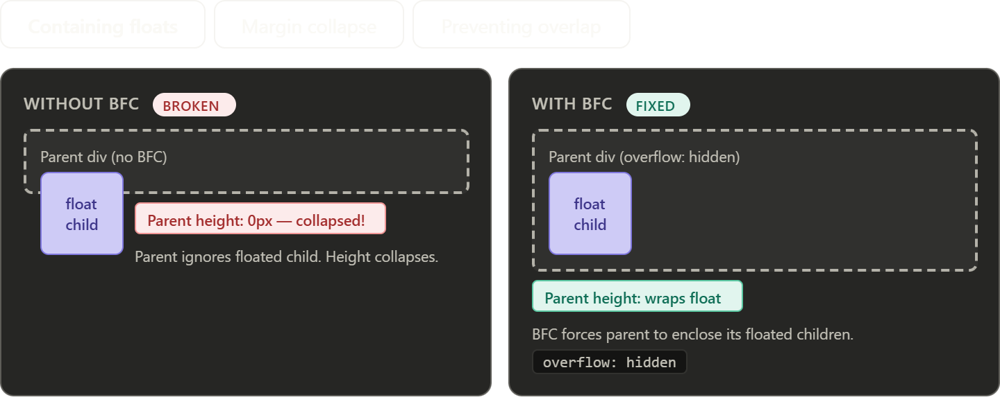

# Block Formatting Context (BFC)

A **BFC** is an isolated CSS layout region — elements inside it don't affect elements outside it (and vice versa).

## Why it matters

- **Contains floats** — parent wraps around floated children instead of collapsing to height 0
- **Prevents margin collapse** — margins inside a BFC don't collapse with margins outside it

## How to create a BFC

Any one of these is enough:

| Property   | Value                                               |
| ---------- | --------------------------------------------------- |
| `overflow` | `hidden`, `auto`, `scroll` (anything but `visible`) |
| `display`  | `flow-root`, `flex`, `grid`, `inline-block`         |
| `position` | `absolute`, `fixed`                                 |
| `float`    | `left`, `right`                                     |

> Prefer `display: flow-root` — it creates a BFC with no side effects.

## Example: float collapse

```html
<!-- Without BFC: parent collapses to height 0 -->
<div class="parent">
  <div style="float: left; width: 100px; height: 100px;"></div>
</div>

<!-- With BFC: parent wraps the float -->
<div class="parent" style="display: flow-root;">
  <div style="float: left; width: 100px; height: 100px;"></div>
</div>
```


