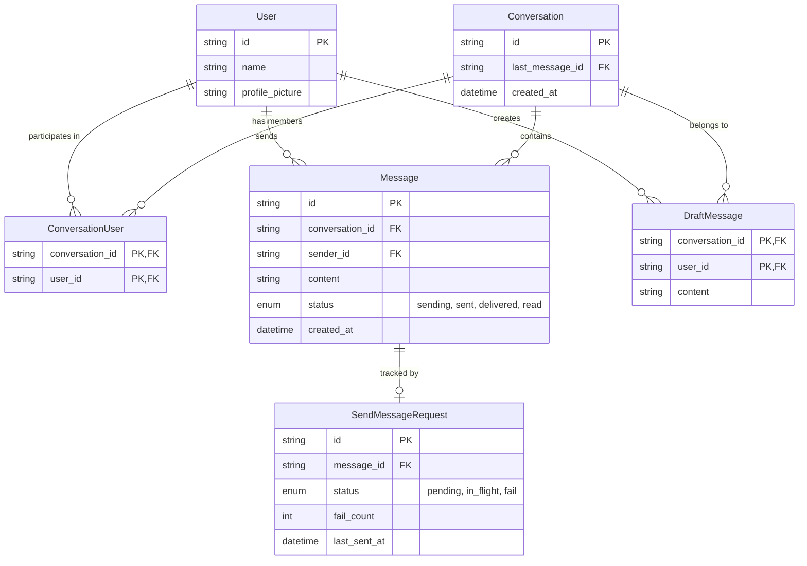

# Chat Application System Design Summary

## 📱 Real-life Examples
- Messenger, WhatsApp Web, Slack, Discord, Telegram.

## 🎯 Core Requirements
- **Functionalities:** 1:1 Messaging (Send/Receive), Chat History.
- **Real-time:** Near-instant message updates.
- **Formats:** Text, Emojis.
- **Offline Mode:** Browse messages, queue outgoing messages, resync on reconnect.

## 🏗️ High-level Architecture
The architecture centers on a **Client-Side Database** to enable offline usage and multi-tab consistency.

### Components:
1. **Chat UI:** Conversations list and selected conversation view.
2. **Controller:** Bridges UI and Database.
3. **Data Syncer:** Manages client-server synchronization.
4. **Client-side Database (IndexedDB):** Persistent storage on device.
5. **Message Scheduler:** Manages outgoing message status (pending, in-flight, fail, success) and retries.
6. **Server:** Provides HTTP APIs and Real-time (WebSocket) channel.

### Tricky Scenarios:
- **Multiple Tabs:** Cross-tab consistency via a shared IndexedDB and `BroadcastChannel`.
- **Offline -> Online:** Use a scheduler to retry pending messages with exponential backoff.
- **Stale Clients:** Re-sync using timestamps or cursors to get missing messages.

## 📊 Data Model (Client-side DB)
| Entity | Sync? | Purpose |
| :--- | :---: | :--- |
| **User** | Yes | Identity data. |
| **Conversation** | Yes | Metadata about 1:1 chats. |
| **Message** | Yes | Content and status (sending, sent, delivered, read). |
| **DraftMessage** | No | Local-only unsent typed text. |
| **SendMessageRequest** | No | Tracks status/retries for outgoing messages. |

### Entity-Relationship Diagram:

## 📡 API & Events
- **APIs:** Send Message, Sync Outgoing, Fetch History.
- **Server-to-Client Events:**
    - `message_sent`: Server acknowledged receipt.
    - `message_delivered`: Recipient received the message.
    - `incoming_message`: Real-time new message.
    - `sync`: Catch-up data for stale clients.

## ⚡ Key Optimizations & Deep Dive
- **Storage:** Use **IndexedDB** for structured data (Cookies/Web Storage too limited).
- **Real-time:** **WebSockets** preferred over Long/Short Polling for low latency.
- **Network Resilience:**
    - **Batching:** Group messages sent in quick succession.
    - **Exponential Backoff:** Avoid overwhelming the server during retry loops.
- **UI/UX:**
    - **Virtualization:** Efficiently render long message lists.
    - **Scroll Management:** Maintain position when history loads; pin to bottom for new messages.
    - **Optimistic UI:** Update UI immediately with "Sending" status before server confirmation.
- **Accessibility:** Keyboard shortcuts (Enter to send, Shift+Enter for new line).
- **PWA:** Use Service Workers for offline asset caching and push notifications.
