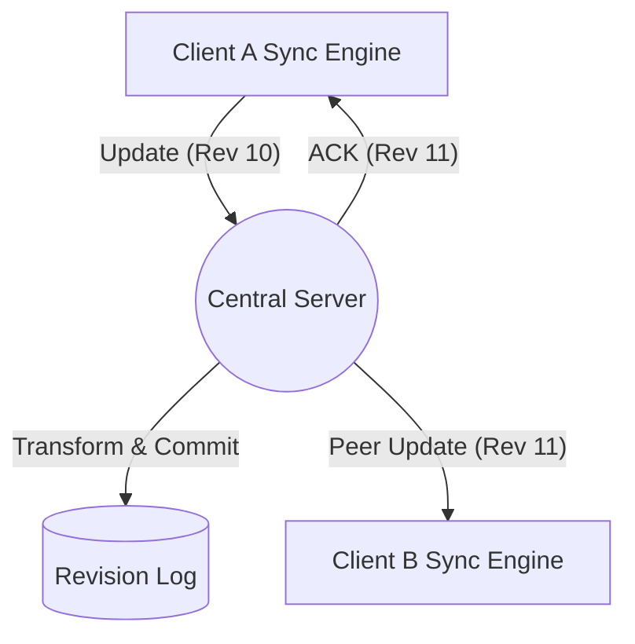

# System Design: Real-Time Collaborative Document Editor (e.g., Google Docs)

Designing a collaborative editor focuses on **real-time synchronization**, **concurrency control**, and **conflict resolution** across distributed clients.

---

## 1. Requirements Exploration

### Functional
- **Real-time Editing:** Multiple participants can view and edit the same document simultaneously.
- **Automatic Sync:** Peer updates are reflected near-instantly (< 500ms).
- **Conflict Resolution:** Concurrent edits to the same part must be resolved automatically.
- **Eventual Consistency:** All participants must eventually see the same document revision.
- **Presence:** View who is currently editing (cursors/avatars).

### Non-functional
- **Low Latency:** Responsive local editing (0ms latency for typing).
- **Scalability:** Support up to 100 concurrent editors per document.
- **Reliability:** No data loss even with network flakiness.

---

## 2. Rich Text Rendering (Frontend)
Most web-based editors use the `contenteditable` attribute, though some move to `<canvas>` for total control.

- **`contenteditable`:** Native browser support, easier to build, but behavior varies across browsers.
- **`<canvas>` (Advanced):** Renders everything manually. Provides pixel-perfect consistency (used by Google Docs since 2021) but requires re-implementing layout, selection, and cursors.
- **Model-View Architecture (MV*):** 
    - Maintain a **Tree-based Document Model**.
    - Map the model to DOM elements.
    - Translate user events (keypress/clicks) into **Operations** (Insert/Delete/Format).

---

## 3. Communication Architecture

### Network Model: Client-Server
A **centralized** model is preferred over P2P for document editing:
- **Source of Truth:** Server determines the official revision order.
- **Persistence:** Server handles saving to the database.
- **Simplified Sync:** New participants join by fetching the latest state from one reliable location.

### Transport: WebSockets
- **Bidirectional:** Server can push peer updates to clients immediately.
- **Low Latency:** Persistent connection avoids handshake overhead for every character typed.
- **Note:** SSE + HTTP is a viable alternative but WebSockets are standard for high-frequency interaction.

---

## 4. Concurrency & Conflict Resolution

### Optimistic Concurrency Control
Users make changes locally (0ms delay) and send **deltas** (changes) to the server. The server verifies the **document revision number** to detect conflicts.

### Conflict Resolution: OT vs. CRDT
| Feature | Operational Transformation (OT) | Conflict-free Replicated Data Types (CRDT) |
| :--- | :--- | :--- |
| **Concept** | Transforms operation offsets based on concurrent edits. | Data structures where ops are commutative/associative. |
| **Source of Truth** | Usually requires a central server to order ops. | Decentered; can work P2P or via Gossip protocol. |
| **Complexity** | High (math for transforms is complex). | Modern, but metadata-heavy (tombstones). |
| **Maturity** | Very mature (Google Docs, Etherpad). | Rising (Figma, Notion). |

**Chosen Approach: OT** (due to maturity and efficient storage).

---

## 5. The Collaboration Protocol (Sync Engine)

### The Buffer Strategy (Single In-Flight Request)
To avoid race conditions and out-of-order requests, the client uses a three-state buffer:
1.  **Sent Updates:** Operations currently being processed by the server (Max 1 request).
2.  **Local Updates Buffer:** Operations made locally while a request is "in-flight".
3.  **Acknowledged Log:** Operations confirmed by the server.

**Flow:**
- User types $\rightarrow$ Add to **Local Buffer**.
- If no request is "Sent" $\rightarrow$ Send Local Buffer to Server $\rightarrow$ Move to "Sent".
- On **ACK** $\rightarrow$ Move "Sent" to Log. If Local Buffer isn't empty, send it.

### Revision Logs & N-Way Sync
- The server stores the document as an **append-only Revision Log**.
- Every update includes the `base_revision_id`.
- If a client's `base_revision` is behind the server's current head, the server **transforms** the incoming operation against all intervening operations in its log before committing.

---

## 6. Data Model & APIs

### Document Model
Represented as a **Tree of Nodes**:
- **Element Nodes:** Root, Paragraph, Heading, Table.
- **Text Nodes:** Plain text + Formatting flags (bold, italic).

### Core API types
- **`INITIALIZE`:** Fetches the full document state + current revision number.
- **`UPDATE`:** Client sends array of operations + `base_revision`.
- **`ACK`:** Server confirms write and returns new `revision_id`.
- **`PEER_UPDATE`:** Server pushes transformed peer operations to other clients.
- **`SYNC`:** Sent to reconnecting clients to bridge the gap in missed revisions.

---

## 7. Deep Dives & Optimizations

### History & Versioning
- Since the server uses an append-only log, **Time Travel** is possible by replaying operations from Rev 0.
- **Version Snapshots:** Group granular operations by time/author to create meaningful history points.

### Undo/Redo
- In collaborative environments, undoing should only affect **your own changes**.
- **Implementation:** Append the **Inverse Operation** (e.g., `Undo Delete` $\rightarrow$ `Insert`) at the current head of the log, rather than deleting previous log entries.

### Reliability & Offline
- **Gaps:** Clients include their `last_seen_revision` in every request. The server uses this to send any missed operations.
- **Offline Editing:** Local changes accumulate in the buffer. Upon reconnection, the client sends all buffered changes as a single bulk update.

### Performance
- **Operation Coalescing:** Combine multiple sequential character insertions into a single `INSERT "string"` operation to reduce payload and log size.
- **Throttling:** Don't send every keystroke instantly; wait for a small idle (e.g., 200ms) or until the previous ACK returns.

---

## Summary Diagram

