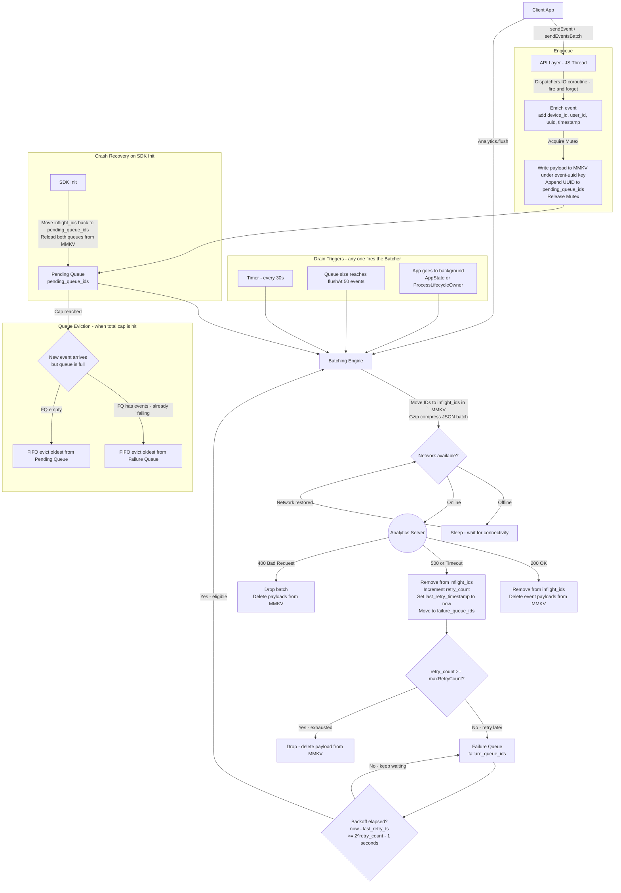

# System Design: Analytics SDK (React Native / Android)

An analytics SDK lets developers track user behavior in their app. The core challenge is collecting events **reliably** without draining the battery, hogging the network, or losing data when the app crashes or goes offline.

**Architecture framing:** The public API (TypeScript) runs on the JS thread and returns instantly. All heavy work — persisting events, batching, and sending — happens in a native background module (Kotlin on Android, Swift on iOS).

---

## 1. Requirements (R)

### Functional

- **Manual tracking:** Developers call `sendEvent()` explicitly. The SDK does not auto-collect lifecycle events.
- **Batching:** Events are grouped and sent together, not one-by-one, to reduce network calls.
- **Two queues:**
  - **Pending Queue** — new events waiting to be sent.
  - **Failure Queue** — events that failed to send and need to be retried.
- **Manual flush:** `Analytics.flush()` force-sends whatever is currently batched.
- **Auto-enrichment:** Every event automatically gets `device_id`, `user_id`, and `timestamp` added — the developer doesn't set these manually.

### Non-functional

- **No data loss:** Events survive app crashes and network drops (persisted to disk immediately).
- **Offline support:** Events queue up locally when there is no connection.
- **Performance:** Zero impact on the UI thread (60fps). Minimal battery and bandwidth usage.
- **Network resilience:** Retries with exponential backoff when the network is intermittent.

---

## 2. Architecture (A)

The SDK separates **collecting events** from **sending events**. The app can always write events instantly; the SDK handles delivery in the background.

### Components

1. **API Layer** — The JS interface the host app calls (`sendEvent`, `flush`, `identify`). It enriches events and immediately hands off to a background thread, so the caller never waits.
2. **Queue Manager** — The brain of the SDK. Owns the Pending Queue and Failure Queue, and decides what to send and when.
3. **Storage (MMKV)** — Persists all queue state to disk synchronously. Events are safe the moment they are written.
4. **Batching Engine** — Watches for a time or size trigger, then assembles a batch from the Pending Queue and any eligible Failure Queue events.
5. **Network Manager** — Sends batches, checks connectivity, and routes each response: success → delete, retryable failure → Failure Queue, non-retryable → drop.

---

## 3. Data Model (D)

### Event Schema

```json
{
  "event_id": "uuid-v4",
  "event_name": "checkout_completed",
  "timestamp": 1678886400000,
  "user_id": "usr_123",
  "device_id": "dev_abc",
  "retry_count": 0,
  "last_retry_timestamp": null,
  "properties": {
    "cart_value": 150.0,
    "currency": "USD"
  }
}
```

- `event_id` — unique UUID per event; used for server-side deduplication.
- `retry_count` — how many times this event has failed; drives the backoff delay and retry cap.
- `last_retry_timestamp` — epoch ms of the last failed attempt; used to check if the backoff window has elapsed before including the event in the next batch. `null` for new events.

### Storage Layout (MMKV)

MMKV is a key-value store that writes synchronously using memory-mapped files (`mmap`). It is much faster and crash-safer than AsyncStorage, which is async and can lose data if the app dies before the write completes.

| Key                 | Value                                                              |
| ------------------- | ------------------------------------------------------------------ |
| `pending_queue_ids` | Ordered list of UUIDs waiting to be sent                           |
| `failure_queue_ids` | Ordered list of UUIDs that failed and need retry                   |
| `inflight_ids`      | Set of UUIDs currently being transmitted (crash-protection marker) |
| `event_{uuid}`      | Full serialized JSON payload for that event                        |
| `user_id`           | Current identified user — persists across app restarts             |

**How the queues and payloads connect:** The queue lists (`pending_queue_ids`, `failure_queue_ids`, `inflight_ids`) only store UUIDs — they are lightweight index lists. The actual event payload is stored separately under `event_{uuid}`. When the Batching Engine drains the queue, it reads the IDs from `pending_queue_ids`, then fetches each payload by looking up `event_{uuid}` for every ID. This two-level design keeps the index lists small and fast to update, while payloads are only read when actually needed for transmission.

---

## 4. API (I)

```typescript
// One-time setup
Analytics.init({
  flushInterval: 30000, // send every 30 seconds
  flushAt: 50, // or when 50 events pile up
  maxQueueSize: 10000, // max events stored on device
  maxStorageSize: 10, // max MB used on disk across both queues
  maxRetryCount: 5, // drop event after 5 failures
});

// Set user identity — persisted to MMKV, auto-injected into every future event including after restarts
Analytics.identify("usr_123");

// Track a single event
Analytics.sendEvent("Item Added", { itemId: "sku_99", price: 9.99 });

// Track multiple events at once
Analytics.sendEventsBatch([
  { name: "App Opened", properties: { source: "push" } },
  { name: "Banner Clicked", properties: { bannerId: "b_12" } },
]);

// Force send immediately — called manually on critical flows (e.g. checkout)
// or auto-called by the SDK when the app goes to background
Analytics.flush();
```

---

## 5. Deep Dives (O)

### How Enqueue Works (Pending Queue)

`sendEventsBatch()` runs the same flow below for each event in the array, sequentially inside one coroutine. When `sendEvent()` is called:

1. Returns to the caller **instantly** — a background coroutine (`Dispatchers.IO`) does the actual work.
2. Event is enriched: `device_id`, `user_id`, `event_id` (UUID), `timestamp` are added.
3. A **Mutex** lock is acquired so only one coroutine writes to the queue at a time (no race conditions).
4. Event payload is written to MMKV under key `event_{uuid}` — crash-safe the moment this line completes.
5. The UUID is appended to `pending_queue_ids` in MMKV.
6. Lock is released.
7. If `pending_queue_ids.size >= flushAt` → trigger an immediate batch drain without waiting for the timer.

### How Batch Drain Works (Dequeue)

A drain is triggered by any one of these:

| Trigger        | Condition                                                                                          |
| -------------- | -------------------------------------------------------------------------------------------------- |
| Timer          | Every `flushInterval` (default 30s)                                                                |
| Size           | `pending_queue_ids` hits `flushAt` (default 50 events)                                             |
| Manual         | `Analytics.flush()` is called by the host app                                                      |
| App background | `AppState` (React Native) or `ProcessLifecycleOwner` (Android) detects the app going to background |

**Steps during a drain:**

1. Read up to `flushAt` (50) IDs from `pending_queue_ids` — these fill the batch first.
2. If the batch has remaining slots (e.g. only 30 pending events), fill the rest with eligible IDs from `failure_queue_ids` — only those where `now - last_retry_timestamp >= backoff_delay(retry_count)`.
3. Move all selected IDs to `inflight_ids` in MMKV — **do not delete yet**. If the app crashes mid-send, these IDs are recovered on the next init.
4. Gzip-compress the JSON batch and HTTP POST to the server.

### Server Response Routing

| Response            | What happens                                                                                                                 |
| ------------------- | ---------------------------------------------------------------------------------------------------------------------------- |
| **200 OK**          | Remove IDs from `inflight_ids`. Delete payloads from MMKV. Done.                                                             |
| **500 / Timeout**   | Remove IDs from `inflight_ids`. Increment `retry_count`, record `last_retry_timestamp = now()`. Move to `failure_queue_ids`. |
| **400 Bad Request** | Drop the batch — delete payloads from MMKV.                                                                                  |

### Failure Queue & Retry Logic

Events in the Failure Queue are retried with **exponential backoff + jitter**:

| retry_count | Wait before retry    |
| ----------- | -------------------- |
| 1           | ~1s                  |
| 2           | ~3s                  |
| 3           | ~7s                  |
| 4           | ~15s                 |
| 5+          | capped at ~5 minutes |

Formula: `wait = (2^retry_count - 1) seconds` + random jitter.

**Why jitter?** Without it, millions of devices that went offline at the same time would all retry simultaneously when connectivity is restored, spiking the server. Adding random milliseconds spreads the load out — this is called solving the "thundering herd" problem.

On each drain cycle, an event in the Failure Queue is only included if:

```
now - last_retry_timestamp >= backoff_delay(retry_count)
```

If `retry_count >= maxRetryCount` (default 5), the event is **permanently dropped** and deleted from MMKV.

### When Are Events Permanently Removed?

| Condition                      | Action                                                         |
| ------------------------------ | -------------------------------------------------------------- |
| 200 OK                         | Delete from MMKV                                               |
| `retry_count >= maxRetryCount` | Drop — delete from MMKV                                        |
| 400 / non-retryable 4xx        | Drop — delete from MMKV                                        |
| Queue full (eviction)          | FIFO evict oldest from Failure Queue first, then Pending Queue |

### Queue Size Limits & Eviction

- Total cap: `maxQueueSize` (10,000 events) and `maxStorageSize` (10MB), applied across both queues.
- Recommended split: ~70% Pending, ~30% Failure — fresh events are more valuable than already-failing ones.
- When the cap is hit and a new event arrives:
  1. Drop the **oldest from the Failure Queue first** — already failed at least once, least time-sensitive.
  2. If the Failure Queue is empty, drop the oldest from the Pending Queue.

### Why MMKV Over AsyncStorage

React Native's default `AsyncStorage` writes asynchronously. If the app crashes between `sendEvent()` returning and the async write completing, the event is lost.

**MMKV** uses memory-mapped files (`mmap`) — the OS flushes data from memory to disk without a separate async step. Once the write call returns, the data is on disk even if the process dies 1ms later.

### Crash Recovery

On SDK init, the Queue Manager does two things before anything else:

1. Reads `inflight_ids` — any events that were mid-flight when the crash happened get moved back to `pending_queue_ids`. They were never confirmed delivered, so they must be retried.
2. Reloads `pending_queue_ids` and `failure_queue_ids` from MMKV to restore both queues to their pre-crash state.

### Concurrency (Thread Safety)

**Problem:** Multiple `sendEvent()` calls can arrive simultaneously and race to write to the same queue lists.

**Solution:** A **Mutex** (coroutine-friendly lock). Unlike a regular `synchronized` block that freezes the entire OS thread, a Kotlin `Mutex` just _suspends_ the current coroutine until the lock is free — the thread stays available for other work. This prevents race conditions without starving the thread pool.

### Server-Side Deduplication

If a batch is delivered successfully but the server's `200 OK` response is lost in transit, the client retries and sends the same events again. The server uses `event_id` as an **idempotency key** — any duplicate `event_id` seen within a 24-hour window is silently discarded. This gives **at-least-once delivery** with effectively **exactly-once semantics**.

### Payload Compression

Batch payloads are **gzip-compressed** before sending (`Content-Encoding: gzip` header). Analytics JSON compresses by ~60–70%, cutting bandwidth usage significantly — directly satisfying the efficiency non-functional requirement.

---

## Summary Diagram


