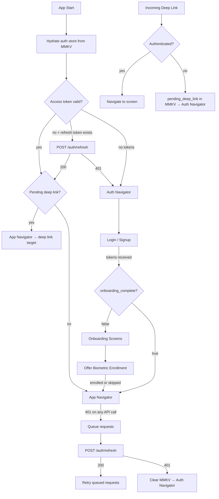

# System Design: Authentication + Onboarding (React Native / Mobile)

A root navigator acts as a state machine — it reads auth state on startup and switches between the Auth stack and the App stack. All token I/O goes through `@rideshare/auth`; no feature screen ever touches tokens directly.



---

## 1. Requirements (R)

### Functional

- **Login / Signup:** Email + password. Server returns access token + refresh token.
- **Session persistence:** Tokens stored in MMKV. Returning users skip login on next launch.
- **Silent token refresh:** Expired access token is swapped for a new one using the refresh token — user never sees a login screen unless the refresh token itself is invalid.
- **Onboarding:** First-time users see intro screens after signup. Completion is persisted so it shows only once.
- **Biometrics:** FaceID / TouchID unlock after onboarding. Re-prompts when app returns from background after N minutes.
- **Deep links:** Incoming URLs route to a specific screen. If unauthenticated, the link is held and resolved after login.
- **Logout:** Clears local tokens, switches to Auth stack. Tells server to invalidate the token on best-effort.
- **Social login (OAuth):** Login with Google / Apple. Server exchanges the OAuth token for its own access + refresh token pair — same storage and refresh flow as email/password from that point on.

### Non-functional

- **No token access outside `@rideshare/auth`:** Feature packages call `useSession()` only. Enforced by Nx module boundaries.
- **Thread-safe refresh:** Concurrent 401s queue behind a single refresh call — no duplicate refresh requests.
- **Crash-safe storage:** MMKV writes survive process death (memory-mapped files, not async).

---

## 2. Architecture (A)

### Root Navigator — State Machine

```typescript
// apps/consumer/src/RootNavigator.tsx
// Top-level navigator mounted once in App.tsx — switches between Auth and App stacks
export function RootNavigator() {
  const status = useAuthStore((s) => s.status); // "loading" | "authenticated" | "unauthenticated"

  if (status === "loading") return <SplashScreen />;
  return (
    <NavigationContainer linking={linkingConfig}>
      {/* AuthNavigator: Welcome → Login/Signup → Onboarding */}
      {/* AppNavigator:  all feature screens (Checkout, Orders, etc.) */}
      {status === "authenticated" ? <AppNavigator /> : <AuthNavigator />}
    </NavigationContainer>
  );
}
```

When `status` changes (login, logout, session expiry), React Navigation unmounts one stack and mounts the other. No per-screen auth guards needed.

Onboarding lives inside `AuthNavigator` — after tokens are stored, if `onboarding_complete = false`, the auth stack renders onboarding before switching the root to `AppNavigator`.

### Folder Structure (inside `packages/core/auth/`)

```
src/
├── store/authStore.ts          # Zustand — status, userId; hydrated from MMKV on init
├── navigation/AuthNavigator.tsx
├── screens/                    # Login, Signup, Welcome
├── onboarding/                 # Onboarding steps + BiometricEnrollScreen
├── tokens/
│   ├── TokenStorage.ts         # MMKV read/write (private — not exported)
│   └── TokenRefresher.ts       # Singleton refresh + request queue
├── biometrics/BiometricService.ts
├── linking/LinkingHandler.ts
└── interceptors/axiosInterceptor.ts
```

---

## 3. Data Model (D)

### MMKV Storage

| Key                   | Value                                                                                                                           |
| --------------------- | ------------------------------------------------------------------------------------------------------------------------------- |
| `access_token`        | JWT string                                                                                                                      |
| `refresh_token`       | Opaque long-lived token                                                                                                         |
| `access_token_exp`    | Epoch ms expiry — parsed from `exp` claim inside the JWT on store; checked client-side before each request to skip obvious 401s |
| `user_id`             | Persisted user ID — survives logout for analytics                                                                               |
| `device_id`           | Stable UUID generated once on first install                                                                                     |
| `biometric_enabled`   | `"true"` / `"false"`                                                                                                            |
| `onboarding_complete` | `"true"` / `"false"`                                                                                                            |
| `pending_deep_link`   | URL held while unauthenticated; cleared after resolution                                                                        |
| `last_active_ts`      | Epoch ms of last foreground — drives biometric re-auth gate                                                                     |

---

## 4. API (I)

### Public surface of `@rideshare/auth`

```typescript
Auth.init(); // call in App.tsx before navigator mounts
Auth.attachInterceptor(axiosInstance); // wires token attach + 401 handling
Auth.logout(); // clear tokens, switch to auth stack
Auth.requireBiometric(); // returns Promise<boolean> — use before sensitive screens

const { userId, isAuthenticated } = useSession(); // only hook feature packages import
```

### Server Endpoints

```
POST /auth/login    { email, password, device_id }  → { access_token, refresh_token, user_id }
POST /auth/signup   { email, password, name, device_id } → same shape
POST /auth/refresh  { refresh_token }               → { access_token, refresh_token }
POST /auth/logout   { refresh_token }               → best-effort, fire-and-forget

// On receiving access_token, parse exp from JWT payload and store it:
// access_token_exp = base64Decode(access_token.split('.')[1]).exp * 1000  (convert s → ms)
```

---

## 5. Deep Dives (O)

### When Is Refresh Called?

1. **App launch** — MMKV has a refresh token but the access token is expired (user opens the app after 15+ min). Auth store calls refresh silently before showing the App Navigator.
2. **Mid-session 401** — access token expires while the app is open and an API call gets a 401 back. The axios interceptor catches it, calls refresh, then retries the original request.

The client-side pre-check (`Date.now() < exp - 10_000`) avoids most 401s — the token is refreshed proactively before making the request. A 401 still happens if the token expired in the tiny gap between that check and the server receiving the request.

### Silent Refresh with Request Queuing

Two API calls fire simultaneously, both get 401, both try to refresh → race condition, one refresh wins and the other fails because refresh tokens are single-use.

**Fix — singleton promise:**

```typescript
let refreshPromise: Promise<string> | null = null;

export async function getValidAccessToken(): Promise<string> {
  const token = TokenStorage.getAccessToken();
  const exp = TokenStorage.getAccessTokenExpiry();

  if (token && Date.now() < exp - 10_000) return token; // still valid

  if (!refreshPromise) {
    refreshPromise = doRefresh().finally(() => {
      refreshPromise = null;
    });
  }
  return refreshPromise; // all concurrent callers await the same promise
}
```

All concurrent 401 handlers attach to the same `refreshPromise`. One HTTP call goes out; everyone retries with the new token.

### Biometric Re-auth

**Enrollment (end of onboarding):**

1. `BiometricService.isAvailable()` — checks OS-level biometric enrollment.
2. OS dialog prompts for confirmation. On success, write `biometric_enabled = true` to MMKV.

**Re-auth trigger:** `last_active_ts` is written to MMKV every time the app goes to background (`AppState` change event). When the app foregrounds and `now - last_active_ts > N minutes`, the root navigator renders a `BiometricLockScreen` overlay on top of `AppNavigator`. Dismissed only on successful biometric or PIN.

**Fallback chain:** Biometric → PIN/Password → 5 wrong attempts → force logout.

### Deep Link Routing

**Authenticated:** `NavigationContainer`'s `linking` config handles it automatically.

**Unauthenticated:** `LinkingHandler` intercepts the URL before navigation, writes it to `pending_deep_link` in MMKV, and returns `null` so the auth stack renders normally. After login:

```typescript
function onAuthSuccess() {
  const pending = TokenStorage.getPendingDeepLink();
  if (pending) {
    TokenStorage.clearPendingDeepLink();
    requestAnimationFrame(() => navigate(pending));
  }
}
```

Register both a URI scheme (`rideshare://`) and Universal Links (`https://rideshare.app/`). Universal Links are verified by Apple/Google (can't be hijacked by another app); URI schemes are the fallback for testing and QR codes.

### Token Expiry Strategy

- **Access token: 15 minutes** — limits blast radius of a stolen token.
- **Refresh token: 30 days, single-use rotating** — each refresh issues a new refresh token and invalidates the old one. If an attacker uses a stolen refresh token first, the real user's next refresh gets 401 → forced logout + optional email alert.
- **Client-side pre-check:** Compare `Date.now()` to `access_token_exp - 10s` before every request. Skips the 401 round-trip for obviously stale tokens (e.g. after 30-min background).
