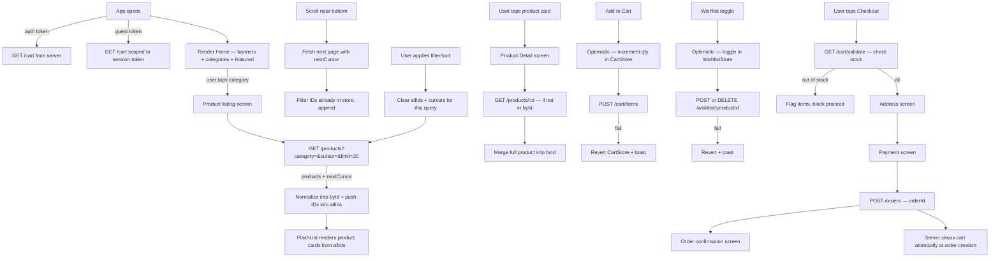
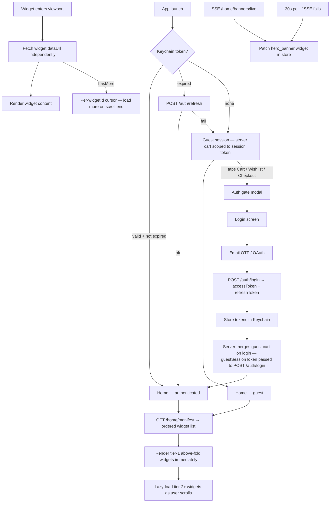
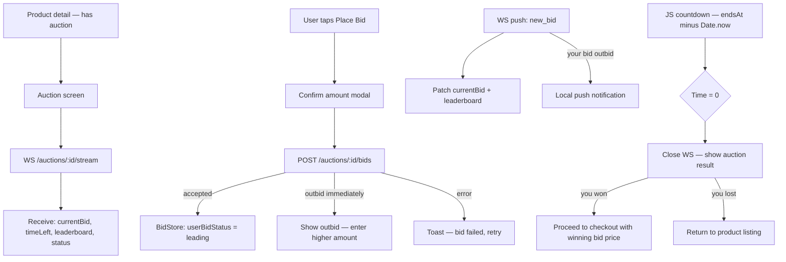

# System Design: E-Commerce App (React Native / Android)

**Core idea:** Product catalog is fetched with cursor-based pagination and rendered via FlashList. Products are stored in a normalized `allIds + byId` map so a price update never re-renders every card. Cart is server-maintained and tied to the user's account (or a guest session token) — it works across devices and survives app kills without any local storage. Cart mutations are optimistic on the client but the server response is always applied back, and prices/limits are never trusted from the client. Add-to-cart and wishlist are optimistic. Images carry `width`/`height` so aspect ratio is set before the first byte arrives. Auth is JWT-based with Keychain storage; guest sessions use a UUID session token (in MMKV) to scope the server-side cart, which merges into the account on login. The home screen is server-driven: a single `/home/manifest` call returns an ordered widget list; each widget fetches its own data independently so above-fold content renders in under 1 s while below-fold widgets lazy-load on scroll. Auction products stream real-time bid state over WebSocket. Promotional banners update via SSE with a 30-second polling fallback.







---

## 1. Requirements (R)

### Functional

- **Home screen:** Promotional banners, category chips, featured / trending products.
- **Product listing:** Browse by category; filter by price range, brand, rating; sort by price/popularity/newest.
- **Infinite scroll:** Load more products as user scrolls — no full reload.
- **Product detail:** Images carousel, description, variants (size/color), seller info, reviews, stock status.
- **Add to cart:** Instant feedback; cart badge updates immediately.
- **Wishlist:** Save products; persisted across sessions.
- **Cart:** View items, update quantity, remove, see subtotal; cart is server-maintained and works across devices and sessions.
- **Checkout:** Enter/select address, choose shipping, select payment method, place order.
- **Order confirmation + history:** Confirmation screen after order, list of past orders.
- **Search:** Fuzzy product search with suggestions (debounced, see SearchWithAutocomplete design).
- **Offline browse:** Recently viewed products readable from MMKV without connection; cart mutations are disabled offline and retried on reconnect.
- **Guest browsing:** Full product catalog accessible without login; cart is scoped on the server to a UUID session token stored in MMKV; recently-viewed stored locally in MMKV.
- **Authentication:** Email + OTP and Google/Apple OAuth; JWT access + refresh token pair stored in Keychain/Keystore.
- **Guest → auth migration:** Cart and wishlist items preserved when a guest logs in — merged server-side.
- **Home widget feed:** 30+ heterogeneous widgets (hero banners, category strips, recommendation rows, flash-sale countdowns, order history strip, sponsored banners) — layout and order driven by the server.
- **Per-widget pagination:** Each widget section independently loads more items with its own cursor; a "load more" at the end of a carousel or section does not affect other widgets.
- **Recommendation section:** Personalized product rows; cold-start guests see popularity-based fallback.
- **Order history strip:** Last 10 orders shown as a home widget; tapping opens full order detail.
- **Live banners:** Hero banners update in near-real-time (< 5 s latency) for flash sales and promotions without requiring the user to pull-to-refresh.
- **Bidding / auction products:** Real-time current bid price, countdown timer, leaderboard; outbid push notification; winning user proceeds to checkout at locked-in bid price.

### Non-functional

- **Product grid renders at 60 fps** on mid-range Android.
- **Cart never lost** — lives on the server tied to user account or session token; survives process kill, crash, and reinstall without local storage.
- **Images never cause layout shift** — aspect ratio known before first byte.
- **No duplicate products** regardless of how pages overlap at cursor boundaries.
- **Stale-while-revalidate** — show cached listing instantly, refresh in background.
- **Inventory validated before checkout** — user never gets stuck at payment because of a stale stock count.
- **Above-fold widgets render in < 1 s** — only tier-1 widgets block initial render; all others lazy-load.
- **Auth tokens never in AsyncStorage** — Keychain (iOS) / Keystore (Android) only; tokens are not readable by other apps.
- **Bid placement is not optimistic** — server confirmation required; no false "you're winning" state shown before the API response.
- **Banner update latency < 5 s** — SSE push preferred; 30 s polling as fallback when SSE is unavailable.
- **Widget layout is server-controlled** — A/B tests, promotions, and new widget types ship without a client release.

---

## 2. Architecture (A)

| Component                          | What it does                                                                                                                                      |
| ---------------------------------- | ------------------------------------------------------------------------------------------------------------------------------------------------- |
| **ProductStore (Zustand)**         | Normalized `allIds + byId` map. All listing screens read from here                                                                                |
| **PaginationManager**              | Per-(category+filter+sort) slice: tracks `nextCursor`, `hasMore`, `isFetching`                                                                    |
| **CartStore (Zustand)**            | In-memory mirror of the server cart; mutations are optimistic and reconciled from server responses; prices and limits always come from the server |
| **WishlistStore (Zustand + MMKV)** | Set of wishlisted product IDs; persisted across restarts                                                                                          |
| **ImagePrefetchQueue**             | Prefetches images for the next page while user reads the current one                                                                              |
| **CheckoutStateMachine**           | Manages multi-step checkout: address → shipping → payment → confirmation                                                                          |
| **OptimisticLayer**                | Applies cart/wishlist mutations instantly; reverts on API failure                                                                                 |
| **MMKV Persistence**               | Wishlist, recently viewed, guest session token — survives app kill; 10× faster than AsyncStorage                                                  |
| **AuthStore (Zustand)**            | Tracks userId, role (guest / user), token expiry; tokens stored in Keychain not MMKV                                                              |
| **HomeManifestStore**              | Ordered array of widget descriptors from `/home/manifest`; drives home screen layout                                                              |
| **WidgetDataStore**                | Per-widgetId items + cursor; all product widgets share the global `byId` map to avoid duplication                                                 |
| **BannerSSEClient**                | SSE connection to `/home/banners/live`; reconnects with exponential backoff; falls back to 30s polling                                            |
| **BidStore (Zustand)**             | Per-auction: currentBid, timeLeft, leaderboard, userBidStatus; fed by WebSocket events                                                            |
| **AuctionSocketManager**           | One WS connection per open auction screen; reconnects on drop; closes on screen unmount                                                           |

---

## 3. Data Model (D)

### Product (normalized in-memory + MMKV for recently viewed)

```json
{
  "id": "prod_nike_air_001",
  "title": "Nike Air Max 270",
  "brand": "Nike",
  "categoryId": "cat_shoes",
  "price": 129.99,
  "originalPrice": 159.99,
  "discountPct": 19,
  "rating": 4.6,
  "reviewCount": 2840,
  "images": [
    {
      "url": "https://cdn.shop.com/products/nike_270_1.jpg",
      "width": 800,
      "height": 800
    },
    {
      "url": "https://cdn.shop.com/products/nike_270_2.jpg",
      "width": 800,
      "height": 800
    }
  ],
  "variants": [
    { "id": "var_001_8", "label": "Size 8", "inStock": true },
    { "id": "var_001_9", "label": "Size 9", "inStock": false }
  ],
  "inStock": true,
  "tags": ["running", "lifestyle"]
}
```

- `images[].width` + `images[].height` — client sets `aspectRatio` before image loads → zero layout shift.
- `variants` on the list card can be omitted (lighter payload); fetched in full on product detail.

### ProductStore shape

```typescript
type ProductStore = {
  allIds: string[]; // ordered IDs for current query
  byId: Record<string, Product>; // O(1) lookup
  paginationByQuery: Record<
    string,
    {
      // key = "cat_shoes|sort=price|minPrice=50"
      nextCursor: string | null;
      hasMore: boolean;
      isFetching: boolean;
    }
  >;
};
```

### Cart item (server-sourced, mirrored in Zustand)

```json
{
  "productId": "prod_nike_air_001",
  "variantId": "var_001_8",
  "qty": 2,
  "priceAtAdd": 129.99,
  "title": "Nike Air Max 270",
  "imageUrl": "https://cdn.shop.com/products/nike_270_1.jpg"
}
```

- `priceAtAdd` — server sets this at add time; shown as "price changed" warning if `/cart/validate` returns a different current price.
- `title` + `imageUrl` — cart renders without joining back to ProductStore.
- All prices and `maxQuantity` values come from the server response — the client never computes or trusts local copies.

### User / Session

```json
{
  "userId": "usr_abc123",
  "email": "user@example.com",
  "displayName": "Shubham",
  "avatarUrl": "https://cdn.shop.com/avatars/abc123.jpg",
  "role": "user"
}
```

**Keychain keys** (never AsyncStorage — OS-level encrypted storage):

| Key             | Value                                                   |
| --------------- | ------------------------------------------------------- |
| `access_token`  | JWT, 15-min TTL — sent as `Authorization: Bearer`       |
| `refresh_token` | Opaque token, 30-day TTL — sent only to `/auth/refresh` |
| `user_id`       | Plain string — fast hydration before token decode       |

**Guest session:** `userId` is null; `role = "guest"`. A UUID `guest_session_token` is generated on first launch and stored in MMKV; it is sent as `X-Session-Token` on every request so the server can scope the guest's cart. On login, the server merges the guest cart into the account cart — the client deletes the MMKV token and starts using the auth token exclusively.

---

### Widget Manifest Entry

```json
{
  "widgetId": "wgt_hero_banner",
  "type": "hero_banner",
  "priority": "above_fold",
  "dataUrl": "/home/widgets/wgt_hero_banner",
  "config": { "autoPlay": true, "intervalMs": 4000 },
  "liveUpdates": true
}
```

- `priority`: `"above_fold"` (fetch on mount) | `"below_fold"` (fetch on viewport entry).
- `liveUpdates: true` — client opens SSE for this widget; banner patches arrive without polling.
- `config` — widget-type-specific display config. Changing it server-side reshapes the UI without a release.

**Supported widget types:**

| type                   | Description                                                    |
| ---------------------- | -------------------------------------------------------------- |
| `hero_banner`          | Full-width rotating promotional banners                        |
| `category_strip`       | Horizontal scrollable category chips                           |
| `product_carousel`     | Horizontal product row (recommendations, trending, flash sale) |
| `flash_sale_countdown` | Countdown + product grid for a timed sale                      |
| `order_history_strip`  | Last N orders as compact cards                                 |
| `search_bar`           | Pinned search widget                                           |
| `referral_banner`      | Single CTA banner                                              |
| `sponsored_row`        | Advertiser-funded product row                                  |

---

### Widget Data Envelope

```json
{
  "widgetId": "wgt_recommendations",
  "items": [{ "productId": "prod_001" }, { "productId": "prod_002" }],
  "nextCursor": "cursor_xyz",
  "hasMore": true,
  "ttlMs": 300000
}
```

- `items` for product widgets contain only `productId`; full product objects are merged into the shared `byId` map.
- `ttlMs` — client caches widget data for this duration before re-fetching on scroll-in.

**WidgetDataStore shape:**

```typescript
type WidgetDataStore = {
  widgets: Record<
    string,
    {
      // key = widgetId
      status: "idle" | "loading" | "ready" | "error";
      itemIds: string[]; // ordered IDs (product or order)
      nextCursor: string | null;
      hasMore: boolean;
      fetchedAt: number; // ms — for TTL check
    }
  >;
};
```

---

### Auction / Bid

```json
{
  "auctionId": "auc_watch_001",
  "productId": "prod_watch_001",
  "currentBid": 250.0,
  "minNextBid": 260.0,
  "reservePrice": 200.0,
  "reserveMet": true,
  "endsAt": "2026-04-25T18:00:00Z",
  "status": "active",
  "totalBids": 18,
  "userBidStatus": "outbid",
  "userHighBid": 240.0
}
```

- `minNextBid` — minimum the user must enter; enforced client-side for UX, server-side for integrity.
- `reserveMet` — if false, show "Reserve not met" warning; winner still pays their bid but seller can refuse.
- `userBidStatus`: `"none"` | `"leading"` | `"outbid"` | `"won"` | `"lost"`.

**BidStore shape (Zustand):**

```typescript
type BidStore = {
  byAuctionId: Record<string, AuctionState>;
};
type AuctionState = {
  auctionId: string;
  currentBid: number;
  minNextBid: number;
  endsAt: string;
  status: "active" | "ending_soon" | "closed";
  userBidStatus: "none" | "leading" | "outbid" | "won" | "lost";
  leaderboard: { userId: string; amount: number; placedAt: string }[];
  wsStatus: "connecting" | "open" | "reconnecting" | "closed";
};
```

---

### MMKV keys

| Key                        | Value                                                                                                       |
| -------------------------- | ----------------------------------------------------------------------------------------------------------- |
| `guest_session_token`      | UUID generated on first launch; sent as `X-Session-Token` to scope server-side guest cart; deleted on login |
| `pending_payment_order_id` | Order ID saved just before the payment sheet — used to recover navigation if app crashes mid-payment        |
| `wishlist_ids`             | JSON set of product IDs                                                                                     |
| `recently_viewed`          | JSON array of up to 30 product IDs, newest first                                                            |
| `home_cache`               | JSON snapshot of banners + featured products                                                                |
| `home_last_synced`         | Unix ms — TTL check on open                                                                                 |
| `guest_wishlist`           | JSON set of product IDs for unauthenticated session                                                         |

---

## 4. API (I)

```
# Auth
POST /auth/login              { email }                 → { message: "OTP sent" }
POST /auth/otp/verify         { email, otp }            → { accessToken, refreshToken, user }
POST /auth/oauth              { provider, idToken }     → { accessToken, refreshToken, user }
POST /auth/refresh            { refreshToken }          → { accessToken }
POST /auth/logout             {}                        → 200
POST /auth/login              { ...credentials, guestSessionToken? }
                              → if guestSessionToken provided, server merges guest cart into account cart

# Products
GET  /products?category=cat_shoes&sort=price_asc&minPrice=50&maxPrice=200&cursor=<c>&limit=20
       → { products[], nextCursor, total }

GET  /products/:id                            → full product with all variants + reviews summary
GET  /products?ids=id1,id2,id3               → { products[] } — batch fetch for recently viewed
GET  /categories                              → { categories[] } — cached, rarely changes

# Home (server-driven)
GET  /home/manifest                           → { widgets[] }  — ordered widget descriptors
GET  /home/widgets/:widgetId?cursor=&limit=   → { items[], nextCursor, hasMore, ttlMs }
GET  /home/banners/live                       → SSE stream — banner_updated events
                                              — event: { widgetId, banners[], expiresAt }

# Cart  (server is source of truth; X-Session-Token scopes guest carts)
GET  /cart                                              → { items[], totalAmount }
POST /cart/items        { productId, variantId, qty }   → { items[] }  — also sends silent cart_updated push to other sessions
PATCH /cart/items/:id   { qty }                         → { items[] }  — also sends silent cart_updated push to other sessions
DELETE /cart/items/:id                                  → { items[] }  — also sends silent cart_updated push to other sessions
POST /cart/validate                                     → { valid, issues: [{ productId, issue }] }
                                                           (no payload — server reads its own cart; validates stock, limits, prices)

# Wishlist
POST /wishlist/:productId   → { wishlisted: true }
DELETE /wishlist/:productId → { wishlisted: false }

# Orders
POST /orders            { cartId, addressId, shippingMethodId, paymentMethodId }
       → { orderId, estimatedDelivery }

GET  /orders            → { orders[] }           — order history
GET  /orders/:id        → { order, trackingUrl } — order detail

# Auctions
GET  /auctions/:id                            → { auction, product }
POST /auctions/:id/bids  { amount }           → { bid, status: 'accepted' | 'outbid', currentBid, minNextBid }
GET  /auctions/:id/bids                       → { bids[], leaderboard[] }
WS   /auctions/:id/stream                     → real-time events:
                                                  new_bid: { currentBid, totalBids, minNextBid }
                                                  outbid:  { yourBid, currentBid }
                                                  ending_soon: { secondsLeft }
                                                  closed:  { winnerId, finalPrice, status }
```

---

## 5. Deep Dives (O)

### Why Cursor Pagination — Not Offset

Product listings look tempting for offset (`?page=3&pageSize=20`) because it supports jump-to-page. But offset has two critical failure modes in a live catalog:

|                                 | Cursor                                            | Offset                                                                              |
| ------------------------------- | ------------------------------------------------- | ----------------------------------------------------------------------------------- |
| **Consistency while scrolling** | Stable — new products added don't shift pages     | Drifts — a new product on page 1 pushes everything down by 1 → user sees duplicates |
| **DB performance**              | `WHERE id < :cursor LIMIT 20` → single index seek | `OFFSET 200 LIMIT 20` → DB scans 220 rows, discards 200                             |
| **Deep scroll**                 | O(1) always                                       | Gets slow past page 50+ on large catalogs                                           |
| **Filter + sort combo**         | Cursor encodes sort key + id → stable             | Breaks badly when sort key isn't unique                                             |
| **Jump-to-page**                | Not possible                                      | Easy, but rarely needed in mobile browse                                            |

Use offset only for admin dashboards where jump-to-page 50 matters. For all consumer-facing mobile lists: cursor.

**Cursor implementation detail:** For price-sorted results the cursor is a composite `(price, id)` not just `id`, because price isn't unique:

```
Server: WHERE (price, id) > (:cursorPrice, :cursorId) ORDER BY price ASC, id ASC LIMIT 20
```

The server encodes this as an opaque base64 string — the client never needs to understand it.

---

### Normalized Store — allIds + byId

Storing products as an array means patching one product's stock status recreates the whole array → every `ProductCard` in the list re-renders.

Storing products as an array means one price update recreates the whole array and re-renders every card. With `byId`, `patchProduct(id, patch)` writes a new reference only for that product — all other cards stay stable. FlashList receives only `allIds`; each `ProductCard` subscribes to `useProductStore(s => s.byId[productId])` so only that one card re-renders.

**Multiple listing screens share the same `byId` map.** The "Shoes" listing, the search results listing, and the wishlist listing all write into one shared `byId`. No duplication, and a wishlist toggle on one screen is instantly reflected everywhere.

---

### FlashList — 60 fps Product Grid

Use **FlashList** (Shopify) over FlatList. Key props for a 2-column product grid:

- `data={allIds}` — only IDs, so a stock-status change on one product doesn't re-render the list.
- `getItemType` returning `'product'` or `'sponsored'` — FlashList recycles views by type, eliminating layout thrash.
- `estimatedItemSize={260}` — measure with `onLayout` in dev and hardcode; wrong value causes scroll jumps.
- `onEndReachedThreshold={0.4}` — prefetch next page when 40% from bottom.
- `viewabilityConfig={{ itemVisiblePercentThreshold: 50 }}` — only count a card as viewed when half on screen.

**FlashList v2 (2025):** Self-corrects `estimatedItemSize` after first render; `getItemType` not needed for uniform lists. Drop-in upgrade.

---

### Cursor Load-Next-Page — No Duplicates

```
loadNextPage (per query key):
  queryKey = buildKey(category, sort, filters)  // "cat_shoes|price_asc|50-200"
  pagination = store.paginationByQuery[queryKey]
  if !pagination.hasMore || pagination.isFetching → return

  mark isFetching = true
  fetch GET /products?...&cursor=pagination.nextCursor&limit=20

  existingSet = new Set(store.allIds)            // O(1) dedup guard
  fresh = products.filter(p => !existingSet.has(p.id))

  merge fresh products into byId
  append fresh IDs to allIds
  save nextCursor; if products.length < 20 → hasMore = false
  mark isFetching = false
```

The dedup guard matters: at a high-traffic catalog, a product added between page 1 and page 2 can appear on both pages. Filter-before-append prevents the duplicate card from ever rendering.

---

### Filter + Sort = New Query Key, Reset Pagination

Applying a filter or changing sort order is a new query — not a continuation of the previous one. On filter change: clear `allIds` and reset the cursor for the new `queryKey`, then fetch the first page. Products already in `byId` from a prior query stay in place — if they reappear in the new result, the dedup guard skips the network fetch and uses the cached object.

---

### Cart — Server-Maintained with Optimistic UI

The cart lives on the server. `CartStore` (Zustand) is purely a client-side mirror — it is never the source of truth, only a snapshot for rendering. Prices, stock, and `maxQuantity` always come from the server response.

**Mutations — optimistic then reconcile:**

```
addToCart(productId, variantId, qty):
  snapshot = CartStore.applyOptimistic({ productId, variantId, qty, op: 'add' })
  try:
    { items } = POST /cart/items { productId, variantId, qty }
    CartStore.set(items)         // server response overwrites — price/qty may differ
  catch:
    CartStore.revert(snapshot)
    Toast.show("Couldn't add to cart")

updateQty(productId, qty):
  snapshot = CartStore.applyOptimistic({ productId, qty, op: 'update' })
  try:
    { items } = PATCH /cart/items/:productId { qty }
    CartStore.set(items)
  catch 404:
    // Item removed by another device — don't revert, just refresh
    { items } = GET /cart
    CartStore.set(items)
```

Cart badge reads `CartStore.totalQty` — updates instantly without an API round-trip.

**Rapid tapping / concurrent mutations:** Debounce quantity changes by 300 ms so only one `PATCH` fires per burst. The final server response always overwrites intermediate optimistic state.

**Guest session token:** Generated once on first launch, stored in MMKV, sent as `X-Session-Token` on every request. The server scopes the cart to this token. On login, pass the token to `POST /auth/login`; the server merges the guest cart into the account cart additively (quantities summed, capped at `maxQuantity`). Client deletes the token from MMKV — auth token takes over.

**Cart on app open:** `GET /cart` is called on every app launch and on every `AppState` transition to `active`. This is the primary sync mechanism — no local cart to hydrate, no async gap.

---

### Cart Multi-Device Sync

Because the cart lives on the server, two devices on the same account always see the same cart. Keeping them in sync uses two mechanisms:

**Foreground refetch (primary):** On `AppState change → active`, call `GET /cart` and set `CartStore`. Covers the common case: user adds something on phone, opens tablet — tablet's first foreground event refreshes the cart.

**Silent push (fast path):** After any cart mutation, the server sends a `cart_updated` silent push to all other active sessions of the same user. The receiving device calls `GET /cart` immediately. Push can be missed (backgrounded, network gap) — the foreground refetch is the reliable safety net.

**Conflict resolution — server wins:** There is no merge on the client. If device A removes an item while device B is about to increment it, device B's `PATCH` returns 404; the catch block calls `GET /cart` and reconciles from the authoritative response. No special conflict logic needed.

**Cart cleared at order creation:** `POST /orders` atomically reads the server cart, creates the order, and clears the cart in one DB transaction. A double-tap or retry finds an empty cart and returns `CART_EMPTY` — no duplicate order, no duplicate charge. Client-side idempotency keys are not needed.

---

### Inventory Validation Before Checkout

Stock shown on the product card is a cached snapshot. Before entering payment, validate with the server:

```
tap "Proceed to Checkout":
  GET /cart/validate
  if outOfStockIds.length > 0:
    flag those rows in CartStore (show "Out of Stock" badge)
    block "Proceed" button
    show banner "Some items are no longer available"
  else:
    navigate to Address screen
```

This single pre-checkout call prevents the worst UX failure in e-commerce: a user who fills out payment details only to discover an item went out of stock.

**Price-change handling:** If `cart/validate` returns a different price than `priceAtAdd`, show "Price updated" inline on that row and re-calculate the subtotal. Don't block checkout — price changes are common and expected.

---

### Product Images — Zero Layout Shift

Every image carries `width` and `height`. The client sets `aspectRatio: image.width / image.height` on the `FastImage` style before the first byte arrives — no layout shift, and FlashList can compute card heights for recycling. When `onEndReached` fires, call `FastImage.preload(nextPageUrls)` in parallel with the next-page API call so images and data arrive together.

---

### Recently Viewed — Instant Product Detail Open

When a user taps a product:

1. If `byId[id]` exists → render immediately, no spinner.
2. If not → show skeleton, fetch `GET /products/:id`, merge into `byId`.

On every product open, prepend the ID to a MMKV `recently_viewed` array (dedup + cap at 30). On the home screen, "Recently Viewed" reads those IDs: products already in `byId` render instantly; missing ones are fetched in one batch (`GET /products?ids=...`).

---

### Checkout State Machine

Checkout is a multi-step flow with back-navigation, validation at each step, and a single terminal success state. Model it explicitly:

```
STATES: idle → validating_cart → address → shipping → payment → placing_order → confirmed | failed

TRANSITIONS:
  idle → validating_cart  : tap "Proceed"
  validating_cart → address : cart valid
  validating_cart → idle   : out-of-stock items found
  address → shipping       : address saved/selected
  shipping → payment       : shipping method selected
  payment → placing_order  : tap "Place Order"
  placing_order → confirmed : POST /orders success
  placing_order → failed    : POST /orders error (show retry)
  confirmed → idle          : tap "Continue Shopping" → clear cart
```

State machine prevents double-submits (`placing_order` state disables the button), handles the back-press correctly (address → shipping is reversible; confirmed → payment is not), and makes the checkout flow unit-testable.

---

### Wishlist — Optimistic Toggle

Same optimistic pattern as cart: toggle in `WishlistStore` + MMKV immediately, then call `POST/DELETE /wishlist/:productId`. On failure, revert the store + MMKV + toast. Heart icon re-renders only on `WishlistStore.has(productId)` — not on cart or product store updates.

---

### Home Screen — Stale-While-Revalidate

```
initHome:
  raw = MMKV.getString('home_cache')
  if raw → render immediately (no spinner)

  lastSynced = MMKV.getNumber('home_last_synced') ?? 0
  if (Date.now() - lastSynced > 10 * 60 * 1000):  // 10 min TTL
    fetch GET /home in background
    on success: update store + MMKV + home_last_synced
```

Home content (banners, featured) changes infrequently. 10-minute TTL means the user never waits for banners to load, and data is fresh enough.

---

### Impression Tracking (for Personalization)

Batch product view events — never one network call per card scroll:

```
onViewableItemsChanged → push visible productIds into buffer
debounce 3s → POST /events/impressions { productIds[], sessionId, screen: 'listing' }
AppState → background → flush immediately
```

`viewabilityConfig: { itemVisiblePercentThreshold: 50 }` — only count a product as viewed when 50% is on screen. Used server-side to improve recommendation ranking.

---

### Auth — Guest Session and Login Migration

The app always has a session — either `guest` or `user`. This allows full browse without login while cleanly migrating state on sign-in.

**Token storage:** Use `react-native-keychain` (`Keychain.setGenericPassword`), not MMKV or AsyncStorage. Both MMKV and AsyncStorage are readable by any process with the app's UID on a rooted device; Keychain uses the hardware-backed secure enclave.

**Token refresh:** Attach an Axios response interceptor that catches 401 → reads the refresh token from Keychain → calls `POST /auth/refresh` → retries the original request. On refresh failure, clear tokens and route to login.

**Guest → auth migration on login:**

```
1. POST /auth/login { ...credentials, guestSessionToken }
   → server merges guest server-cart into account cart; returns merged cart + tokens
2. Store accessToken + refreshToken in Keychain
3. CartStore.set(mergedCart)
4. MMKV.delete('guest_session_token')  — server owns merged cart now
5. Read guest_wishlist from MMKV; POST /wishlist/:id for each; MMKV.delete('guest_wishlist')
```

**Auth gate:** Protected actions (cart, checkout, wishlist) check `AuthStore.role`. If `"guest"`, show a bottom-sheet login prompt. After login the original action is replayed — user never loses their intent.

---

### Home Screen — Server-Driven Widget Feed (30+ Widgets)

Fetching all 30+ widgets in one request blocks the screen. Fetching them all in parallel on mount floods the network. The solution: one manifest call that returns metadata, then per-widget data fetches gated by viewport entry.

**Priority tiers:**

| Tier         | Fetch trigger                                                  | Count |
| ------------ | -------------------------------------------------------------- | ----- |
| `above_fold` | On manifest load — parallel fetch all                          | ≤ 5   |
| `below_fold` | Widget `View` enters viewport (via `onLayout` + scroll offset) | Rest  |

**Widget registry (type → component):**

```typescript
const WIDGET_REGISTRY: Record<string, React.ComponentType<{ widgetId: string }>> = {
  hero_banner:          HeroBannerWidget,
  category_strip:       CategoryStripWidget,
  product_carousel:     ProductCarouselWidget,
  flash_sale_countdown: FlashSaleWidget,
  order_history_strip:  OrderHistoryWidget,
  referral_banner:      ReferralBannerWidget,
  sponsored_row:        SponsoredRowWidget,
};

function HomeWidget({ widget }: { widget: WidgetManifestEntry }) {
  const Component = WIDGET_REGISTRY[widget.type];
  return Component ? <Component widgetId={widget.widgetId} /> : null;
}
```

New widget types deploy without a client release — the registry lookup returns `null` and the unknown widget is silently skipped.

**Render flow:** `HomeScreen` fetches `/home/manifest`, immediately fires `WidgetDataStore.fetch()` for all `above_fold` widgets in parallel, then renders a `FlashList` of `LazyWidget` wrappers. Each `LazyWidget` starts as a type-matched skeleton; when it enters the viewport (`InViewport` callback), it triggers its own data fetch and swaps the skeleton for the real widget. Skeletons are sized to match the widget type so there is no layout jump.

---

### Per-Widget Pagination

Every widget that returns a list owns its own cursor in `WidgetDataStore` keyed by `widgetId`. On `onEndReached`:

```
loadMoreWidget(widgetId):
  if !hasMore || status === 'loading' → return
  fetch dataUrl?cursor=nextCursor&limit=20
  merge new products into shared byId (dedup via Set)
  append IDs to WidgetDataStore[widgetId].itemIds
  save nextCursor; if items < 20 → hasMore = false
```

Scrolling a recommendations carousel to the end does not trigger the flash-sale widget — each cursor is fully isolated.

---

### Live Banners — SSE vs Polling

Hero banners are the highest-value real-estate on the home screen. Flash sales, limited-time offers, and emergency notices need to appear within seconds without the user having to pull-to-refresh.

**Why SSE over WebSocket for banners:**

- Banners are server → client only; no client → server messages needed.
- SSE is HTTP/2 multiplexed — no extra connection; works through most corporate proxies.
- Automatic reconnect is built into the `EventSource` API.

**BannerSSEClient:** Opens `EventSource` to `/home/banners/live`. On `banner_updated` event, patches `WidgetDataStore` with the new banner list in-place. On error, closes and reconnects with exponential backoff (1 s → 2 s → … → 60 s cap). After 3 failed reconnects, falls back to a `setInterval` 30 s poll against `/home/widgets/wgt_hero_banner`. Poll is paused when `AppState` goes to background and resumed on foreground.

**Expiry-based local invalidation:** The SSE event carries `expiresAt`. Client schedules a `setTimeout` at that timestamp so flash-sale banners disappear exactly on schedule even if the SSE connection is idle.

---

### Bidding — Real-Time Auction with WebSocket

Bids are not optimistic. A user placing ₹260 must receive server confirmation before seeing "You're leading" — showing a false lead state that reverts on the next WS push is worse UX than a 200 ms spinner.

**AuctionSocketManager:** Singleton map of `auctionId → WebSocket`. `open(auctionId)` is called on screen mount (skips if already connected); `close(auctionId)` on unmount. On each WS message:

| Event type    | Action                                                       |
| ------------- | ------------------------------------------------------------ |
| `new_bid`     | Patch `currentBid`, `minNextBid`, `totalBids` in BidStore    |
| `outbid`      | Set `userBidStatus = 'outbid'`; fire local push notification |
| `ending_soon` | Set `status = 'ending_soon'` (UI turns countdown red)        |
| `closed`      | Set `status = 'closed'`, resolve `won`/`lost`; close socket  |

On `ws.onclose`, reconnect after 2 s if auction `status` is still `active`.

**Placing a bid (server-confirmed, not optimistic):**

```
disable bid button → POST /auctions/:id/bids { amount }
  if accepted  → BidStore: userBidStatus = 'leading', update currentBid
  if outbid    → BidStore: userBidStatus = 'outbid', toast with minNextBid
  if error     → toast "Couldn't place bid"
re-enable bid button
```

**Countdown timer:** `setInterval` ticking every 1 s, seeded from `endsAt - Date.now()`. Timer lives in the component; no server polling needed — WS `closed` event is the authoritative end signal.

**Why not optimistic bids?** Two users bidding simultaneously at the minimum both get "You're leading" → one reverts → user sees a flash of false state. The 200 ms wait for server confirmation is always the better UX.

**Auction won → checkout:** Server locks the final price. The checkout flow starts with a pre-filled cart containing `{ productId, lockedPrice: finalBid, auctionId }`. `/cart/validate` skips stock check for auction items (the item is reserved for the winner) but still validates that the lock hasn't expired (locks expire after 10 minutes).

---

### Recommendation Widget — Cold Start and Personalization

Same `/home/widgets/:widgetId` endpoint for all users. Authenticated users get collaborative-filtering results ranked on purchase + browse history. Guests (cold start) get top-selling or trending products for their detected locale — no empty state.

The cursor encodes the model snapshot version, so scrolling page 2 returns results from the same ranked list the user started with — a new product can't insert itself mid-scroll. Impression events (50%+ visible, 3 s+) are batched and sent to `/events/impressions`; the ranking model refreshes every 30 minutes and the next manifest fetch reflects it.

---

## 6. Libraries

| Library                            | Use                                                                                            |
| ---------------------------------- | ---------------------------------------------------------------------------------------------- |
| **FlashList (Shopify)**            | 60 fps product grid; recycles views by card type                                               |
| **FastImage**                      | Image caching, priority loading, background decode                                             |
| **Zustand**                        | ProductStore, CartStore, WishlistStore — selector subscriptions prevent over-render            |
| **MMKV**                           | Cart + wishlist persistence; synchronous reads; 10× faster than AsyncStorage                   |
| **TanStack Query**                 | Orders history, categories — server state with stale-while-revalidate built in                 |
| **React Navigation**               | Stack navigator for product detail; tab navigator for main app                                 |
| **Stripe React Native**            | Payment sheet — handles PCI compliance, 3DS, Apple/Google Pay                                  |
| **NetInfo**                        | Online/offline detection — show "offline" banner and disable cart mutations when no connection |
| **Lodash debounce**                | Filter input debounce — avoid firing a new query on every slider tick                          |
| **react-native-keychain**          | Keychain/Keystore storage for access + refresh tokens; hardware-backed on modern devices       |
| **react-native-push-notification** | Local push for outbid events; remote push for order updates                                    |
| **EventSource (rn-eventsource)**   | SSE client for live banner feed; auto-reconnect with exponential backoff                       |
| **react-native-gesture-handler**   | Smooth bid-amount slider and swipe-to-dismiss modals in auction screen                         |
