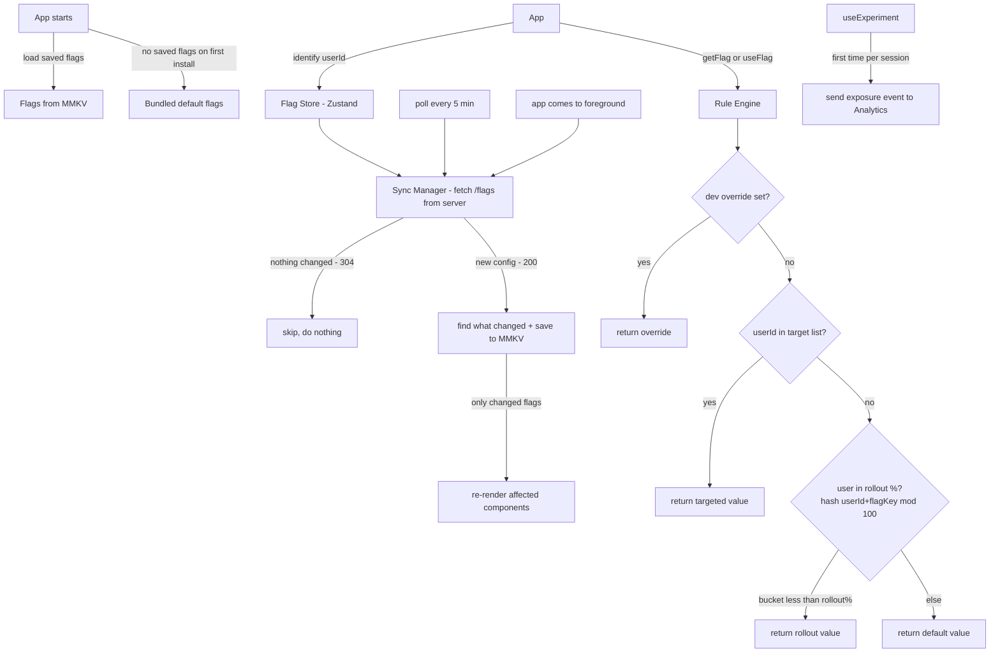

# System Design: Feature Flag + A/B Testing System (React Native / Mobile)

**Core idea:** Flag rules run on the device, not on the server. The server just sends a config file. `getFlag()` is always instant — no waiting for a network call before rendering.



---

## 1. Requirements (R)

### Functional

- **Boolean flags:** Turn a screen or feature on/off without shipping a new build.
- **Multivariate flags:** Return a value (string, number, JSON) instead of just true/false — e.g., button label, API URL.
- **A/B experiments:** Split users into named groups (`control`, `treatment_a`) with custom traffic weights.
- **Percentage rollouts:** Turn a flag on for 5% of users, then 20%, then 100% — safely and gradually.
- **User targeting:** Always turn a flag on for specific users (beta testers, employees).
- **Remote config:** Change flag values from a dashboard — no app store release needed.
- **Exposure tracking:** Automatically log when a user sees an experiment variant — needed for stats.

### Non-functional

- **No async on render path:** `getFlag()` must return instantly — never blocks the UI.
- **Same result every time:** Same user always gets the same variant for the same flag, on any device.
- **Works offline:** Use locally cached flags when there is no network.
- **Low bandwidth:** Only download the config when it actually changes (ETag + 304).

---

## 2. Architecture (A)

| Component                | What it does                                                                           |
| ------------------------ | -------------------------------------------------------------------------------------- |
| **Rule Engine**          | Checks rules in order: kill switch → dev override → user segment → % rollout → default |
| **Assignment Engine**    | Hashes `userId + flagKey` to a number 0–99 — used to decide if a user is in a rollout  |
| **Flag Store (Zustand)** | Keeps current flag values in memory; components re-render only when their flag changes |
| **MMKV Cache**           | Saves the flag config to disk so it survives app restarts and works offline            |
| **Sync Manager**         | Fetches fresh config every 5 min and on app foreground; only updates what changed      |

---

## 3. Data Model (D)

### Flag Config (from server)

```json
{
  "version": 42,
  "flags": [
    {
      "key": "new_checkout_ui",
      "type": "boolean",
      "defaultValue": false,
      "enabled": true,
      "rules": [
        { "type": "user_segment", "userIds": ["usr_beta_1"], "value": true },
        { "type": "percentage", "rolloutPct": 20, "value": true }
      ]
    },
    {
      "key": "checkout_cta_experiment",
      "type": "experiment",
      "defaultValue": "control",
      "enabled": true,
      "allocation": 80,
      "variants": [
        { "key": "control", "weight": 50, "config": { "ctaLabel": "Buy Now" } },
        {
          "key": "treatment_a",
          "weight": 30,
          "config": { "ctaLabel": "Add to Cart" }
        },
        {
          "key": "treatment_b",
          "weight": 20,
          "config": { "ctaLabel": "Get It" }
        }
      ]
    }
  ]
}
```

- `enabled: false` — emergency off switch. All users get `defaultValue`, no rules run.
- `allocation: 80` — only 80% of users enter the experiment. The other 20% get `defaultValue`.
- `weight` — how to split traffic among variants within that 80%.

`flags.bootstrap.json` — simple defaults bundled inside the app for the very first launch:

```json
{ "new_checkout_ui": false, "checkout_cta_experiment": "control" }
```

### What is saved in MMKV

| Key                 | What is stored                                                     |
| ------------------- | ------------------------------------------------------------------ |
| `ff_config`         | Latest flag config from the server                                 |
| `ff_etag`           | Used to check if the config changed since last fetch               |
| `ff_user_context`   | `{ userId, attributes }` — kept across restarts                    |
| `ff_exposures`      | Tracks which experiments the user already saw (no double-counting) |
| `ff_override_{key}` | Dev-only flag override for testing                                 |

---

## 4. API (I)

```typescript
// App.tsx — call before the navigator renders
await FeatureFlags.init({
  sdkKey: "prod_sk_abc",
  bootstrapFlags: require("./flags.bootstrap.json"),
  pollInterval: 300_000, // 5 minutes
});

// Tell the SDK who the current user is
FeatureFlags.identify("usr_123", { isPremium: true, appVersion: "6.2.0" });

// Get a flag value — always synchronous, safe to call during render
const isEnabled = FeatureFlags.getFlag("new_checkout_ui", false);
const variant   = FeatureFlags.getVariant("checkout_cta_experiment", "control");

// In a component — re-renders automatically when the flag changes
function CheckoutScreen() {
  const isNewUi = useFlag("new_checkout_ui", false);
  const { variantKey, config } = useExperiment("checkout_cta_experiment");
  return <Button label={config.ctaLabel} style={isNewUi ? styles.v2 : styles.v1} />;
}
```

```
GET /api/flags
  Headers: Authorization, X-User-Id, If-None-Match: {etag}
  → 200: new config + ETag header
  → 304: nothing changed, do nothing
```

---

## 5. Deep Dives (O)

### How Flag Rules Are Evaluated

```typescript
function evaluateFlag(flag: FlagConfig, user: UserContext): unknown {
  if (!flag.enabled) return flag.defaultValue; // kill switch
  const override = __DEV__ ? FlagStorage.getOverride(flag.key) : undefined;
  if (override !== undefined) return override; // dev override
  for (const rule of flag.rules) {
    if (rule.type === "user_segment" && rule.userIds?.includes(user.userId))
      return rule.value; // exact user match
    if (
      rule.type === "percentage" &&
      isInRollout(flag.key, user.userId, rule.rolloutPct)
    )
      return rule.value; // % rollout match
  }
  return flag.defaultValue; // fallback
}

// Zustand selector — only this component re-renders when this flag changes
function useFlag<T>(key: string, defaultValue: T): T {
  return useFlagStore((s) => (s.flags[key] as T) ?? defaultValue);
}
```

### How % Rollouts Work (Consistent Hashing)

```typescript
function getBucket(flagKey: string, userId: string): number {
  return Math.abs(murmurHash32(`${flagKey}:${userId}`)) % 100; // always 0–99
}
```

**Why include `flagKey` in the hash?** Without it, a user at bucket 15 would be inside every flag's 20%+ rollout at the same time. Adding the flag key makes each flag's rollout independent.

**Raising the rollout % never removes existing users.** Going from 20% → 30% only adds users with buckets 20–29. Users already in (buckets 0–19) stay in — no one gets a broken experience mid-rollout.

### How A/B Variant Assignment Works

```typescript
function assignVariant(exp: ExperimentFlag, userId: string): string {
  // Step 1: is this user even in the experiment?
  if (getBucket(`${exp.key}:alloc`, userId) >= exp.allocation)
    return exp.defaultValue;

  // Step 2: which variant do they get?
  const bucket = getBucket(`${exp.key}:variant`, userId);
  let cursor = 0;
  for (const v of exp.variants) {
    cursor += v.weight;
    if (bucket < cursor) return v.key;
  }
  return exp.defaultValue;
}
```

Two separate hashes are used so "who enters the experiment" and "which variant they get" are not correlated.

### First Launch — No Blank Screen

The app renders before any network call completes, so flags need a value immediately.

| Priority | Source                                  | When                                   |
| -------- | --------------------------------------- | -------------------------------------- |
| 1        | MMKV (saved from last session)          | Returning users — instant, synchronous |
| 2        | `flags.bootstrap.json` (bundled in app) | First install, no cache yet            |
| 3        | Server fetch                            | Runs in background after init          |

`init()` loads 1 or 2 right away, then fetches from the server in the background. If the server returns something different, only the components using changed flags re-render.

### Exposure Tracking for A/B Tests

```typescript
export function useExperiment(key: string) {
  const variantKey = useFlagStore((s) => s.flags[key]) as string;

  useEffect(() => {
    const id = `${key}:${userId}`;
    if (!FlagStorage.hasExposure(id)) {
      Analytics.sendEvent("experiment_exposure", {
        experiment_key: key,
        variant_key: variantKey,
      });
      FlagStorage.markExposure(id); // saved to MMKV so we don't double-count after restart
    }
  }, [variantKey]);

  return { variantKey, config: getVariantConfig(key, variantKey) };
}
```

Fires once per user per experiment. The analytics team uses this count as the denominator when measuring conversion rates.

### Kill Switch + Fast Rollback

Set `enabled: false` in the admin dashboard → all devices get `defaultValue` within the next poll (≤5 min).

For faster response during an incident: keep a Server-Sent Events connection open. The dashboard pushes a notification → devices sync immediately → rollback happens in ~2–5 seconds instead of 5 minutes.

### Syncing Flags Efficiently

```typescript
async function syncFlags() {
  try {
    const res = await fetch("/api/flags", {
      headers: { "If-None-Match": FlagStorage.getEtag() },
    });
    if (res.status === 304) return; // config unchanged, skip everything

    const newConfig = await res.json();
    const changedKeys = diffFlagConfig(FlagStorage.getConfig(), newConfig);
    FlagStorage.setConfig(newConfig);
    FlagStorage.setEtag(res.headers.get("ETag"));

    flagStore.setState((s) => {
      const flags = { ...s.flags };
      changedKeys.forEach((k) => {
        flags[k] = evaluateFlag(newConfig.flags[k], userCtx);
      });
      return { flags };
    });
  } catch {
    /* network error — keep serving cached flags silently */
  }
}
```

Most polls get a 304 back — almost zero bandwidth. Only components using a changed flag re-render.

---

## 6. Real Tools to Use (instead of building from scratch)

In an interview, mentioning these shows you know the ecosystem. You can say: _"I'd use Firebase Remote Config for simplicity, or LaunchDarkly if we need advanced targeting and experimentation."_

| Tool                       | Best for                                            | Notes                                                                                                               |
| -------------------------- | --------------------------------------------------- | ------------------------------------------------------------------------------------------------------------------- |
| **Firebase Remote Config** | Simple boolean/value flags, small teams             | Free, built into Firebase. No A/B stats built in — need to pair with Google Analytics. Easy to set up in RN.        |
| **LaunchDarkly**           | Full feature flags + A/B testing + targeting        | Industry standard. Has a React Native SDK. Expensive but very powerful. Does on-device evaluation like this design. |
| **Statsig**                | A/B experiments + feature gates with built-in stats | Cheaper than LaunchDarkly. Has a React Native SDK. Good dashboard for experiment results.                           |
| **Unleash**                | Self-hosted, open source                            | Good if the company cannot send user data to third-party servers (compliance). You run it yourself.                 |
| **Optimizely**             | Large-scale A/B testing                             | Used by big e-commerce companies. More focused on experiments than feature flags.                                   |

### When to build vs buy

- **Use Firebase Remote Config** if you only need simple on/off flags or remote config values and don't need detailed experiment stats.
- **Use LaunchDarkly / Statsig** if you need percentage rollouts, user targeting, and A/B test results with statistical significance out of the box.
- **Build your own** (like this design) if you need full control, want to avoid vendor costs at scale, or have strict data residency requirements.
