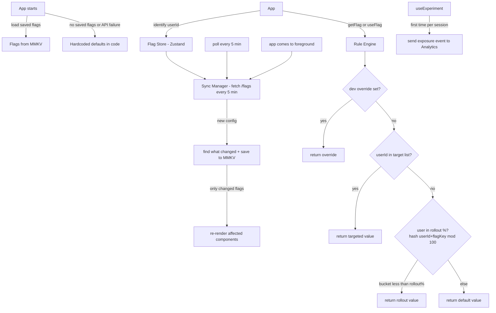

# System Design: Feature Flag + A/B Testing System (React Native / Mobile)

**Core idea:** Flag rules run on the device, not on the server. The server just sends a config file. `getFlag()` is always instant — no waiting for a network call before rendering.



---

## 1. Requirements (R)

### Functional

- **Boolean flags:** Turn a screen or feature on/off without shipping a new build.
- **Multivariate flags:** Return a value (string, number, JSON) instead of just true/false — e.g., button label, API URL.
- **A/B experiments:** Split users into named groups (`control`, `treatment_a`) with custom traffic weights.
- **Percentage rollouts:** Turn a flag on for 5% of users, then 20%, then 100% — safely and gradually.
- **User targeting:** Always turn a flag on for specific users (beta testers, employees).
- **Remote config:** Change flag values from a dashboard — no app store release needed.
- **Exposure tracking:** Automatically log when a user sees an experiment variant — needed for stats.

### Non-functional

- **No async on render path:** `getFlag()` must return instantly — never blocks the UI.
- **Same result every time:** Same user always gets the same variant for the same flag, on any device.
- **Works offline:** Use locally cached flags when there is no network.

---

## 2. Architecture (A)

| Component                | What it does                                                                           |
| ------------------------ | -------------------------------------------------------------------------------------- |
| **Rule Engine**          | Checks rules in order: kill switch → dev override → user segment → % rollout → default |
| **Assignment Engine**    | Hashes `userId + flagKey` to a number 0–99 — used to decide if a user is in a rollout  |
| **Flag Store (Zustand)** | Keeps current flag values in memory; components re-render only when their flag changes |
| **MMKV Cache**           | Saves the flag config to disk so it survives app restarts and works offline            |
| **Sync Manager**         | Fetches fresh config every 5 min and on app foreground; only updates what changed      |

---

## 3. Data Model (D)

### Flag Config (from server)

```json
{
  "flags": [
    {
      "key": "new_checkout_ui",
      "type": "boolean",
      "defaultValue": false,
      "enabled": true,
      "rules": [
        { "type": "user_segment", "userIds": ["usr_beta_1"], "value": true },
        { "type": "percentage", "trafficPct": 20, "value": true }
      ]
    },
    {
      "key": "checkout_cta_experiment",
      "type": "experiment",
      "defaultValue": "control",
      "enabled": true,
      "trafficPct": 80,
      "variants": [
        {
          "key": "control",
          "splitPct": 50,
          "config": { "ctaLabel": "Buy Now" }
        },
        {
          "key": "treatment_a",
          "splitPct": 30,
          "config": { "ctaLabel": "Add to Cart" }
        },
        {
          "key": "treatment_b",
          "splitPct": 20,
          "config": { "ctaLabel": "Get It" }
        }
      ]
    }
  ]
}
```

- `enabled: false` — emergency off switch. All users get `defaultValue`, no rules run.
- `trafficPct` — what % of users are affected. For a flag rule: 20 means 20% of users get the flag ON. For an experiment: 80 means only 80% of users enter the experiment; the other 20% get `defaultValue`.
- `splitPct` — of the users inside the experiment, how to divide them across variants. Must add up to 100.

### What is saved in MMKV

| Key              | What is stored                                                     |
| ---------------- | ------------------------------------------------------------------ |
| `config`         | Latest flag config from the server                                 |
| `user`           | `{ userId, attributes }` — kept across restarts                    |
| `exposures`      | Tracks which experiments the user already saw (no double-counting) |
| `override_{key}` | Dev-only flag override for testing                                 |

---

## 4. API (I)

```typescript
// App.tsx — call before the navigator renders
await FeatureFlags.init({ pollInterval: 300_000 });

// Tell the SDK who the current user is (call after login)
FeatureFlags.identify("usr_123");

// Get a flag value — always synchronous, safe to call during render
const isEnabled = FeatureFlags.getFlag("new_checkout_ui", false);
const variant   = FeatureFlags.getVariant("checkout_cta_experiment", "control");

// In a component — re-renders automatically when the flag changes
function CheckoutScreen() {
  const isNewUi = useFlag("new_checkout_ui", false);
  const { variantKey, config } = useExperiment("checkout_cta_experiment");
  return <Button label={config.ctaLabel} style={isNewUi ? styles.v2 : styles.v1} />;
}
```

```
GET /api/flags
  Headers: X-User-Id
  → 200: full flag config JSON
```

---

## 5. Deep Dives (O)

### How Flag Rules Are Evaluated

Rules are checked in order — first match wins, fallback to `defaultValue`.

```
evaluateFlag(flag, userId):
  if flag.enabled is false      → return defaultValue   // kill switch
  if dev override exists        → return override       // for testing
  if userId is in flag.userIds  → return true           // targeted user
  if userId bucket < trafficPct → return true           // % rollout
  return defaultValue                                   // fallback
```

### How % Rollouts Work

```
getBucket(flagKey, userId):
  hash(flagKey + userId) % 100  → gives a number 0–99
```

Every user always lands in the same bucket for a given flag. A `trafficPct: 20` means buckets 0–19 are in — that's 20% of users.

**Why hash `flagKey + userId` together?** Without the flag key, the same user would land in the same bucket for every flag — so anyone in the first 20% would be in every flag's 20% rollout. Combining them makes each flag's assignment independent.

**Raising % never kicks users out.** Going 20% → 30% only adds buckets 20–29. Anyone already in (0–19) stays in.

### How A/B Variant Assignment Works

Two separate hashes — one decides if the user enters the experiment, another decides which variant they get.

```
assignVariant(experiment, userId):
  // Step 1: does this user enter the experiment?
  if bucket(experiment + "traffic", userId) >= trafficPct
    return defaultValue

  // Step 2: which variant?
  bucket = bucket(experiment + "split", userId)   // 0–99
  cursor = 0
  for each variant:
    cursor += variant.splitPct
    if bucket < cursor → return variant.key
```

Example with `trafficPct: 80`, variants `control 50 / treatment_a 30 / treatment_b 20`:

- Bucket 0–49 → `control`, 50–79 → `treatment_a`, 80–99 → `treatment_b` (within the 80% who entered)

### First Launch — No Blank Screen

| Priority | Source                         | When                                              |
| -------- | ------------------------------ | ------------------------------------------------- |
| 1        | MMKV (saved from last session) | Returning users — instant, synchronous            |
| 2        | Hardcoded defaults in code     | First install, no cache yet, or API/network error |
| 3        | Server fetch                   | Runs in background after init                     |

Default values are passed inline at every call site — `getFlag("new_checkout_ui", false)` — so there is no blank state even on first install or when the network is down.

### Syncing Flags

```
syncFlags (runs every 5 min + on app foreground):
  fetch /api/flags
  compare new config with saved config → find changed flag keys
  save new config to MMKV
  re-evaluate only changed flags → update store → affected components re-render
  on network error → do nothing, keep serving cached flags
```

### Exposure Tracking for A/B Tests

```
useExperiment(experimentKey):
  variantKey = read from store

  on mount:
    if not already logged (check MMKV):
      send analytics event { experiment: key, variant: variantKey }
      mark as logged in MMKV  // so we don't double-count after restart

  return { variantKey, config }
```

### Kill Switch + Fast Rollback

Set `enabled: false` in the admin dashboard → all devices get `defaultValue` within the next poll (≤5 min).

For faster response during an incident: keep a Server-Sent Events connection open. The dashboard pushes a notification → devices sync immediately → rollback in ~2–5 seconds instead of 5 minutes.

---

## 6. Real Tools to Use (instead of building from scratch)

| Tool                       | Best for                                            | Notes                                                                                  |
| -------------------------- | --------------------------------------------------- | -------------------------------------------------------------------------------------- |
| **Firebase Remote Config** | Simple boolean/value flags, small teams             | Free, built into Firebase. No A/B stats built in — need to pair with Google Analytics. |
| **LaunchDarkly**           | Full feature flags + A/B testing + targeting        | Industry standard. Has a React Native SDK. Does on-device evaluation like this design. |
| **Statsig**                | A/B experiments + feature gates with built-in stats | Cheaper than LaunchDarkly. Good dashboard for experiment results.                      |
| **Unleash**                | Self-hosted, open source                            | Good if the company cannot send user data to third-party servers (compliance).         |

### When to build vs buy

- **Use Firebase Remote Config** if you only need simple on/off flags or remote config values and don't need detailed experiment stats.
- **Use LaunchDarkly / Statsig** if you need percentage rollouts, user targeting, and A/B test results with statistical significance out of the box.
- **Build your own** (like this design) if you need full control, want to avoid vendor costs at scale, or have strict data residency requirements.
