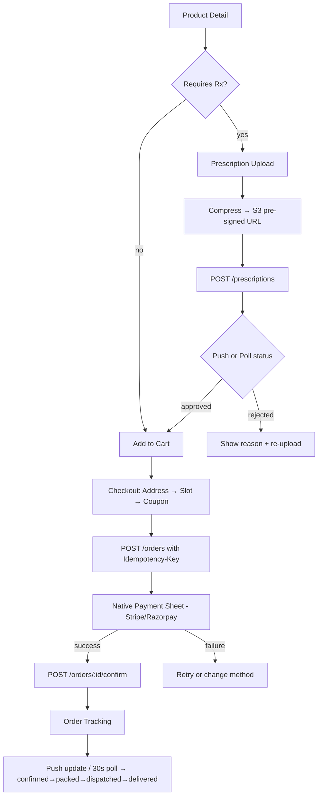

# System Design: Medicine Order Flow (React Native)

Prescription upload triggers a validation gate before the cart is unlocked. Cart is local-first (Zustand + MMKV). Checkout goes through a payment orchestration layer. Order status tracked via push + polling fallback.



---

## 1. Requirements

### Functional

- Prescription upload via camera or file picker; cart unlocks only after server approval
- Cart: add/remove/quantity, persisted across restarts, substitution suggestions
- Checkout: address, delivery slot, coupon/wallet, order summary
- Payment: card, UPI, wallet, POD; 3DS/OTP handled by SDK; retry on failure
- Order tracking: status timeline + last-mile map; push-first with polling fallback
- Reorder: re-validates Rx if expired before adding to cart

### Non-functional

- Rx images never cached on device; pre-signed S3 URLs with short TTL
- PCI compliance delegated entirely to Stripe/Razorpay SDK
- Idempotent order creation — double-tap must not double-charge
- Cart survives crashes (MMKV); regulated fields (price, limits) always from server

---

## 2. Architecture

| Component                       | What it does                                                                         |
| ------------------------------- | ------------------------------------------------------------------------------------ |
| **Prescription Manager**        | Upload, compress, S3 PUT, status poll/push, gates cart for Rx items                  |
| **Cart Store (Zustand + MMKV)** | Local-first cart; `/cart/validate` before entering checkout                          |
| **Checkout Orchestrator**       | Sequences address → slot → coupon → payment; rolls back on failure                   |
| **Payment Service**             | Wraps Stripe/Razorpay; server creates intent, client presents sheet, server confirms |
| **Order Store (Zustand)**       | Order list + active order; updated by push or poll                                   |
| **Push Handler**                | FCM/APNs data push for Rx approval and order status updates                          |

---

## 3. Data Model

### Prescription

```json
{
  "rxId": "rx_abc123",
  "status": "approved",
  "eligibleProductIds": ["prod_amox500"],
  "expiresAt": 1745536000000,
  "approvedBy": "pharmacist_id|ai_model_v2",
  "rejectionReason": null
}
```

`status`: `pending | under_review | approved | rejected | expired`

### Cart Item

```json
{
  "productId": "prod_amox500",
  "quantity": 2,
  "unitPrice": 45.0,
  "rxRequired": true,
  "rxId": "rx_abc123",
  "maxQuantity": 30,
  "stockStatus": "in_stock"
}
```

### Order

```json
{
  "orderId": "ord_789",
  "status": "dispatched",
  "paymentStatus": "captured",
  "totalAmount": 320.0,
  "deliverySlot": { "date": "2026-04-24", "window": "10:00-12:00" },
  "timeline": [
    { "status": "confirmed", "ts": 1714000000000 },
    { "status": "dispatched", "ts": 1714020000000 }
  ]
}
```

### MMKV Keys

| Key                        | Value                                   |
| -------------------------- | --------------------------------------- |
| `cart_items`               | JSON array of CartItem                  |
| `pending_payment_order_id` | orderId for crash recovery              |
| `checkout_idempotency_key` | UUID — cleared after successful confirm |

---

## 4. API

```
POST /prescriptions           { s3Key, productIds }     → { rxId, status }
GET  /prescriptions/:rxId                               → { status, eligibleProductIds, rejectionReason }

POST /cart/validate           { items }                 → { valid, issues: [{productId, issue}] }

GET  /delivery/slots          ?pincode&date             → [{ slotId, window, available }]
POST /orders                  { items, addressId, slotId, couponCode }  → { orderId, clientSecret }
                              Header: Idempotency-Key: <uuid>
POST /orders/:id/confirm      { paymentIntentId }       → { status: "confirmed" }
GET  /orders/:id/location                               → { lat, lng, eta }
```

---

## 5. Deep Dives

### Prescription Upload

```typescript
async function uploadPrescription(uri: string, productIds: string[]) {
  const compressed = await ImageResizer.createResizedImage(
    uri,
    1200,
    1600,
    "JPEG",
    80,
  );
  const { uploadUrl, s3Key } = await api.post("/media/rx-upload-url");
  await fetch(uploadUrl, {
    method: "PUT",
    body: await readFile(compressed.uri),
  });
  const { rxId } = await api.post("/prescriptions", { s3Key, productIds });
  PrescriptionPoller.start(rxId); // push-first, poll as fallback
  await FileSystem.deleteAsync(compressed.uri); // never cache Rx on device
}
```

### Prescription Validation States (follow-up area)

| State          | UI                                   | Action                          |
| -------------- | ------------------------------------ | ------------------------------- |
| `pending`      | Spinner                              | —                               |
| `under_review` | "Pharmacist reviewing (up to 2 hrs)" | Browse, can't checkout Rx items |
| `approved`     | Green unlock                         | Add to cart                     |
| `rejected`     | Error + reason                       | Re-upload corrected Rx          |
| `expired`      | Warning + expiry date                | Doctor renewal                  |

### Polling + Push Hybrid (Rx and Order status)

```typescript
function poll(rxId: string, attempt = 1) {
  const delay = Math.min(3000 * attempt, 30_000);
  setTimeout(async () => {
    const { status } = await api.get(`/prescriptions/${rxId}`);
    store.update(rxId, { status });
    if (status === "pending" || status === "under_review")
      poll(rxId, attempt + 1);
  }, delay);
}

// Push wins — stops polling immediately
function onPush(data: PushPayload) {
  if (data.type === "rx_status_update") {
    store.update(data.rxId, { status: data.status });
    PrescriptionPoller.stop(data.rxId);
  }
}
```

### Cart — Local-First + Server Validation

```typescript
// Add to cart optimistically (non-Rx items)
cartStore.addItem(item);

// Validate before checkout — server checks stock, Rx status, qty limits
async function validateCartBeforeCheckout() {
  const result = await api.post("/cart/validate", { items: cartStore.items });
  if (!result.valid)
    result.issues.forEach((i) => cartStore.flagIssue(i.productId, i.issue));
  return result;
}
```

**Optimistic UI rule:** Cart mutations (add/remove) are optimistic. Payment, Rx approval, order creation — never optimistic.

### Payment Flow (Stripe)

```typescript
// Server creates intent — client secret back to client
const { orderId, clientSecret } = await api.post("/orders", payload, {
  headers: { "Idempotency-Key": getOrCreateIdempotencyKey() },
});
MMKV.set("pending_payment_order_id", orderId); // crash recovery

await initPaymentSheet({
  paymentIntentClientSecret: clientSecret,
  merchantDisplayName: "PharmaCo",
});
const { error } = await presentPaymentSheet(); // 3DS handled inside sheet
if (!error) {
  await api.post(`/orders/${orderId}/confirm`, { paymentIntentId });
  MMKV.delete("pending_payment_order_id");
  clearIdempotencyKey();
  cartStore.clearCart();
}
```

### Idempotency — Prevent Double Orders

```typescript
function getOrCreateIdempotencyKey() {
  return (
    MMKV.getString("checkout_idempotency_key") ??
    (() => {
      const key = uuid();
      MMKV.set("checkout_idempotency_key", key);
      return key;
    })()
  );
}
// Cleared only after successful confirm — crash reuses same key, server deduplicates
```

### Crash Recovery — Payment in Flight

```typescript
async function recoverPendingPayment() {
  const orderId = MMKV.getString("pending_payment_order_id");
  if (!orderId) return;
  const order = await api.get(`/orders/${orderId}`);
  if (order.paymentStatus === "captured")
    navigate("OrderConfirmation", { orderId });
  else if (["failed", "cancelled"].includes(order.paymentStatus))
    navigate("Checkout");
  else navigate("PaymentRecovery", { orderId }); // still pending
}
// Call after auth established in App.tsx
```

### Order Tracking

```typescript
function useOrderTracking(orderId: string) {
  useEffect(() => {
    if (isTerminalStatus(order?.status)) return;
    const interval = setInterval(async () => {
      const updated = await api.get(`/orders/${orderId}`);
      orderStore.update(orderId, updated);
      if (isTerminalStatus(updated.status)) clearInterval(interval);
    }, 30_000); // fallback poll — push is fast path
    return () => clearInterval(interval);
  }, [orderId]);
}
```

### Pay-on-Delivery Path

No payment sheet — order is created and confirmed in one step. Server sets `paymentStatus: "pending_collection"`. No `pending_payment_order_id` written to MMKV since there's no SDK sheet to crash during.

```typescript
if (method === "pod") {
  const { orderId } = await api.post(
    "/orders",
    { ...payload, method: "pod" },
    { headers: { "Idempotency-Key": getOrCreateIdempotencyKey() } },
  );
  clearIdempotencyKey();
  cartStore.clearCart();
  navigate("OrderConfirmation", { orderId });
}
// Delivery agent collects cash → server marks paymentStatus: "collected" via their app
```

### Stock Reservation Timing

**Cart add does NOT reserve stock** — only soft checks stock status. Actual reservation happens at `POST /orders` (server atomically decrements inventory). This avoids holding stock for abandoned carts.

Consequence: a cart item can become out-of-stock between "add to cart" and checkout. `/cart/validate` catches this at checkout entry and surfaces it before payment — never after.

### Last-Mile Location Tracking

```typescript
function useDeliveryLocation(orderId: string, isOutForDelivery: boolean) {
  const [pin, setPin] = useState<LatLng | null>(null);
  useEffect(() => {
    if (!isOutForDelivery) return;
    const id = setInterval(async () => {
      const { lat, lng } = await api.get(`/orders/${orderId}/location`);
      setPin({ lat, lng });
    }, 30_000);
    return () => clearInterval(id);
  }, [orderId, isOutForDelivery]);
  return pin;
}
// Render on <MapView> with Animated pin; stop polling on "delivered" push
```

### Order Cancellation + Refund

```
DELETE /orders/:id          → allowed only while status ∈ { confirmed, packed }
                              returns { refundId, estimatedRefundTs }
```

- **Before dispatch:** Cancel is instant; inventory released server-side; refund issued to original payment method via Stripe `refund.create` / Razorpay refund API.
- **After dispatch:** Cannot cancel in-app — returns `{ cancellable: false }`. User contacts support.
- **POD orders:** No refund needed on cancel; just mark `paymentStatus: "void"`.

Client: optimistic "Cancelling…" state → confirm on server response. If server rejects (already dispatched), revert UI with toast.

### Regulated Error Handling

```typescript
type PharmacyError =
  | { code: "RX_REQUIRED"; productId: string }
  | { code: "RX_EXPIRED"; rxId: string }
  | { code: "CONTROLLED_SUBSTANCE_LIMIT"; limit: number }
  | { code: "PAYMENT_DECLINED"; retryable: boolean }
  | { code: "ORDER_DUPLICATE"; existingOrderId: string };

// ORDER_DUPLICATE → navigate to existing order (idempotency fallback)
// RX_EXPIRED → prompt reorder Rx upload flow
// CONTROLLED_SUBSTANCE_LIMIT → server enforced; show banner, not client-side guard
```

---

## 6. Security

| Risk                       | Mitigation                                                              |
| -------------------------- | ----------------------------------------------------------------------- |
| Rx image leak              | Pre-signed S3 URLs, 15-min TTL, server validates ownership              |
| Cart price tampering       | Server re-validates all prices and limits at order creation             |
| Double charge              | Idempotency-Key header + crash recovery with `pending_payment_order_id` |
| Controlled substance abuse | Per-user daily limits enforced at `/cart/validate` and order creation   |
| Fake prescription          | AI + pharmacist pipeline; approval source logged in Rx record           |

---

## 7. Tools

| Tool                           | Use                                                                     |
| ------------------------------ | ----------------------------------------------------------------------- |
| `@stripe/stripe-react-native`  | Card, Apple/Google Pay, 3DS — PCI compliant, no raw card data on device |
| `react-native-razorpay`        | UPI, wallets, net banking (India)                                       |
| `react-native-vision-camera`   | High-quality Rx document capture                                        |
| `react-native-document-picker` | PDF Rx upload from Files app                                            |
| `react-native-image-resizer`   | Compress Rx photos before S3 upload                                     |
| `react-native-maps`            | Delivery agent map tracking                                             |
