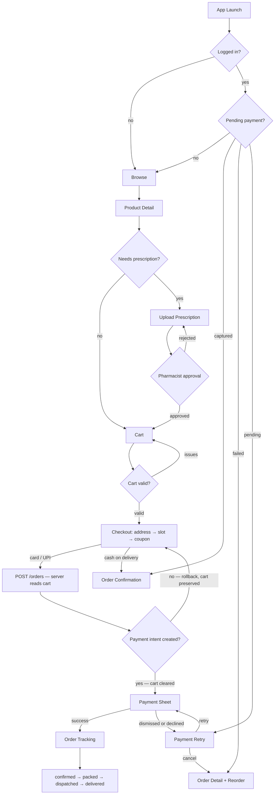

# System Design: Medicine Order Flow (React Native)

A user can browse medicines, upload a prescription if needed, add items to cart, pay, and track delivery. The cart is server-maintained and works across devices for authenticated users; guests get a session-scoped cart that merges on login. Before payment, the server validates everything. Order status updates come via push notifications, with polling as a backup.



---

## 1. Requirements

### Functional (What the app must do)

- User can upload a prescription via camera or file; they can only add that medicine to cart after a pharmacist approves it
- Cart: add/remove items, change quantity; cart is server-maintained and persists across devices and sessions; guest users are identified by a session token that merges into their account on login
- Checkout: pick delivery address, choose a time slot, apply a coupon or use wallet balance
- Payment: card, UPI, wallet, or cash on delivery; OTP/3D Secure is handled by the payment SDK automatically; user can retry if payment fails
- Order tracking: see a status timeline; push notifications are the primary update method, polling every 30 seconds is the fallback
- Reorder: if the prescription has expired, the user must upload a fresh one before re-ordering

### Non-functional (How well it must do it)

- Prescription images are never stored on the device; the upload link expires in 15 minutes
- The app never touches raw card data — the payment SDK (Stripe/Razorpay) handles that entirely
- Placing an order twice (e.g., double-tap) must never charge the user twice — the server atomically converts the cart into an order and clears it, so a second request finds an empty cart and fails gracefully
- Cart lives on the server; prices and quantity limits always come from the server, never trusted from the client

---

## 2. Architecture — Main Pieces

| Piece                        | What it does                                                                                                                                     |
| ---------------------------- | ------------------------------------------------------------------------------------------------------------------------------------------------ |
| **Prescription Manager**     | Handles photo upload, sends it to cloud storage, waits for pharmacist approval, and blocks checkout for prescription medicines until approved    |
| **Cart (server-maintained)** | Cart lives on the server and is tied to the user's account or guest session token; works across devices; guest cart merges into account on login |
| **Checkout Orchestrator**    | Walks the user through address → slot → coupon → payment in order; rolls back if something fails                                                 |
| **Payment Service**          | Talks to Stripe/Razorpay; server creates the payment session, user pays in the SDK's own screen, server confirms the charge                      |
| **Order Store**              | Keeps list of orders and the active order; updated via push or polling                                                                           |
| **Push Handler**             | Receives silent push notifications for prescription approvals and order status changes                                                           |

---

## 3. Data Shapes

### Prescription

```json
{
  "rxId": "rx_abc123",
  "status": "approved",
  "eligibleProductIds": ["prod_amox500"],
  "expiresAt": 1745536000000,
  "approvedBy": "pharmacist_id|ai_model_v2",
  "rejectionReason": null
}
```

`status` can be: `pending | under_review | approved | rejected | expired`

### Cart Item

```json
{
  "productId": "prod_amox500",
  "quantity": 2,
  "unitPrice": 45.0,
  "rxRequired": true,
  "rxId": "rx_abc123",
  "maxQuantity": 30,
  "stockStatus": "in_stock"
}
```

### Order

```json
{
  "orderId": "ord_789",
  "status": "dispatched",
  "paymentStatus": "captured",
  "totalAmount": 320.0,
  "deliverySlot": { "date": "2026-04-24", "window": "10:00-12:00" },
  "items": [
    {
      "productId": "prod_amox500",
      "name": "Amoxicillin 500mg",
      "quantity": 2,
      "unitPrice": 45.0,
      "rxRequired": true
    }
  ],
  "timeline": [
    { "status": "confirmed", "ts": 1714000000000 },
    { "status": "dispatched", "ts": 1714020000000 }
  ]
}
```

> **Why items live on the Order (not just in the cart):** The cart is cleared immediately after a successful payment. If the user opens the order later — confirmation screen, order history, reorder flow — the only source of truth for what they bought is the server's order record. The client never reconstructs order items from cart state.

### What we save locally on the device (MMKV — fast on-device key-value store)

| Key                        | What it stores                                                                                                                                                                    |
| -------------------------- | --------------------------------------------------------------------------------------------------------------------------------------------------------------------------------- |
| `guest_session_token`      | A UUID generated on first launch; sent as a header on all requests; server uses it to scope the guest cart; discarded after login (server merges the guest cart into the account) |
| `pending_payment_order_id` | Order ID saved just before showing the payment screen — used to recover if the app crashes mid-payment                                                                            |

---

## 4. API Endpoints

```
POST /prescriptions           { s3Key, productIds }     → { rxId, status }
GET  /prescriptions/:rxId                               → { status, eligibleProductIds, rejectionReason }

GET  /cart                                              → { items: CartItem[], totalAmount }
POST /cart/items              { productId, quantity }   → { items: CartItem[] }   (add or increment)
                              Server also sends a silent cart_updated push to all other active sessions of the same user
PATCH /cart/items/:productId  { quantity }              → { items: CartItem[] }   (update quantity)
                              Server also sends a silent cart_updated push to all other active sessions of the same user
DELETE /cart/items/:productId                           → { items: CartItem[] }   (remove item)
                              Server also sends a silent cart_updated push to all other active sessions of the same user
POST /cart/validate                                     → { valid, issues: [{productId, issue}] }
                              (no payload — server reads its own cart; validates stock, rx status, limits)

GET  /delivery/slots          ?pincode&date             → [{ slotId, window, available }]

POST /orders                  { addressId, slotId, couponCode, method }  → { orderId, clientSecret? }
                              Server does (all inside a DB transaction):
                                1. Reads the caller's server-side cart (fails with CART_EMPTY if empty)
                                2. Validates items (stock, prescription approvals, limits)
                                3. Creates order record in DB with status "pending_payment"
                                4. For card/UPI: calls Stripe to create a payment intent
                                   → if Stripe fails, the entire transaction rolls back (cart is preserved, no order created)
                                   → returns orderId + clientSecret
                                5. Clears the cart only after the payment intent is successfully created
                                6. For cash on delivery: marks order "confirmed" immediately, no clientSecret, then clears cart

GET  /orders/:id                                        → full order including items, timeline, paymentStatus
GET  /orders/:id/location                               → { lat, lng } — only when status is dispatched

POST /auth/login              { ...credentials, guestSessionToken? }
                              If guestSessionToken provided, server merges guest cart into account cart

Stripe webhook (server-side, not a client API):
  payment_intent.succeeded → server marks order "confirmed", sends push to client
  payment_intent.failed    → server marks order "failed", sends push to client
```

---

## 5. Key Design Decisions (Deep Dives)

### Prescription Upload

```typescript
async function uploadPrescription(uri: string, productIds: string[]) {
  // Shrink the image before uploading (saves bandwidth)
  const compressed = await ImageResizer.createResizedImage(
    uri,
    1200,
    1600,
    "JPEG",
    80,
  );

  // Ask the server for a short-lived upload link (pre-signed URL)
  const { uploadUrl, s3Key } = await api.post("/media/rx-upload-url");

  // Upload directly to cloud storage using that link
  await fetch(uploadUrl, {
    method: "PUT",
    body: await readFile(compressed.uri),
  });

  // Tell our server the upload is done
  const { rxId } = await api.post("/prescriptions", { s3Key, productIds });

  // Start listening for approval (push notification first, polling as backup)
  PrescriptionPoller.start(rxId);

  // Delete the compressed image from the device immediately — never cache prescriptions
  await FileSystem.deleteAsync(compressed.uri);
}

// Called once on app launch (after auth resolves).
// The prescription poller is setTimeout-based and dies when the app is killed;
// this re-attaches pollers for any prescriptions still awaiting approval.
async function restorePrescriptionPollers() {
  const active = await api.get("/prescriptions?status=pending,under_review");
  active.forEach(({ rxId }: { rxId: string }) =>
    PrescriptionPoller.start(rxId),
  );
}

// App entry point — run on every launch after login resolves
async function onAppLaunch() {
  await recoverPendingPayment(); // resume any interrupted payment
  await restorePrescriptionPollers(); // re-attach prescription status listeners
}
```

### Prescription Status — What the user sees

| Status         | What the UI shows                    | What the user can do                          |
| -------------- | ------------------------------------ | --------------------------------------------- |
| `pending`      | Loading spinner                      | Wait                                          |
| `under_review` | "Pharmacist reviewing (up to 2 hrs)" | Browse, but can't checkout prescription items |
| `approved`     | Green checkmark, cart unlocked       | Add to cart                                   |
| `rejected`     | Error message with reason            | Re-upload a corrected prescription            |
| `expired`      | Warning with expiry date             | Get a new prescription from the doctor        |

### Push + Polling Together (for prescription and order status)

**Why both?** Push is fast but can be missed (app backgrounded, network gap). Polling is a reliable safety net.

```typescript
// Polling: checks status on an increasing delay (3s, 6s, 9s... up to 30s max)
function poll(rxId: string, attempt = 1) {
  const delay = Math.min(3000 * attempt, 30_000);
  setTimeout(async () => {
    const { status } = await api.get(`/prescriptions/${rxId}`);
    store.update(rxId, { status });
    if (status === "pending" || status === "under_review")
      poll(rxId, attempt + 1);
  }, delay);
}

// Push wins — if we get a push notification, stop polling immediately
function onPush(data: PushPayload) {
  if (data.type === "rx_status_update") {
    store.update(data.rxId, { status: data.status });
    PrescriptionPoller.stop(data.rxId);
    // If the prescription was rejected, re-fetch the cart so any items
    // linked to this rxId are flagged RX_REJECTED and block checkout
    if (data.status === "rejected") {
      api.get("/cart").then(({ items }) => cartStore.set(items));
    }
  }
}
```

### Cart — Server-Maintained, Optimistic UI

Every cart mutation (add, update, remove) calls the server and returns the updated cart. The UI updates optimistically, then reconciles with the server response.

```typescript
// Guest session token — generated once on first launch, sent on every request
function getGuestToken() {
  return (
    MMKV.getString("guest_session_token") ??
    (() => {
      const token = uuid();
      MMKV.set("guest_session_token", token);
      return token;
    })()
  );
}

// All API calls carry the session header so the server can scope the cart
// For logged-in users the auth token takes precedence; for guests the session token identifies the cart
api.defaults.headers["X-Session-Token"] = getGuestToken();

async function addToCart(productId: string, quantity: number) {
  const optimistic = cartStore.applyOptimistic({
    productId,
    quantity,
    op: "add",
  });
  try {
    const { items } = await api.post("/cart/items", { productId, quantity });
    cartStore.set(items); // reconcile with server truth
  } catch {
    cartStore.revert(optimistic); // roll back on failure
  }
}

async function updateQuantity(productId: string, quantity: number) {
  const optimistic = cartStore.applyOptimistic({
    productId,
    quantity,
    op: "update",
  });
  try {
    const { items } = await api.patch(`/cart/items/${productId}`, { quantity });
    cartStore.set(items);
  } catch {
    // 404 means the item was removed by another device — refresh from server instead of reverting
    const { items } = await api.get("/cart");
    cartStore.set(items);
  }
}

async function removeFromCart(productId: string) {
  const optimistic = cartStore.applyOptimistic({ productId, op: "remove" });
  try {
    const { items } = await api.delete(`/cart/items/${productId}`);
    cartStore.set(items);
  } catch {
    const { items } = await api.get("/cart");
    cartStore.set(items);
  }
}

// Before checkout, server validates its own cart (no payload needed)
async function validateCartBeforeCheckout() {
  const result = await api.post("/cart/validate");
  if (!result.valid)
    result.issues.forEach((i) => cartStore.flagIssue(i.productId, i.issue));
  return result;
}

// On login, pass the guest session token so the server merges carts
async function login(credentials: Credentials) {
  const guestToken = MMKV.getString("guest_session_token");
  await api.post("/auth/login", {
    ...credentials,
    guestSessionToken: guestToken,
  });
  MMKV.delete("guest_session_token"); // server owns the merged cart now
}
```

**Concurrent mutations (rapid tapping)**

If the user taps `+` five times quickly, five `PATCH` requests go in-flight simultaneously. Responses can arrive out of order — the UI might show quantity 3 when the server settled on 5. Fix: debounce quantity changes by 300 ms so only one request fires per burst; the final server response is always applied to the store, overwriting any intermediate optimistic state.

```typescript
const debouncedUpdate = useMemo(
  () =>
    debounce(
      (productId: string, qty: number) => updateQuantity(productId, qty),
      300,
    ),
  [],
);
```

**Prescription rejected after item already in cart**

A cart item tied to a prescription (`rxRequired: true`) can become invalid if the prescription is later rejected. The server sends a `rx_status_update` push; the client should re-fetch the cart and flag any items whose `rxId` now has a `rejected` status. Those items block checkout with `RX_REJECTED` until the user re-uploads and gets approval.

**Rule of thumb:** Cart mutations call the server immediately with optimistic UI. Payment, prescription approval, order creation = always wait for the server.

### Multi-Device Cart Sync (Authenticated Users)

Because the cart lives on the server, the same user opening the app on a second device sees the same cart. The challenge is keeping the UI in sync when the user modifies the cart on one device while the other device is open.

**Strategy: fetch on focus, push on mutation**

- **App foreground / tab focus** — call `GET /cart` every time the app returns to foreground (`AppState change: background → active`). This is the primary sync mechanism and covers the common case (user adds something on their phone, opens the tablet later).
- **Silent push notification** — server sends a `cart_updated` silent push after any mutation. The receiving device calls `GET /cart` and refreshes its local store. Fast, but not guaranteed (push can be missed).
- **Polling** — not used for cart; foreground-refetch is sufficient and cheaper.

```typescript
// Refresh cart whenever the app comes back to the foreground
AppState.addEventListener("change", (next) => {
  if (next === "active" && authStore.isLoggedIn) {
    api.get("/cart").then(({ items }) => cartStore.set(items));
  }
});

// Refresh cart when a silent push arrives from another device
function onPush(data: PushPayload) {
  if (data.type === "cart_updated") {
    api.get("/cart").then(({ items }) => cartStore.set(items));
  }
}
```

**Conflict resolution**

The server is the single source of truth. There is no merge — whichever mutation reaches the server last wins. If device A removes an item while device B is about to increment it, device B's `PATCH /cart/items/:productId` returns a 404 (item no longer in cart); the error handler calls `GET /cart` and reconciles the store from the authoritative response. No special conflict logic is needed on the client — every mutation's catch block falls back to a full cart refresh.

**Guest users**

Guest cart is scoped to the session token stored on that one device. It is intentionally not shared across devices — sharing would require an account. The guest sees only what they added on the current device.

If the user clears app data or reinstalls, the guest token is lost. The orphaned server-side cart becomes unreachable. The server GCs guest carts that have had no activity for 30 days. No user-facing recovery needed — the guest simply starts with a fresh cart.

**Cart merge on login — conflict strategy**

When a guest logs in and both the guest cart and the account cart have items, the server merges them additively: quantities for the same `productId` are summed, capped at `maxQuantity`. The merged result is returned from `POST /auth/login` and the client refreshes the cart store from it. If the account cart already has an item the guest also added, the combined quantity is capped and the user is shown a toast "Some quantities were adjusted because of purchase limits."

### Payment Flow (Stripe)

```typescript
// 1. Server reads its own cart, creates the order + payment intent, returns a secret token
//    No items payload needed — server already has the cart
//    Server atomically clears the cart, so a second POST /orders finds nothing and fails gracefully
const { orderId, clientSecret } = await api.post("/orders", {
  addressId,
  slotId,
  couponCode,
  method: "card",
});

// 2. Save the order ID locally in case the app crashes during payment
MMKV.set("pending_payment_order_id", orderId);

// 3. Show Stripe's own payment screen (handles card input, 3DS, OTP internally)
await initPaymentSheet({
  paymentIntentClientSecret: clientSecret,
  merchantDisplayName: "PharmaCo",
});
const { error } = await presentPaymentSheet();

// 4a. Payment succeeded — Stripe fires payment_intent.succeeded webhook to the server
//     Server marks the order confirmed and sends a push notification to the client
if (!error) {
  MMKV.delete("pending_payment_order_id");
  cartStore.clear(); // local UI cache only — server already cleared the cart at order creation
  navigate("OrderTracking", { orderId }); // poll GET /orders/:id until status is "confirmed"
}

// 4b. User dismissed the payment sheet (tapped back / closed without paying)
//     The Stripe payment intent is abandoned (Stripe will expire it automatically)
//     The order is stuck in "pending_payment" and the server-side cart is already cleared
if (error?.code === "Canceled") {
  // The order exists but was never paid — offer the user a retry on the same payment intent
  // Navigate to a PaymentRetry screen; the pending_payment_order_id is still in MMKV
  // so crash recovery will also land here correctly if the app is killed and reopened
  navigate("PaymentRetry", { orderId });
  // Do NOT clear pending_payment_order_id here — crash recovery needs it
}
```

### Preventing Duplicate Orders

**Problem:** User double-taps "Place Order", or retries after a network failure — we must never charge twice.

**Solution:** The server-maintained cart is the natural guard. `POST /orders` atomically reads the cart, creates the order, and clears the cart in a single transaction. A second request arrives to find an empty cart and returns an error (`CART_EMPTY`) — no order is created, no payment is attempted. No client-side idempotency key is needed.

### Crash Recovery — App Crashed During Payment

**Problem:** App crashes after the payment sheet closes but before the user sees the order confirmation screen.

**Not a problem for order confirmation** — Stripe's webhook already notified the server, so the order is confirmed regardless. The only issue is the client doesn't know where to navigate.

**Solution:** On every app launch (after login), check if there's a saved `pending_payment_order_id`. Fetch the order status and navigate accordingly:

```typescript
async function recoverPendingPayment() {
  const orderId = MMKV.getString("pending_payment_order_id");
  if (!orderId) return;
  const order = await api.get(`/orders/${orderId}`);
  if (order.paymentStatus === "captured") {
    MMKV.delete("pending_payment_order_id");
    navigate("OrderConfirmation", { orderId }); // payment went through, show success
  } else if (["failed", "cancelled"].includes(order.paymentStatus)) {
    MMKV.delete("pending_payment_order_id");
    // Cart was already cleared at order creation — user must rebuild it
    // Navigate to order detail so they can see what failed and use Reorder to repopulate the cart
    navigate("OrderDetail", { orderId, showRetryBanner: true });
  } else {
    // Still pending_payment — offer retry on the same Stripe payment intent
    navigate("PaymentRetry", { orderId });
  }
}
```

### Order Tracking

```typescript
const STATUS_RANK: Record<string, number> = {
  pending_payment: 0,
  confirmed: 1,
  packed: 2,
  dispatched: 3,
  delivered: 4,
  cancelled: 4,
};

function useOrderTracking(orderId: string) {
  useEffect(() => {
    if (isTerminalStatus(order?.status)) return;

    let interval: ReturnType<typeof setInterval> | null = null;

    const startPolling = () => {
      interval = setInterval(async () => {
        const updated = await api.get(`/orders/${orderId}`);
        orderStore.update(orderId, (current) => {
          // Guard against out-of-order responses from racing push + poll
          if (STATUS_RANK[updated.status] >= STATUS_RANK[current.status])
            return updated;
          return current; // discard stale response
        });
        if (isTerminalStatus(updated.status)) stopPolling();
      }, 30_000);
    };

    const stopPolling = () => {
      if (interval) {
        clearInterval(interval);
        interval = null;
      }
    };

    // Pause polling when app goes to background — saves battery
    const sub = AppState.addEventListener("change", (state) => {
      if (state === "active") startPolling();
      else stopPolling();
    });

    startPolling();
    return () => {
      stopPolling();
      sub.remove();
    };
  }, [orderId]);
}
```

### Cash on Delivery (Pay on Delivery)

No payment screen is shown. Order is created and confirmed in one step. No crash-recovery key is written because there's no payment SDK involved.

```typescript
if (method === "pod") {
  const { orderId } = await api.post("/orders", {
    addressId,
    slotId,
    couponCode,
    method: "pod",
  });
  cartStore.clear(); // local UI cache only — server cleared the cart at order creation
  navigate("OrderConfirmation", { orderId });
}
// Delivery agent collects cash → their app marks paymentStatus as "collected"
```

### When Does Stock Actually Get Reserved?

**Not when added to cart** — only a soft check happens ("is it in stock?"). Stock is actually held when the order is created (`POST /orders`). This way we don't block inventory for carts that are abandoned.

**Consequence:** An item can go out of stock between "add to cart" and checkout. The `/cart/validate` call catches this at checkout entry — before payment, never after.

### Live Map Tracking (Delivery Agent Location)

Only active when order status is `dispatched`. Client polls `GET /orders/:id/location` every 30 seconds and updates the pin on the map. Stops polling when a "delivered" push arrives. Not shown for any other status.

### Order Cancellation and Refund

```
DELETE /orders/:id   → only allowed when status is "confirmed" or "packed"
                       returns { refundId, estimatedRefundTs }
```

- **Before the order is dispatched:** Cancel works instantly. Stock is released. Refund goes back to the original payment method via Stripe/Razorpay.
- **After dispatch:** Cannot cancel via the app — user must contact support.
- **Cash on delivery orders:** No refund needed; order is just marked void.

UI: Immediately show "Cancelling…" (optimistic). If server rejects it (already dispatched), revert and show a message.

On successful cancellation, also clear `pending_payment_order_id` from MMKV if it matches the cancelled order — otherwise crash recovery will pick it up on the next launch and try to navigate to a cancelled order.

### Error Codes the App Handles

```typescript
type PharmacyError =
  | { code: "RX_REQUIRED"; productId: string } // prescription needed
  | { code: "RX_EXPIRED"; rxId: string } // prescription is too old
  | { code: "RX_REJECTED"; rxId: string; reason: string } // prescription rejected mid-cart
  | { code: "CONTROLLED_SUBSTANCE_LIMIT"; limit: number } // server enforced daily limit
  | { code: "PAYMENT_DECLINED"; retryable: boolean } // card/UPI failed
  | { code: "CART_EMPTY" } // double-tap guard: cart already converted to an order
  | { code: "SLOT_UNAVAILABLE"; slotId: string } // delivery slot taken between selection and order creation
  | { code: "COUPON_EXPIRED"; couponCode: string } // coupon expired between application and checkout
  | { code: "OUT_OF_STOCK"; productId: string } // item sold out between validate and order creation
  | { code: "ORDER_DUPLICATE"; existingOrderId: string }; // safety net if server detects a replay

// CART_EMPTY → show "Your cart is empty" and navigate back to cart — no charge occurred
// ORDER_DUPLICATE → take user to the existing order (not an error, just a redirect)
// RX_EXPIRED / RX_REJECTED → send user back to prescription upload; flag the cart item
// SLOT_UNAVAILABLE → drop back to slot picker with a "slot no longer available" message
// COUPON_EXPIRED → remove the coupon and let the user re-enter one
// OUT_OF_STOCK → flag the item in cart; user must remove it before checkout
// CONTROLLED_SUBSTANCE_LIMIT → shown as a banner; never checked on the client
```

---

## 6. Security

| Risk                               | How we handle it                                                                                           |
| ---------------------------------- | ---------------------------------------------------------------------------------------------------------- |
| Prescription image leaks           | Upload links expire in 15 minutes; server checks that the user owns the prescription before serving it     |
| User tampers with price in the app | Server re-calculates all prices and limits at order creation — client values are ignored                   |
| Double charge                      | Server atomically converts cart → order in one transaction; second request finds empty cart (`CART_EMPTY`) |
| Controlled substance abuse         | Per-user daily purchase limits enforced server-side, not client-side                                       |
| Fake prescription                  | AI screening + pharmacist review; who approved it is recorded in the prescription record                   |

---

## 7. Third-Party Libraries

| Library                        | What it's used for                                                                 |
| ------------------------------ | ---------------------------------------------------------------------------------- |
| `@stripe/stripe-react-native`  | Card payments, Apple/Google Pay, 3DS — PCI compliant, app never sees raw card data |
| `react-native-razorpay`        | UPI, wallets, net banking (popular in India)                                       |
| `react-native-vision-camera`   | High quality camera for capturing prescription documents                           |
| `react-native-document-picker` | Let user pick a PDF prescription from their files                                  |
| `react-native-image-resizer`   | Compress prescription photos before uploading to save bandwidth                    |
