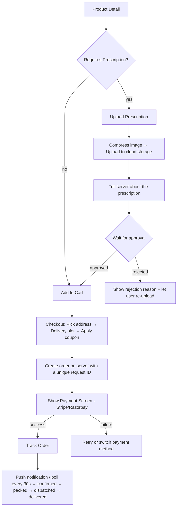

# System Design: Medicine Order Flow (React Native)

A user can browse medicines, upload a prescription if needed, add items to cart, pay, and track delivery. The cart is saved locally on the device. Before payment, the server double-checks everything. Order status updates come via push notifications, with polling as a backup.



---

## 1. Requirements

### Functional (What the app must do)

- User can upload a prescription via camera or file; they can only add that medicine to cart after a pharmacist approves it
- Cart: add/remove items, change quantity; cart is saved so it survives app restarts
- Checkout: pick delivery address, choose a time slot, apply a coupon or use wallet balance
- Payment: card, UPI, wallet, or cash on delivery; OTP/3D Secure is handled by the payment SDK automatically; user can retry if payment fails
- Order tracking: see a status timeline; push notifications are the primary update method, polling every 30 seconds is the fallback
- Reorder: if the prescription has expired, the user must upload a fresh one before re-ordering

### Non-functional (How well it must do it)

- Prescription images are never stored on the device; the upload link expires in 15 minutes
- The app never touches raw card data — the payment SDK (Stripe/Razorpay) handles that entirely
- Placing an order twice (e.g., double-tap) must never charge the user twice
- Cart survives crashes because it is saved on-device; prices and quantity limits always come from the server, never trusted from the client

---

## 2. Architecture — Main Pieces

| Piece                               | What it does                                                                                                                                  |
| ----------------------------------- | --------------------------------------------------------------------------------------------------------------------------------------------- |
| **Prescription Manager**            | Handles photo upload, sends it to cloud storage, waits for pharmacist approval, and blocks checkout for prescription medicines until approved |
| **Cart (stored locally on device)** | Saves cart items on the device so they survive restarts; checks with server before entering checkout                                          |
| **Checkout Orchestrator**           | Walks the user through address → slot → coupon → payment in order; rolls back if something fails                                              |
| **Payment Service**                 | Talks to Stripe/Razorpay; server creates the payment session, user pays in the SDK's own screen, server confirms the charge                   |
| **Order Store**                     | Keeps list of orders and the active order; updated via push or polling                                                                        |
| **Push Handler**                    | Receives silent push notifications for prescription approvals and order status changes                                                        |

---

## 3. Data Shapes

### Prescription

```json
{
  "rxId": "rx_abc123",
  "status": "approved",
  "eligibleProductIds": ["prod_amox500"],
  "expiresAt": 1745536000000,
  "approvedBy": "pharmacist_id|ai_model_v2",
  "rejectionReason": null
}
```

`status` can be: `pending | under_review | approved | rejected | expired`

### Cart Item

```json
{
  "productId": "prod_amox500",
  "quantity": 2,
  "unitPrice": 45.0,
  "rxRequired": true,
  "rxId": "rx_abc123",
  "maxQuantity": 30,
  "stockStatus": "in_stock"
}
```

### Order

```json
{
  "orderId": "ord_789",
  "status": "dispatched",
  "paymentStatus": "captured",
  "totalAmount": 320.0,
  "deliverySlot": { "date": "2026-04-24", "window": "10:00-12:00" },
  "items": [
    {
      "productId": "prod_amox500",
      "name": "Amoxicillin 500mg",
      "quantity": 2,
      "unitPrice": 45.0,
      "rxRequired": true
    }
  ],
  "timeline": [
    { "status": "confirmed", "ts": 1714000000000 },
    { "status": "dispatched", "ts": 1714020000000 }
  ]
}
```

> **Why items live on the Order (not just in the cart):** The cart is cleared immediately after a successful payment. If the user opens the order later — confirmation screen, order history, reorder flow — the only source of truth for what they bought is the server's order record. The client never reconstructs order items from cart state.

### What we save locally on the device (MMKV — fast on-device key-value store)

| Key                        | What it stores                                                                                         |
| -------------------------- | ------------------------------------------------------------------------------------------------------ |
| `cart_items`               | The full cart as a JSON list                                                                           |
| `pending_payment_order_id` | Order ID saved just before showing the payment screen — used to recover if the app crashes mid-payment |
| `checkout_idempotency_key` | A unique ID for this checkout attempt — cleared after a successful order to prevent duplicate charges  |

---

## 4. API Endpoints

```
POST /prescriptions           { s3Key, productIds }     → { rxId, status }
GET  /prescriptions/:rxId                               → { status, eligibleProductIds, rejectionReason }

POST /cart/validate           { items }                 → { valid, issues: [{productId, issue}] }

GET  /delivery/slots          ?pincode&date             → [{ slotId, window, available }]

POST /orders                  { items, addressId, slotId, couponCode }  → { orderId, clientSecret }
                              Header: Idempotency-Key: <uuid>
                              Server does:
                                1. Creates order record in DB with status "pending_payment"
                                2. Calls Stripe: "create a payment intent for this amount"
                                3. Stripe returns a paymentIntentId
                                4. Server saves paymentIntentId on the order record in DB
                                5. Returns orderId + clientSecret (a token Stripe needs to show the payment sheet)

GET  /orders/:id                                        → full order including items, timeline, paymentStatus
GET  /orders/:id/location                               → { lat, lng } — only when status is dispatched

Stripe webhook (server-side, not a client API):
  payment_intent.succeeded → server marks order "confirmed", sends push to client
  payment_intent.failed    → server marks order "failed", sends push to client
```

---

## 5. Key Design Decisions (Deep Dives)

### Prescription Upload

```typescript
async function uploadPrescription(uri: string, productIds: string[]) {
  // Shrink the image before uploading (saves bandwidth)
  const compressed = await ImageResizer.createResizedImage(
    uri,
    1200,
    1600,
    "JPEG",
    80,
  );

  // Ask the server for a short-lived upload link (pre-signed URL)
  const { uploadUrl, s3Key } = await api.post("/media/rx-upload-url");

  // Upload directly to cloud storage using that link
  await fetch(uploadUrl, {
    method: "PUT",
    body: await readFile(compressed.uri),
  });

  // Tell our server the upload is done
  const { rxId } = await api.post("/prescriptions", { s3Key, productIds });

  // Start listening for approval (push notification first, polling as backup)
  PrescriptionPoller.start(rxId);

  // Delete the compressed image from the device immediately — never cache prescriptions
  await FileSystem.deleteAsync(compressed.uri);
}
```

### Prescription Status — What the user sees

| Status         | What the UI shows                    | What the user can do                          |
| -------------- | ------------------------------------ | --------------------------------------------- |
| `pending`      | Loading spinner                      | Wait                                          |
| `under_review` | "Pharmacist reviewing (up to 2 hrs)" | Browse, but can't checkout prescription items |
| `approved`     | Green checkmark, cart unlocked       | Add to cart                                   |
| `rejected`     | Error message with reason            | Re-upload a corrected prescription            |
| `expired`      | Warning with expiry date             | Get a new prescription from the doctor        |

### Push + Polling Together (for prescription and order status)

**Why both?** Push is fast but can be missed (app backgrounded, network gap). Polling is a reliable safety net.

```typescript
// Polling: checks status on an increasing delay (3s, 6s, 9s... up to 30s max)
function poll(rxId: string, attempt = 1) {
  const delay = Math.min(3000 * attempt, 30_000);
  setTimeout(async () => {
    const { status } = await api.get(`/prescriptions/${rxId}`);
    store.update(rxId, { status });
    if (status === "pending" || status === "under_review")
      poll(rxId, attempt + 1);
  }, delay);
}

// Push wins — if we get a push notification, stop polling immediately
function onPush(data: PushPayload) {
  if (data.type === "rx_status_update") {
    store.update(data.rxId, { status: data.status });
    PrescriptionPoller.stop(data.rxId);
  }
}
```

### Cart — Local First, Server Validates Before Checkout

```typescript
// Adding to cart is instant (no server call needed for non-prescription items)
cartStore.addItem(item);

// Before checkout, ask the server to verify stock, prescription status, and quantity limits
async function validateCartBeforeCheckout() {
  const result = await api.post("/cart/validate", { items: cartStore.items });
  if (!result.valid)
    result.issues.forEach((i) => cartStore.flagIssue(i.productId, i.issue));
  return result;
}
```

**Rule of thumb:** Adding/removing items from cart = instant (optimistic). Payment, prescription approval, order creation = always wait for the server.

### Payment Flow (Stripe)

```typescript
// 1. Server creates a payment session and sends back a secret token
const { orderId, clientSecret } = await api.post("/orders", payload, {
  headers: { "Idempotency-Key": getOrCreateIdempotencyKey() },
});

// 2. Save the order ID locally in case the app crashes during payment
MMKV.set("pending_payment_order_id", orderId);

// 3. Show Stripe's own payment screen (handles card input, 3DS, OTP internally)
await initPaymentSheet({
  paymentIntentClientSecret: clientSecret,
  merchantDisplayName: "PharmaCo",
});
const { error } = await presentPaymentSheet();

// 4. Payment sheet closed successfully — no confirm call needed
//    Stripe fires payment_intent.succeeded webhook directly to our server
//    Server marks the order confirmed and sends a push notification to the client
if (!error) {
  MMKV.delete("pending_payment_order_id");
  clearIdempotencyKey();
  cartStore.clearCart();
  navigate("OrderTracking", { orderId }); // poll GET /orders/:id until status is "confirmed"
}
```

### Preventing Duplicate Orders (Idempotency)

**Problem:** User double-taps "Place Order", or retries after a network failure — we must never charge twice.

**Solution:** Generate a unique ID for each checkout attempt. Send it as a header with every order creation request. The server ignores any duplicate request with the same ID. The key is saved locally and only deleted after the order is confirmed — so even a crash doesn't lose it.

```typescript
function getOrCreateIdempotencyKey() {
  return (
    MMKV.getString("checkout_idempotency_key") ??
    (() => {
      const key = uuid();
      MMKV.set("checkout_idempotency_key", key);
      return key;
    })()
  );
}
```

### Crash Recovery — App Crashed During Payment

**Problem:** App crashes after the payment sheet closes but before the user sees the order confirmation screen.

**Not a problem for order confirmation** — Stripe's webhook already notified the server, so the order is confirmed regardless. The only issue is the client doesn't know where to navigate.

**Solution:** On every app launch (after login), check if there's a saved `pending_payment_order_id`. Fetch the order status and navigate accordingly:

```typescript
async function recoverPendingPayment() {
  const orderId = MMKV.getString("pending_payment_order_id");
  if (!orderId) return;
  const order = await api.get(`/orders/${orderId}`);
  if (order.paymentStatus === "captured")
    navigate("OrderConfirmation", { orderId }); // payment went through, show success
  else if (["failed", "cancelled"].includes(order.paymentStatus))
    navigate("Checkout"); // payment failed, let user retry
  else navigate("PaymentRecovery", { orderId }); // still pending, show recovery screen
}
```

### Order Tracking

```typescript
function useOrderTracking(orderId: string) {
  useEffect(() => {
    if (isTerminalStatus(order?.status)) return; // don't poll for delivered/cancelled orders
    const interval = setInterval(async () => {
      const updated = await api.get(`/orders/${orderId}`);
      orderStore.update(orderId, updated);
      if (isTerminalStatus(updated.status)) clearInterval(interval);
    }, 30_000); // poll every 30 seconds as fallback; push notifications are the fast path
    return () => clearInterval(interval);
  }, [orderId]);
}
```

### Cash on Delivery (Pay on Delivery)

No payment screen is shown. Order is created and confirmed in one step. No crash-recovery key is written because there's no payment SDK involved.

```typescript
if (method === "pod") {
  const { orderId } = await api.post(
    "/orders",
    { ...payload, method: "pod" },
    { headers: { "Idempotency-Key": getOrCreateIdempotencyKey() } },
  );
  clearIdempotencyKey();
  cartStore.clearCart();
  navigate("OrderConfirmation", { orderId });
}
// Delivery agent collects cash → their app marks paymentStatus as "collected"
```

### When Does Stock Actually Get Reserved?

**Not when added to cart** — only a soft check happens ("is it in stock?"). Stock is actually held when the order is created (`POST /orders`). This way we don't block inventory for carts that are abandoned.

**Consequence:** An item can go out of stock between "add to cart" and checkout. The `/cart/validate` call catches this at checkout entry — before payment, never after.

### Live Map Tracking (Delivery Agent Location)

Only active when order status is `dispatched`. Client polls `GET /orders/:id/location` every 30 seconds and updates the pin on the map. Stops polling when a "delivered" push arrives. Not shown for any other status.

### Order Cancellation and Refund

```
DELETE /orders/:id   → only allowed when status is "confirmed" or "packed"
                       returns { refundId, estimatedRefundTs }
```

- **Before the order is dispatched:** Cancel works instantly. Stock is released. Refund goes back to the original payment method via Stripe/Razorpay.
- **After dispatch:** Cannot cancel via the app — user must contact support.
- **Cash on delivery orders:** No refund needed; order is just marked void.

UI: Immediately show "Cancelling…" (optimistic). If server rejects it (already dispatched), revert and show a message.

### Error Codes the App Handles

```typescript
type PharmacyError =
  | { code: "RX_REQUIRED"; productId: string } // prescription needed
  | { code: "RX_EXPIRED"; rxId: string } // prescription is too old
  | { code: "CONTROLLED_SUBSTANCE_LIMIT"; limit: number } // server enforced daily limit
  | { code: "PAYMENT_DECLINED"; retryable: boolean } // card/UPI failed
  | { code: "ORDER_DUPLICATE"; existingOrderId: string }; // same order already exists

// ORDER_DUPLICATE → take user to the existing order (not an error, just a redirect)
// RX_EXPIRED → send user back to prescription upload
// CONTROLLED_SUBSTANCE_LIMIT → shown as a banner; never checked on the client
```

---

## 6. Security

| Risk                               | How we handle it                                                                                       |
| ---------------------------------- | ------------------------------------------------------------------------------------------------------ |
| Prescription image leaks           | Upload links expire in 15 minutes; server checks that the user owns the prescription before serving it |
| User tampers with price in the app | Server re-calculates all prices and limits at order creation — client values are ignored               |
| Double charge                      | Unique request ID (idempotency key) per checkout + crash recovery logic                                |
| Controlled substance abuse         | Per-user daily purchase limits enforced server-side, not client-side                                   |
| Fake prescription                  | AI screening + pharmacist review; who approved it is recorded in the prescription record               |

---

## 7. Third-Party Libraries

| Library                        | What it's used for                                                                 |
| ------------------------------ | ---------------------------------------------------------------------------------- |
| `@stripe/stripe-react-native`  | Card payments, Apple/Google Pay, 3DS — PCI compliant, app never sees raw card data |
| `react-native-razorpay`        | UPI, wallets, net banking (popular in India)                                       |
| `react-native-vision-camera`   | High quality camera for capturing prescription documents                           |
| `react-native-document-picker` | Let user pick a PDF prescription from their files                                  |
| `react-native-image-resizer`   | Compress prescription photos before uploading to save bandwidth                    |
