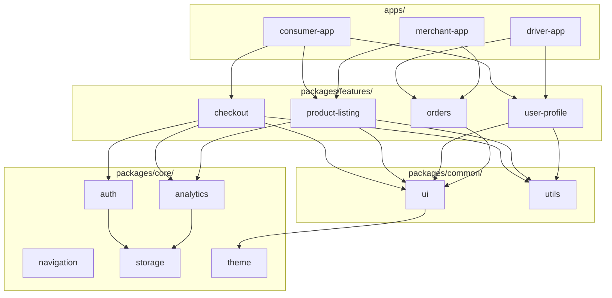

# System Design: Modular Architecture (React Native / Mobile)

Modular architecture treats each product feature as a **self-contained package** — it has its own version number, its own tests, and can be added or removed without touching the rest of the app. The entire codebase lives in a **monorepo** (one git repo for everything) managed by Nx, which tracks what depends on what, caches builds, and knows exactly what needs to be rebuilt when something changes.

**Core idea:** Apps are thin shells. They wire feature packages together and handle only native startup and the top-level navigation. All real product code lives in feature packages. Shared concerns (auth, storage, theming, analytics) live in core packages.



---

## 1. Requirements (R)

### Functional

- **Feature isolation:** Each feature is a self-contained package with its own components, state, and navigation. Adding or removing a feature requires only a dependency change in the app's `package.json`.
- **Multi-app support:** Multiple RN apps (consumer, driver, merchant) live in `apps/` and compose different subsets of feature packages.
- **Shared core and common layers:** Auth, storage, theming, analytics, and reusable UI components are shared packages — written once, consumed everywhere.
- **Independent versioning:** Each package has its own version number. An app can lock to a specific version of a feature package and upgrade when it is ready.
- **Smart rebuilds:** The build tool knows which packages each app uses, so CI only rebuilds and retests what is actually affected by a change — not everything.

### Non-functional

- **No feature-to-feature imports:** Feature packages can only import from `common` and `core` — never from each other. This is automatically enforced by an Nx lint rule, not by convention.
- **Fast builds:** Nx caches build output. If a package did not change, rebuilding it takes zero time.
- **Safe upgrades:** A breaking change in a `core` package does not force all apps to upgrade at the same time. Each app stays on its locked version and upgrades when its team is ready.
- **Independent release schedules:** Each app ships on its own schedule. Driver v4.2 and Consumer v6.0 can go out in the same week from the same repo without any coordination.

---

## 2. Architecture (A)

### Folder Structure

```
monorepo/
├── apps/
│   ├── consumer/          # Customer-facing RN app
│   ├── driver/            # Driver RN app
│   └── merchant/          # Merchant dashboard RN app
│
├── packages/
│   ├── core/
│   │   ├── auth/          # Token management, session, refresh
│   │   ├── navigation/    # React Navigation stack definitions + deep link config
│   │   ├── storage/       # MMKV wrapper with typed get/set helpers
│   │   ├── analytics/     # Event tracking SDK
│   │   └── theme/         # Design tokens, typography, spacing, color palettes
│   │
│   ├── common/
│   │   ├── ui/            # Shared components: Button, Card, Input, Modal...
│   │   └── utils/         # Date formatting, currency, validators, hooks
│   │
│   └── features/
│       ├── checkout/
│       ├── product-listing/
│       ├── orders/
│       └── user-profile/
│
├── nx.json
├── package.json           # Workspace root — no production code lives here
└── tsconfig.base.json     # Path aliases for all packages (@rideshare/ui, @rideshare/auth, etc.)
```

### Layer Rules (enforced by Nx module boundary tags)

| Layer        | Can import from        | Cannot import from     |
| ------------ | ---------------------- | ---------------------- |
| `apps/*`     | features, common, core | other apps             |
| `features/*` | common, core           | other features, apps   |
| `common/*`   | core                   | features, apps         |
| `core/*`     | nothing internal       | features, common, apps |

Rule breaks are caught during linting (`@nx/enforce-module-boundaries`) — before the code even reaches CI.

### What Lives in Each Layer

**Core** — foundational infrastructure with no UI. Any package in the repo can use it.

- `auth`: saves tokens to MMKV, exposes `useSession()`, handles token refresh behind the scenes.
- `navigation`: exports the root navigator and a `navigate()` helper for navigating from outside a component.
- `storage`: a typed MMKV wrapper — `storage.get<T>(key)` / `storage.set(key, value)`.
- `theme`: design tokens (colors, spacing, typography) as a typed JS object + a `ThemeProvider` — one place to update the look of the whole app.
- `analytics`: the event tracking SDK (see DesignAnalyticsSDK).

**Common** — shared UI and utility code with no business logic.

- `ui`: design-system components (`Button`, `Text`, `Card`, `BottomSheet`, ...). No API calls, no state.
- `utils`: pure helper functions — date formatting, currency display, validators, custom hooks (`useDebounce`, `usePrevious`).

**Features** — one package per product feature.

- Owns its screens, local state (Zustand slice or React Query hooks), and its own navigator (a stack/tab that the app shell mounts).
- Exports one entry point: `{ FeatureNavigator, featureStore }`.
- Has no knowledge of which app is using it.

**Apps** — thin shells with three jobs only:

1. Start up native modules (`AppRegistry`, gesture handler, safe area provider).
2. Build the root navigator by combining feature navigators.
3. Own app-specific config (bundle ID, splash screen, app icon, environment variables).

---

## 3. Data Model (D)

### Package Manifest Pattern

Every package follows the same `package.json` shape:

```json
{
  "name": "@rideshare/checkout",
  "version": "2.1.0",
  "main": "src/index.ts",
  "dependencies": {
    "@rideshare/ui": "^3.0.0",
    "@rideshare/auth": "^1.4.0",
    "@rideshare/analytics": "^1.2.0"
  },
  "peerDependencies": {
    "react": "^18.0.0",
    "react-native": "^0.73.0"
  }
}
```

- `peerDependencies` for React and RN — feature packages do not bundle their own copy; they use the single copy installed by the host app.
- `dependencies` use `^` (caret) so packages pick up small bug-fix and minor updates automatically, but never a version with breaking changes.

### How Apps Reference Packages — Two Modes

#### Mode 1 — Local workspace reference (no versioning)

Inside the monorepo, apps can reference packages directly using the workspace protocol. No version number is needed — the package manager just links to the local folder on disk.

```json
{
  "name": "consumer",
  "dependencies": {
    "@rideshare/checkout": "*",
    "@rideshare/auth": "*"
  }
}
```

With Yarn or pnpm workspaces, `*` (or `workspace:*`) means "use whatever is on disk right now." Every time you change `@rideshare/checkout` locally, the consumer app picks it up immediately — no publish step, no version bump. This is the fastest inner loop for development.

**Trade-off:** Because there is no version number, all local apps always run the latest code. A breaking change in a core package breaks every app in the repo at once. Use this mode when teams are small and all apps are owned by the same group.

#### Mode 2 — Published version (explicit version number)

Packages are published to a private npm registry (e.g. GitHub Packages, Artifactory, or a private npm org). Apps then depend on specific version numbers exactly like any third-party package.

```json
{
  "name": "consumer",
  "dependencies": {
    "@rideshare/checkout": "2.1.0",
    "@rideshare/product-listing": "1.8.3",
    "@rideshare/auth": "1.4.2"
  }
}
```

Each app upgrades on its own schedule. A breaking change in `@rideshare/auth` does not affect consumer until that team deliberately bumps the version in their `package.json`.

**Bonus — usable outside the monorepo:** Because the package is published to a registry, any external repo (a partner team's app, a white-label product, a separate experiment app) can install it exactly the same way. The package has no dependency on the monorepo's folder structure.

```json
// external-app/package.json — outside the monorepo entirely
{
  "dependencies": {
    "@rideshare/ui": "3.0.0",
    "@rideshare/auth": "1.4.2"
  }
}
```

#### Choosing between the two

|                         | Local workspace (`*`)                | Published version                                   |
| ----------------------- | ------------------------------------ | --------------------------------------------------- |
| Setup effort            | None                                 | Requires a registry + CI publish step               |
| Inner loop speed        | Instant — change and run             | Must publish before the consumer picks it up        |
| Breaking change impact  | Hits all apps immediately            | Only hits apps that choose to upgrade               |
| Usable outside monorepo | No                                   | Yes                                                 |
| Best for                | Small teams, all apps owned together | Multiple teams, or packages shared outside the repo |

Most large-scale monorepos start with local references and switch to published versions once teams grow large enough that a single breaking change cascading across all apps becomes a real problem.

---

## 4. API (I)

### Feature Package Entry Point Contract

Every feature exports exactly this shape from its `src/index.ts`:

```typescript
// packages/features/checkout/src/index.ts

export { CheckoutNavigator } from "./navigation/CheckoutNavigator";
export { checkoutStore } from "./store/checkoutStore";
export type { CheckoutDeepLinkParams } from "./navigation/types";
```

The app shell mounts it like this:

```typescript
// apps/consumer/src/RootNavigator.tsx

import { CheckoutNavigator } from '@rideshare/checkout';
import { ProductListingNavigator } from '@rideshare/product-listing';

export function RootNavigator() {
  return (
    <Stack.Navigator>
      <Stack.Screen name="ProductListing" component={ProductListingNavigator} />
      <Stack.Screen name="Checkout" component={CheckoutNavigator} />
    </Stack.Navigator>
  );
}
```

Removing a feature = delete one `Stack.Screen` line and one dependency from `package.json`.

### Nx Commands

```bash
# Build only what changed since main
nx affected --target=build

# Run tests only for packages affected by current branch
nx affected --target=test

# Visualize the full dependency graph
nx graph

# Build a specific app
nx build consumer

# Run lint across the entire workspace
nx run-many --target=lint --all
```

---

## 5. Deep Dives (O)

### Version Management — Avoiding Rollbacks from Common Library Changes

The problem: `@rideshare/auth` releases v2.0 with a breaking change. Without version locking, every app gets it at the same time — and if one team is not ready, the only fix is a rollback across the entire repo.

**Solution — per-app version locking + Changesets:**

1. **Changesets** (`@changesets/cli`) manages the release process. Every pull request that touches a package includes a small changeset file that says whether it is a bug fix, new feature, or breaking change, and what it does.
2. When the PR is merged, a GitHub Action opens a "Version PR" that bumps the affected package version numbers and updates changelogs.
3. Apps lock to exact versions. `@rideshare/auth@1.4.2` in the consumer app stays at `1.4.2` even after `@rideshare/auth@2.0.0` is published. Consumer upgrades only when its team chooses to.
4. `nx affected` means CI only builds and tests packages that actually changed — publishing `@rideshare/auth@2.0.0` does not re-run tests for `@rideshare/checkout` unless checkout depends on auth.

```
timeline:
  @rideshare/auth v1.4.2  →  @rideshare/auth v2.0.0 published
  consumer app         still locked to 1.4.2 ← no forced upgrade
  driver app           upgrades to 2.0.0 in its own PR ← team's choice
```

### Adding or Removing a Feature

**Add:**

1. `nx generate @nx/react-native:library features/new-feature --directory=packages/features`
2. Build screens, state, navigator inside the new package.
3. In the target app's `package.json`, add `"@rideshare/new-feature": "1.0.0"`.
4. Mount `NewFeatureNavigator` in the app's root navigator.

**Remove:**

1. Delete `@rideshare/old-feature` from the app's `package.json`.
2. Remove its screen from the root navigator.
3. The package itself stays in the monorepo for other apps that still use it — or is deleted separately when no app references it.

### Shared Native Modules

Native modules (camera, biometrics, Bluetooth, push notifications) must be installed at the **app level**, not inside feature packages. Feature packages declare them as `peerDependencies` to signal "I need this, but don't install it yourself — the app will":

```json
// packages/features/checkout/package.json
"peerDependencies": {
  "react-native-camera": ">=4.0.0"
}
```

The app installs and links the native module once. Every feature package that needs it uses that same copy. This prevents duplicate native code and broken link errors.

### Single Android/iOS Container vs Individual Apps

This is a product strategy decision, not a technical one. The right answer depends on whether users switch roles and whether you want one store listing or several.

#### Option A — Individual Apps (Recommended default)

Each RN app is its own APK/IPA with its own App Store / Play Store listing.

```
apps/consumer  →  com.rideshare.consumer  (separate store listing)
apps/driver    →  com.rideshare.driver    (separate store listing)
apps/merchant  →  com.rideshare.merchant  (separate store listing)
```

| Pros                                                                | Cons                                                                                         |
| ------------------------------------------------------------------- | -------------------------------------------------------------------------------------------- |
| A crash in the driver app has zero impact on the consumer app       | Each app links its own copy of native dependencies — larger total install size               |
| Each team ships on its own schedule with no coordination            | Each app loads its own RN runtime                                                            |
| Separate store listings, separate ratings, separate reviews         | Native modules (camera, push) must be set up separately in each app                          |
| Simplest to understand — one app, one JS bundle, one navigator tree | RN version upgrades, native bug fixes, and shared package upgrades must be done in every app |

**Best when:** The apps serve clearly different users (driver vs consumer vs merchant) and teams want to ship independently.

#### Option B — Single Android/iOS Container (Super App)

One native shell that loads separate JS bundles on demand. The shell handles startup, permissions, and deep links. Each "app experience" is a separate JS file that the shell downloads and runs.

```
apps/shell  →  com.rideshare.superapp  (one store listing)
  ├── loads consumer.bundle.js   (downloaded on first consumer launch)
  ├── loads driver.bundle.js     (downloaded on first driver launch)
  └── loads merchant.bundle.js   (downloaded on first merchant launch)
```

| Pros                                                                                         | Cons                                                                                            |
| -------------------------------------------------------------------------------------------- | ----------------------------------------------------------------------------------------------- |
| One install, one listing — users switch roles without installing anything new                | Much more complex to build — the shell needs to route between bundles and keep versions in sync |
| RN runtime and native modules installed once and shared by all bundles                       | All bundles share one crash boundary — a bad release in one bundle can take down the others     |
| Camera, biometrics, and push permissions granted once                                        | Over-the-air JS updates require version compatibility checks between the shell and each bundle  |
| Smaller total install size per user role                                                     | One App Store review covers all experiences — a rejection blocks every team                     |
| RN version upgrade done once in the shell — all bundles get it automatically                 |                                                                                                 |
| Native bug fixes (crashes, permissions, deep links) applied once and all experiences benefit |                                                                                                 |
| Shared native package upgrade (e.g. camera, maps) done in one place, not repeated per app    |                                                                                                 |

**Best when:** Users genuinely switch roles (e.g., a courier who is also a customer), or there is a strong reason to have a single app store entry point.

#### Recommendation

**Start with individual apps.** The monorepo already gives you shared packages and shared CI — that is 90% of the benefit — without the complexity of a native shell. The super app pattern only pays off when role-switching or install size is a real, measured problem. Add it when you have that evidence, not before.

### Nx Caching and CI Speed

Without caching, a 30-package monorepo would run all 30 builds and all test suites on every pull request. With Nx:

- **Local cache:** `nx build consumer` saves the build output. Run the same command again with no changes → done instantly, replayed from cache.
- **Remote cache (Nx Cloud):** The cache is shared across every CI machine and every developer's laptop. If a teammate's PR already built `@rideshare/ui`, your CI run skips it entirely.
- **`nx affected`:** Only packages that are actually affected by the changed file are rebuilt. A change to `@rideshare/checkout` triggers a rebuild of `consumer` (which uses checkout) but skips `driver` (which does not).

This keeps CI under 5 minutes even as the repo grows to 50+ packages.

### Module Boundary Enforcement

Add tags to each project in `nx.json`:

```json
{
  "projects": {
    "checkout": { "tags": ["scope:feature"] },
    "ui": { "tags": ["scope:common"] },
    "auth": { "tags": ["scope:core"] },
    "consumer": { "tags": ["scope:app"] }
  }
}
```

Then in `.eslintrc.json` at the root:

```json
{
  "rules": {
    "@nx/enforce-module-boundaries": [
      "error",
      {
        "depConstraints": [
          {
            "sourceTag": "scope:feature",
            "onlyDependOnLibsWithTags": ["scope:common", "scope:core"]
          },
          {
            "sourceTag": "scope:common",
            "onlyDependOnLibsWithTags": ["scope:core"]
          },
          { "sourceTag": "scope:core", "onlyDependOnLibsWithTags": [] }
        ]
      }
    ]
  }
}
```

A feature package that tries `import { Button } from '@rideshare/orders'` (one feature importing from another) fails lint immediately with a clear error message. The layer rules are enforced automatically — no manual code review checklist needed.
