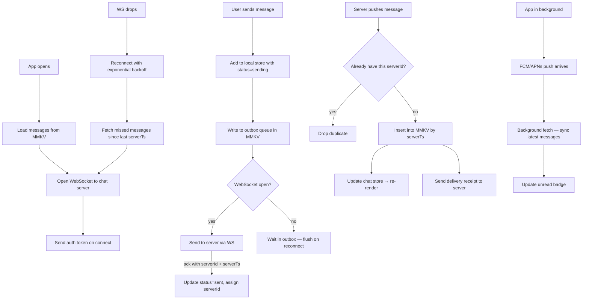

# System Design: Real-Time Chat App (React Native / Android)

WebSocket handles real-time messages while the app is open. Push notifications wake the app when it is closed. MMKV stores messages locally so the chat is instant on open and works offline.



---

## 1. Requirements (R)

### Functional

- **Real-time messaging:** Messages appear instantly without polling.
- **Offline send:** Message is queued and sent when connection is restored.
- **Message ordering:** Messages always appear in server time order, not device time order.
- **Status indicators:** Each message shows sent → delivered → read.
- **Push notifications:** User gets notified when app is in background or killed.
- **Unread counts:** Badge on tab bar and conversation list showing unread messages.
- **Media uploads:** Send images and videos. Show a preview instantly while uploading.
- **Local persistence:** Past messages load instantly from disk — no spinner on open.
- **Background sync:** App silently pulls new messages even when not in foreground.
- **Typing indicators:** Show "X is typing..." — expires automatically.

### Non-functional

- **Message never lost:** Outbox queue survives app kills and crashes.
- **No duplicates:** Same message never shown twice even if received via WS + push.
- **Correct order always:** Late-arriving messages slot into the right position by server timestamp.
- **Low battery impact:** WebSocket kept alive with lightweight ping; no aggressive polling.

---

## 2. Architecture (A)

| Component                   | What it does                                                                                  |
| --------------------------- | --------------------------------------------------------------------------------------------- |
| **WebSocket Manager**       | Single persistent connection. Handles auth handshake, heartbeat ping, reconnect with backoff  |
| **Outbox Queue (MMKV)**     | Stores unsent messages across app restarts. Flushed in order when WS reconnects               |
| **Message Store (Zustand)** | In-memory list per conversation. Components read from here — never from MMKV directly         |
| **MMKV Persistence Layer**  | Writes every message to disk. Seeded into Zustand on app open                                 |
| **Push Handler (FCM/APNs)** | Receives notification, triggers background fetch, updates unread badge                        |
| **Media Upload Manager**    | Uploads file to S3 pre-signed URL in background. Sends WS message only after upload completes |

---

## 3. Data Model (D)

### Message (stored in MMKV and in-memory)

```json
{
  "localId": "uuid-device-generated",
  "serverId": "msg_abc123",
  "conversationId": "conv_789",
  "senderId": "usr_123",
  "text": "Hey!",
  "mediaUrl": null,
  "mediaLocalUri": null,
  "status": "delivered",
  "serverTs": 1714000000000,
  "clientTs": 1714000000100
}
```

- `localId` — generated on device before send. Used as the React list key and dedup guard.
- `serverId` — assigned by server on receipt. Null until server acks.
- `status` — `sending | sent | delivered | read | failed`.
- `serverTs` — source of truth for ordering. `clientTs` is only used while `serverId` is null.
- `mediaLocalUri` — local file path shown as preview while `mediaUrl` is still uploading.

### MMKV keys

| Key                     | Value                                                                |
| ----------------------- | -------------------------------------------------------------------- |
| `chat_msgs_{convId}`    | JSON array of last N messages, sorted by `serverTs`                  |
| `chat_outbox`           | JSON array of messages pending send (survives crashes)               |
| `chat_unread_{convId}`  | Integer count                                                        |
| `chat_last_ts_{convId}` | `serverTs` of newest synced message — used for catch-up on reconnect |
| `chat_cursor_{convId}`  | Pagination cursor for loading older messages                         |

---

## 4. API (I)

### WebSocket events (client → server)

```typescript
// All events share this envelope
type WsEvent = { type: string; payload: unknown };

ws.send({
  type: "send_message",
  payload: { localId, conversationId, text, mediaUrl },
});
ws.send({ type: "delivery_receipt", payload: { serverId, conversationId } });
ws.send({ type: "read_receipt", payload: { conversationId, upToServerId } });
ws.send({ type: "typing_start", payload: { conversationId } });
ws.send({ type: "ping" }); // heartbeat every 30s to keep connection alive
```

### WebSocket events (server → client)

```typescript
// New message from another user
{ type: "new_message", payload: Message }

// Status update for a message you sent
{ type: "message_ack", payload: { localId, serverId, serverTs } }

// Other user delivered or read your message
{ type: "receipt", payload: { serverId, status: "delivered" | "read", actorId } }

// Typing indicator
{ type: "typing", payload: { conversationId, userId, expiresAt } }

{ type: "pong" }
```

### REST endpoints

```
GET  /conversations                    → list with last message + unread count
GET  /conversations/:id/messages?before=cursor&limit=30  → older messages (pagination)
GET  /conversations/:id/messages?since=serverTs          → catch-up after reconnect
POST /media/upload-url                 → { uploadUrl, mediaUrl } — S3 pre-signed URL
```

---

## 5. Deep Dives (O)

### WebSocket Reconnection with Backoff

```typescript
function reconnect(attempt: number) {
  const delay = Math.min(1000 * 2 ** attempt, 30_000); // 1s → 2s → 4s … cap 30s
  setTimeout(async () => {
    await openWebSocket();
    await catchUpMissedMessages(); // fetch since last known serverTs
    flushOutbox(); // replay any queued sends
  }, delay);
}

ws.onclose = () => reconnect(attempt++);
ws.onerror = () => ws.close(); // triggers onclose → reconnect
```

After reconnecting, two things happen before the user sees anything stale: catch-up fetch fills any gap, then the outbox is flushed so queued messages go out in order.

### Outbox Queue — Offline Send

```typescript
async function sendMessage(draft: DraftMessage) {
  const msg = {
    ...draft,
    localId: uuid(),
    status: "sending",
    clientTs: Date.now(),
  };
  MessageStore.addOptimistic(msg); // show immediately in UI
  Outbox.enqueue(msg); // write to MMKV outbox

  if (ws.readyState === WebSocket.OPEN) flushOutbox();
}

async function flushOutbox() {
  const items = Outbox.getAll(); // ordered by clientTs
  for (const msg of items) {
    ws.send({ type: "send_message", payload: msg });
    // item removed from outbox only after server acks with serverId
  }
}
```

Message is removed from the outbox only when the server sends back a `message_ack`. If the app is killed before that, the outbox still has the message and it will be retried on next open.

### Message Ordering — Handling Late Arrivals

All messages are sorted by `serverTs`. When a message arrives out of order (e.g. push notification delivers before WS catches up), it is inserted at the correct position:

```typescript
function insertSorted(messages: Message[], incoming: Message): Message[] {
  const idx = messages.findIndex((m) => m.serverTs > incoming.serverTs);
  if (idx === -1) return [...messages, incoming];
  return [...messages.slice(0, idx), incoming, ...messages.slice(idx)];
}
```

While `serverId` is null (still sending), the message stays at the bottom sorted by `clientTs`. Once the ack arrives, it is updated in place and the list is re-sorted — it almost never moves because the round-trip is < 1s.

### Deduplication

A message can arrive via WebSocket AND a push notification background fetch at the same time. Use `serverId` as the dedup key:

```typescript
function onIncomingMessage(msg: Message) {
  if (MessageStore.has(msg.serverId)) return; // already have it
  // also check if localId matches an optimistic message we sent ourselves
  const optimistic = MessageStore.findByLocalId(msg.localId);
  if (optimistic) {
    MessageStore.upgrade(optimistic.localId, msg); // patch in serverId + serverTs
  } else {
    MessageStore.insert(msg);
  }
  Persistence.save(msg);
}
```

### Push Notifications + Background Sync (Android FCM / iOS APNs)

When the app is in background, the server sends a **data push** (not a visible notification) that wakes the app for ~30s. The app fetches new messages silently and updates the badge:

```typescript
// Android: FirebaseMessagingService.onMessageReceived
// iOS: application(_:didReceiveRemoteNotification:fetchCompletionHandler:)
async function handleBackgroundPush(data: PushPayload) {
  const convId = data.conversationId;
  const since = MMKV.getString(`chat_last_ts_${convId}`);
  const msgs = await api.get(
    `/conversations/${convId}/messages?since=${since}`,
  );
  Persistence.saveBatch(msgs);
  Unread.increment(convId, msgs.length);
  updateBadge(Unread.total());
}
```

For visible notifications (app killed): server sends a display push. Tapping it deep-links into the conversation and triggers a catch-up fetch.

### Unread State

```typescript
// Increment when a message arrives and the conversation is not on screen
function onMessageArrived(msg: Message) {
  const isActive = NavigationState.activeConversation() === msg.conversationId;
  if (!isActive) Unread.increment(msg.conversationId);
}

// Clear when user opens the conversation
function onConversationOpened(convId: string) {
  Unread.clear(convId);
  ws.send({
    type: "read_receipt",
    payload: { conversationId: convId, upToServerId: lastServerId },
  });
}
```

`Unread` state is kept in Zustand and written to MMKV. Badge on Android is updated via `ShortcutBadger`; iOS reads the `badgeCount` from the push payload.

### Media Upload Flow

```typescript
async function sendImage(uri: string, convId: string) {
  const localId = uuid();
  // 1. Show preview immediately using the local file URI
  MessageStore.addOptimistic({
    localId,
    mediaLocalUri: uri,
    status: "sending",
    convId,
  });

  // 2. Get S3 pre-signed URL from server
  const { uploadUrl, mediaUrl } = await api.post("/media/upload-url");

  // 3. Upload directly to S3 (not through your server — saves bandwidth cost)
  await fetch(uploadUrl, { method: "PUT", body: await readFile(uri) });

  // 4. Now send the message with the public CDN URL
  ws.send({ type: "send_message", payload: { localId, convId, mediaUrl } });
  MessageStore.patch(localId, { mediaLocalUri: null, mediaUrl });
}
```

Upload goes directly to S3 so your chat server never handles large binary payloads. The local URI preview means the sender sees their image instantly — no blank placeholder during upload.

### Typing Indicators

Server broadcasts `{ type: "typing", userId, conversationId, expiresAt }` to all participants. Client removes the indicator when `expiresAt` passes (no "stop typing" event needed — simpler):

```typescript
const typingTimers: Record<string, ReturnType<typeof setTimeout>> = {};

function onTypingEvent(e: TypingEvent) {
  TypingStore.set(e.conversationId, e.userId);
  clearTimeout(typingTimers[e.userId]);
  typingTimers[e.userId] = setTimeout(() => {
    TypingStore.remove(e.conversationId, e.userId);
  }, e.expiresAt - Date.now());
}
```

Throttle outgoing `typing_start` events to once every 3s so you don't flood the server on every keystroke.

### Pagination — Loading Older Messages

Chat opens showing the latest 30 messages (already in MMKV — no network needed). When the user scrolls to the top, fetch the next page using a cursor:

```typescript
async function loadOlderMessages(convId: string) {
  if (isLoadingMore || !hasMore) return;
  setLoadingMore(true);

  const cursor = MMKV.getString(`chat_cursor_${convId}`); // null on first page
  const msgs = await api.get(
    `/conversations/${convId}/messages?before=${cursor}&limit=30`,
  );

  if (msgs.length < 30) setHasMore(false); // reached the top of history
  MMKV.set(`chat_cursor_${convId}`, msgs[0].serverId); // oldest message in this batch
  MessageStore.prepend(convId, msgs); // insert before existing messages
}
```

Triggered by `onStartReached` on the inverted FlashList. The cursor is the `serverId` of the oldest message already loaded — the server returns 30 messages older than that. Saving the cursor to MMKV means a reload after backgrounding resumes pagination from the right spot.

### FlashList — Performant Message List

Use **FlashList** (Shopify) instead of FlatList. It recycles item components correctly even when items have different heights (text vs image vs system message), which is exactly the chat use case:

```tsx
<FlashList
  ref={listRef}
  data={messages}
  inverted // newest at bottom; scroll up to go back in time
  estimatedItemSize={72} // rough average height — reduces layout passes
  keyExtractor={(msg) => msg.localId}
  getItemType={(msg) => {
    // separate recycling pools per type — no layout thrash
    if (msg.mediaUrl) return "media";
    if (msg.isSystem) return "system";
    return "text";
  }}
  renderItem={({ item }) => <MessageBubble msg={item} />}
  onStartReached={loadOlderMessages}
  onStartReachedThreshold={0.3} // trigger when 30% from top
  ListHeaderComponent={isLoadingMore ? <ActivityIndicator /> : null}
/>
```

Key decisions:

- **`inverted`** — list renders bottom-up so new messages always appear at the bottom without any `scrollToEnd` call.
- **`getItemType`** — FlashList keeps a separate view pool per type. A text bubble view is never reused for an image bubble, avoiding mismatched layouts.
- **`estimatedItemSize`** — set this to the actual average height of your messages. Wrong values cause the scroll position to jump when the real height is measured. Log actual heights during dev and tune this number.
- **Memoize `MessageBubble`** with `React.memo` — the list is the hottest render path in the app.

---

## 6. Real Tools to Know

| Tool                                 | Best for                               | Notes                                                                   |
| ------------------------------------ | -------------------------------------- | ----------------------------------------------------------------------- |
| **Firebase Realtime DB / Firestore** | Small teams, quick prototypes          | Built-in real-time sync, offline support, push via FCM — all in one SDK |
| **Stream Chat SDK**                  | Production chat without building infra | Handles WS, push, media, reactions, threads. React Native SDK available |
| **Sendbird**                         | Enterprise chat (banking, healthcare)  | Strong compliance story; more expensive than Stream                     |
| **AWS AppSync**                      | GraphQL subscriptions over WebSocket   | Good if already on AWS; subscriptions replace the WS layer              |
| **XMPP / Matrix**                    | Open protocol, self-hosted             | Full control; higher ops burden                                         |

**When to build vs buy:** Build if chat is the core product and you need full control over data and cost at scale. Use Stream or Sendbird if chat is a secondary feature and shipping speed matters.
