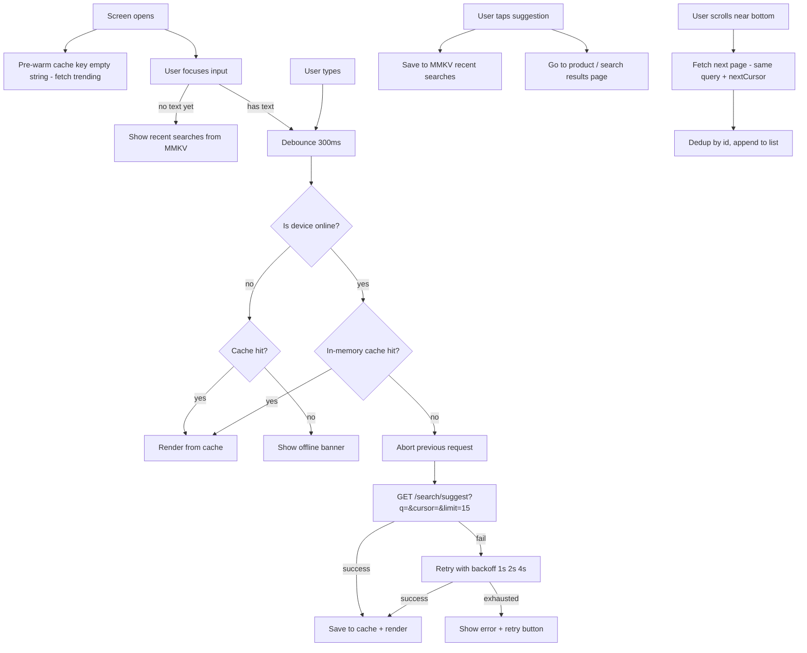

# System Design: Search with Autocomplete (React Native — Truemeds)

**Core idea:** As the user types, suggestions are fetched with a 300ms debounce, cached in memory, and shown in a paginated list. Previous requests are cancelled on each new keystroke. Recent searches are saved locally and shown before any typing begins.



---

## 1. Requirements

### Functional

- Show medicine suggestions as the user types (after 2+ characters)
- Before any typing, show recent searches saved on device
- Tapping a suggestion navigates to the product page or full search results
- Paginated list of suggestions — load more as user scrolls down
- Matched text is highlighted in each suggestion row
- Clear button inside the search bar to reset

### Non-functional

- Suggestions appear within 200ms for cached queries, under 500ms for fresh ones
- No flicker or duplicate results when pages overlap
- Only one API call active at a time — previous ones are cancelled
- Search result cache lives only in memory (cleared on screen exit)

---

## 2. Architecture

| Component                  | What it does                                                                     |
| -------------------------- | -------------------------------------------------------------------------------- |
| **SearchStore (Zustand)**  | Holds query, suggestions list, loading state, error, and pagination cursors      |
| **Debounce Hook**          | Waits 300ms after the last keystroke before triggering a fetch                   |
| **Request Manager**        | Cancels the previous `AbortController` on each new fetch                         |
| **In-Memory Cache**        | Map of `query → { suggestions, nextCursor }` — avoids re-fetching the same query |
| **MMKV (Recent Searches)** | Persists up to 10 recent search terms across sessions                            |
| **Pagination Manager**     | Tracks `nextCursor`, `hasMore`, `isFetchingMore` per query                       |

---

## 3. Data Model

### Suggestion item

```json
{
  "id": "prod_amox500",
  "name": "Amoxicillin 500mg",
  "brand": "Cipla",
  "category": "Antibiotic",
  "imageUrl": "https://cdn.truemeds.com/products/amox500.jpg",
  "rxRequired": true,
  "inStock": true,
  "matchedTokens": ["Amox"]
}
```

`matchedTokens` — server sends back which part of the name matched so the client can bold it without re-computing.

### Suggestion page (API response)

```json
{
  "suggestions": [...],
  "nextCursor": "cursor_opaque_xyz",
  "total": 84
}
```

### MMKV keys

| Key               | Value                                               |
| ----------------- | --------------------------------------------------- |
| `recent_searches` | JSON array of up to 10 search strings, newest first |

---

## 4. API

```
GET /search/suggest?q=amox&cursor=<nextCursor>&limit=15
  → { suggestions[], nextCursor, total }

GET /search/suggest?q=amox&limit=15   (first page — no cursor)
  → { suggestions[], nextCursor, total }
```

- Cursor-based pagination — same reason as the feed: stable results even if new products are indexed mid-session.
- `total` is used to show "84 results for amox" at the top.
- Server returns results ranked by: exact prefix match first → fuzzy match → popularity.

---

## 5. Deep Dives

### Debounce + Cancel Previous Request

Two problems to solve together:

1. **Too many requests** — debounce 300ms so only the last keystroke in a burst fires a request.
2. **Race condition** — user types "am" then "amox". Both go out. "am" is slow and arrives _after_ "amox" → wrong results shown. Fix: cancel "am" before firing "amox" with `AbortController`.

```typescript
const abortRef = useRef<AbortController | null>(null);

const fetchSuggestions = useMemo(
  () =>
    debounce(async (query: string) => {
      if (query.length < 2) return;

      abortRef.current?.abort();
      abortRef.current = new AbortController();

      const cached = cache.get(query);
      if (cached) {
        store.setSuggestions(query, cached.suggestions, cached.nextCursor);
        return;
      }

      store.setLoading(true);
      try {
        const data = await api.get("/search/suggest", {
          params: { q: query, limit: 15 },
          signal: abortRef.current.signal,
        });
        cache.set(query, data);
        store.setSuggestions(query, data.suggestions, data.nextCursor);
      } catch (err) {
        if (err.name !== "AbortError") store.setError(true);
      } finally {
        store.setLoading(false);
      }
    }, 300),
  [],
);
```

### In-Memory Cache — Avoid Re-fetching Same Query

**Two strategies depending on session length:**

| Strategy           | Shape                         | Best for                                    |
| ------------------ | ----------------------------- | ------------------------------------------- |
| **Hash map**       | `query → suggestions[]`       | Short sessions — simple, O(1)               |
| **Normalized map** | `query → ids[]` + `id → item` | Long sessions — no duplicate data in memory |

Use hash map here (short session, cache cleared on exit). Use normalized map for a long SPA session where the same product appears across many queries.

```typescript
const cache = new Map<
  string,
  { suggestions: Suggestion[]; nextCursor: string | null }
>();
// Cleared on screen exit — no TTL needed, catalog doesn't change mid-session
```

- **Cache eviction:** Clear LRU entries when cache exceeds ~100 keys to avoid memory bloat.
- **Zero-state cache:** Key `""` = trending searches. Pre-warm on screen open so first focus shows results instantly.
- Type "amox" → clear → type "amox" again: instant from cache, no spinner.

### Paginated Suggestions List

```typescript
async function loadNextPage() {
  const { query, nextCursor, hasMore, isFetchingMore } = store;
  if (!hasMore || isFetchingMore) return;

  store.setFetchingMore(true);
  const data = await api.get("/search/suggest", {
    params: { q: query, cursor: nextCursor, limit: 15 },
  });

  // Dedup guard — cursor drift can cause overlaps
  const existingIds = new Set(store.suggestions.map((s) => s.id));
  const fresh = data.suggestions.filter((s) => !existingIds.has(s.id));

  store.appendSuggestions(fresh, data.nextCursor);
  if (!data.nextCursor || data.suggestions.length < 15) store.setHasMore(false);
  store.setFetchingMore(false);
}
```

```tsx
<FlashList
  data={suggestions}
  keyExtractor={(s) => s.id}
  estimatedItemSize={64}
  renderItem={({ item }) => <SuggestionRow item={item} />}
  onEndReached={loadNextPage}
  onEndReachedThreshold={0.3}
  ListFooterComponent={isFetchingMore ? <ActivityIndicator /> : null}
/>
```

### Highlight Matched Text

Server sends `matchedTokens` so the client doesn't need to run fuzzy matching:

```tsx
function HighlightedName({ name, matchedTokens }: Props) {
  const parts = splitByTokens(name, matchedTokens); // split around matched spans
  return (
    <Text>
      {parts.map((p, i) =>
        p.matched ? (
          <Text key={i} style={styles.bold}>
            {p.text}
          </Text>
        ) : (
          <Text key={i}>{p.text}</Text>
        ),
      )}
    </Text>
  );
}
```

### Recent Searches

```typescript
const MAX_RECENT = 10;

function saveRecentSearch(query: string) {
  const existing: string[] = MMKV.getArray("recent_searches") ?? [];
  const updated = [query, ...existing.filter((q) => q !== query)].slice(
    0,
    MAX_RECENT,
  );
  MMKV.set("recent_searches", JSON.stringify(updated));
}

function clearRecentSearch(query: string) {
  const existing: string[] = MMKV.getArray("recent_searches") ?? [];
  MMKV.set(
    "recent_searches",
    JSON.stringify(existing.filter((q) => q !== query)),
  );
}
```

- Shown when input is empty/focused. Tapping a recent term fills input and fetches immediately (skip debounce).
- Each row has `×` to delete just that entry.

### Retry + Offline Mode

```typescript
// Exponential backoff: 1s → 2s → 4s, then give up
async function fetchWithRetry(query: string, attempt = 1) {
  try {
    return await api.get("/search/suggest", {
      params: { q: query, limit: 15 },
    });
  } catch (err) {
    if (attempt >= 3) throw err;
    await delay(1000 * 2 ** (attempt - 1));
    return fetchWithRetry(query, attempt + 1);
  }
}

// Offline check — serve from cache, skip network
const { isConnected } = await NetInfo.fetch();
if (!isConnected) {
  const cached = cache.get(query);
  if (cached)
    store.setSuggestions(query, cached.suggestions, cached.nextCursor);
  else store.setOffline(true);
  return;
}
```

### What to Show in Each State

| State                          | What user sees                                         |
| ------------------------------ | ------------------------------------------------------ |
| Input empty / focused          | Recent searches list                                   |
| Input has text, loading        | Skeleton rows (3–5) — no blank screen                  |
| Input has text, results loaded | Suggestion list with highlighted matches + total count |
| Input has text, no results     | "No results for X — try a different name"              |
| Network error                  | "Something went wrong" with a retry button             |
| Loading more (pagination)      | `ActivityIndicator` at list bottom                     |
| Offline, no cache              | "No internet connection" banner                        |

### Accessibility (React Native)

| Element           | What to set                                                                     |
| ----------------- | ------------------------------------------------------------------------------- |
| `TextInput`       | `accessibilityRole="search"`, `accessibilityLabel="Search medicines"`           |
| Results list      | `accessibilityRole="list"`                                                      |
| Each row          | `accessibilityRole="button"`, `accessibilityLabel={item.name}`                  |
| Loading indicator | `accessibilityLiveRegion="polite"` — announces new suggestions to screen reader |
| Clear button      | `accessibilityLabel="Clear search"`                                             |

`accessibilityLiveRegion="polite"` = RN equivalent of `aria-live="polite"` — announces results without interrupting the screen reader.

### Keyboard and Input Behavior

- `autoFocus` the `TextInput` when the search screen opens — user shouldn't have to tap first.
- On Android: `keyboardShouldPersistTaps="handled"` on the `ScrollView`/`FlashList` — prevents the keyboard closing when the user taps a suggestion.
- Submitting via keyboard ("Search" key) navigates to full search results page for that query.

---

## 6. Libraries

| Library                        | Use                                                    |
| ------------------------------ | ------------------------------------------------------ |
| **FlashList**                  | Performant paginated suggestion list                   |
| **MMKV**                       | Recent searches persistence                            |
| **Zustand**                    | Search state (query, suggestions, loading, pagination) |
| **Lodash debounce**            | 300ms input debounce                                   |
| **AbortController** (built-in) | Cancel in-flight requests on new keystroke             |
| **NetInfo**                    | Detect online/offline to serve from cache              |
