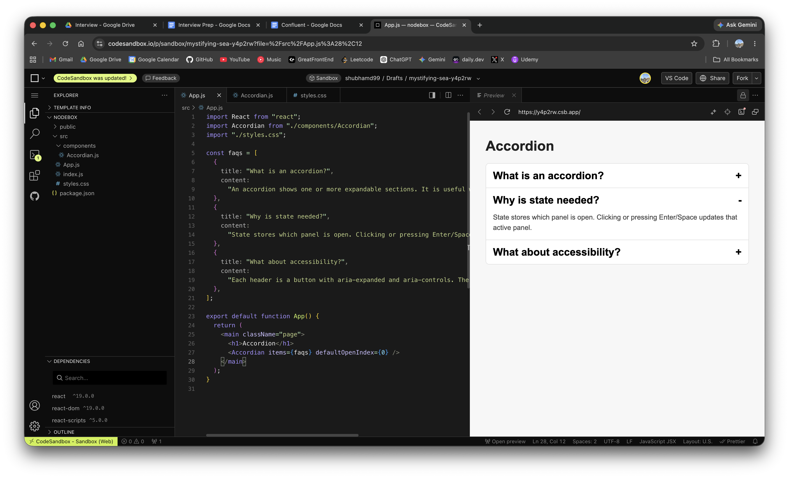

# Accordion - React Machine Coding

Interview-friendly accessible accordion with minimal CSS.

## Preview



## Requirements

- Show a list of expandable panels.
- Only one panel is open at a time.
- Clicking an open panel closes it.
- Use accessible button semantics.
- Support keyboard navigation.

## Key ideas

- `openIndex` stores the currently open panel.
- `setOpenIndex(current => current === index ? null : index)` toggles a panel.
- `aria-expanded` tells screen readers whether a panel is open.
- `aria-controls` connects the button to the panel.
- `role="region"` and `aria-labelledby` connect the panel back to the button.
- Only the open panel is mounted, so closed panel content is not rendered.

## Why these HTML tags are used

- `main`: Wraps the main content of the page. Screen readers and browsers understand this as the primary page area.
- `section`: Groups the accordion as one meaningful UI block.
- `h1`: Page title. There should usually be one main heading for the page.
- `h2`: Each accordion item heading. This keeps heading structure meaningful.
- `button`: Best tag for clickable actions. It supports click, focus, Enter, and Space by default.
- `div`: Used only for layout or panel content when no more specific semantic tag is needed.

Using semantic tags makes the UI easier for screen readers, keyboard users, and interviewers to understand.

## Keyboard support

- `Enter` / `Space`: native button behavior toggles the panel.
- `ArrowDown`: move focus to next accordion header.
- `ArrowUp`: move focus to previous accordion header.
- `Home`: move focus to first header.
- `End`: move focus to last header.

## Why only open content is rendered

The panel is rendered conditionally:

```jsx
{
  isOpen && <div>{item.content}</div>;
}
```

This keeps the DOM small and avoids mounting expensive closed content.

Tradeoff: if the panel contains local state, that state resets after closing and reopening. If you need to preserve state, always render the panel and hide it with CSS or `hidden`.

## File structure

```txt
Accordian/
  App.js
  Accordian.js
  components/
    Accordion.js
  styles.css
  README.md
```

For online IDEs like CodeSandbox, the easiest setup is:

```txt
src/
  App.js
  Accordian.js
  styles.css
```

Then import it like this:

```js
import Accordian from "./Accordian";
```

If you want the cleaner spelling and folder structure, create `src/components/Accordion.js` and import:

```js
import Accordion from "./components/Accordion";
```

## Complexity

- Render: `O(n)`
- Toggle: `O(1)`
- Space: `O(n)` for refs

## Interview explanation

The component receives `items` as props, so it is reusable. It keeps only one piece of state: `openIndex`. Each header is a real button, which gives us Enter and Space support for free. Extra keyboard handling is added for arrow navigation between headers.
