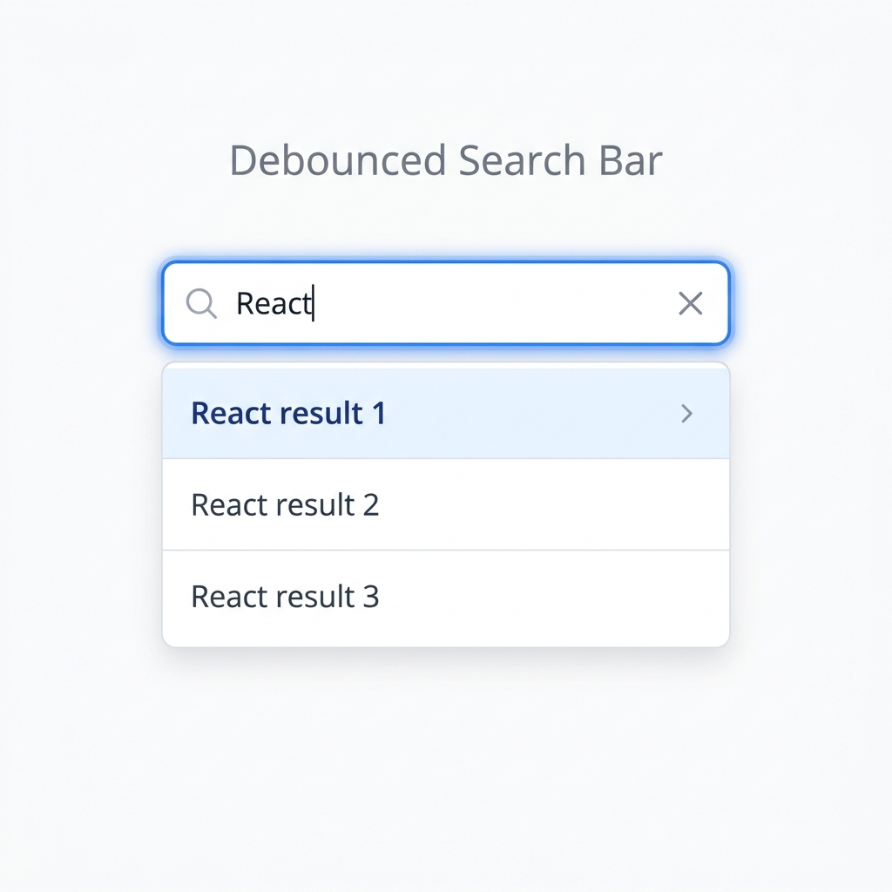

# Debounced Search Bar - React Machine Coding

## Preview

Interview-friendly custom debounce hook and search bar component built from scratch without external libraries (like Lodash).

## Requirements

- Create an input field that captures user search queries.
- Do not trigger the API call on every keystroke.
- Implement a custom `useDebounce` hook from scratch.
- Only trigger the search if the user has stopped typing for a specified delay (e.g., 500ms).
- Show loading states gracefully.

## Key Concepts to Remember

- **`useDebounce` Hook:** Uses `setTimeout` and `clearTimeout`. The hook sets a timeout to update the debounced value. If the user types again before the timeout completes, the `useEffect` cleanup function runs, clearing the old timeout and starting a new one.
- **Dependency Arrays:** The API call inside the component uses a `useEffect` that listens strictly to the `debouncedQuery` rather than the raw `query`.
- **`useCallback`:** The `handleSearch` function passed as a prop from the parent needs to be memoized using `useCallback` to prevent the `useEffect` inside `SearchBar` from re-firing unnecessarily on every parent render.

## Accessibility & Keyboard Navigation (Bonus for Interviews!)

A major plus in frontend interviews is building accessible, keyboard-navigable components.

- **ARIA Roles & States**:
  - The `<input>` has `role="combobox"`, `aria-expanded`, and `aria-controls` to tell screen readers it controls a dropdown list.
  - The results list uses `role="listbox"`, and each item uses `role="option"`.
  - `aria-activedescendant` dynamically links the input to the ID of the currently focused result item.
- **Keyboard Handling (`onKeyDown`)**:
  - Track an `activeIndex` state to know which item is highlighted.
  - **ArrowDown / ArrowUp**: Navigate through the results array.
  - **Enter**: Trigger an action (e.g., selection) for the currently highlighted item.
  - **Escape**: Close the results list.

## Code Structure

- `hooks/useDebounce.js` - Core logic for the timer. This is the main part interviewers care about!
- `components/SearchBar.js` - UI that consumes the hook.
- `App.js` - Parent component that passes down the `onSearch` callback and handles mock API data.
- `styles.css` - Simple, minimal styling.
