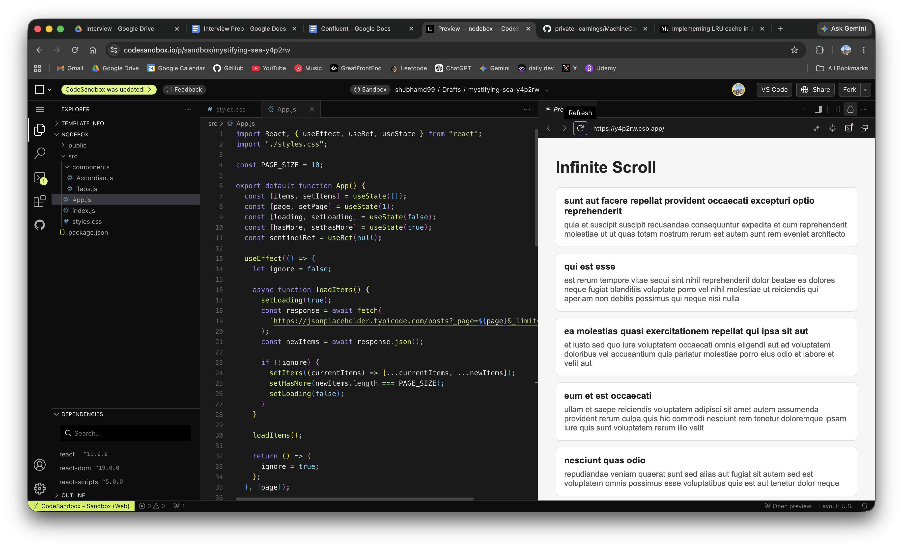

# Infinite Scroll - React Machine Coding

Simple infinite scroll using React state, `useEffect`, and a sentinel element with `IntersectionObserver`.

## Preview



## Requirements

- Load initial items.
- Load next page when user reaches near the bottom.
- Show loading state.
- Stop fetching when there are no more items.
- Clean up observer.

## Key ideas

- `items`: stores rendered list data.
- `page`: stores current page number.
- `loading`: prevents duplicate API calls.
- `hasMore`: stops loading after final page.
- `error`: stores API failure message.
- `sentinelRef`: points to an empty element at the bottom of the list.
- First `useEffect`: fetches data whenever `page` changes.
- Second `useEffect`: observes the sentinel and increments `page` when it becomes visible.

## API used

This example uses JSONPlaceholder posts API:

```js
https://jsonplaceholder.typicode.com/posts?_page=1&_limit=10
```

- `_page`: current page number
- `_limit`: number of items per page

## Why these HTML tags are used

- `main`: Wraps the main content of the page.
- `section`: Groups the list as one meaningful block.
- `article`: Represents each independent item/card.
- `h1`: Page title.
- `h2`: Title for each item.
- `p`: Used for item description and status text.

## Core logic

Place a sentinel element at the bottom:

```jsx
<div ref={sentinelRef} className="sentinel" />
```

Observe it:

```js
const observer = new IntersectionObserver((entries) => {
  const isVisible = entries[0].isIntersecting;

  if (isVisible && !loading && hasMore) {
    setPage((currentPage) => currentPage + 1);
  }
});
```

## Why cleanup is needed

We observe the sentinel:

```js
observer.observe(sentinel);
```

So we must unobserve it when component unmounts:

```js
observer.unobserve(sentinel);
```

Without cleanup, old observers can stay in memory and call stale code.

## File structure

```txt
InfiniteScroll/
  App.js
  styles.css
  README.md
```

## Complexity

- Render: `O(n)` where `n` is loaded items.
- Fetch next page: `O(pageSize)`.
- Space: `O(n)` for loaded items.

## Interview explanation

The component keeps `items`, `page`, `loading`, and `hasMore` in state. When `page` changes, we fetch that page and append it to the list. A sentinel `div` sits below the list. When it becomes visible, `IntersectionObserver` increments `page`. The cleanup unobserves the sentinel to avoid memory leaks.
