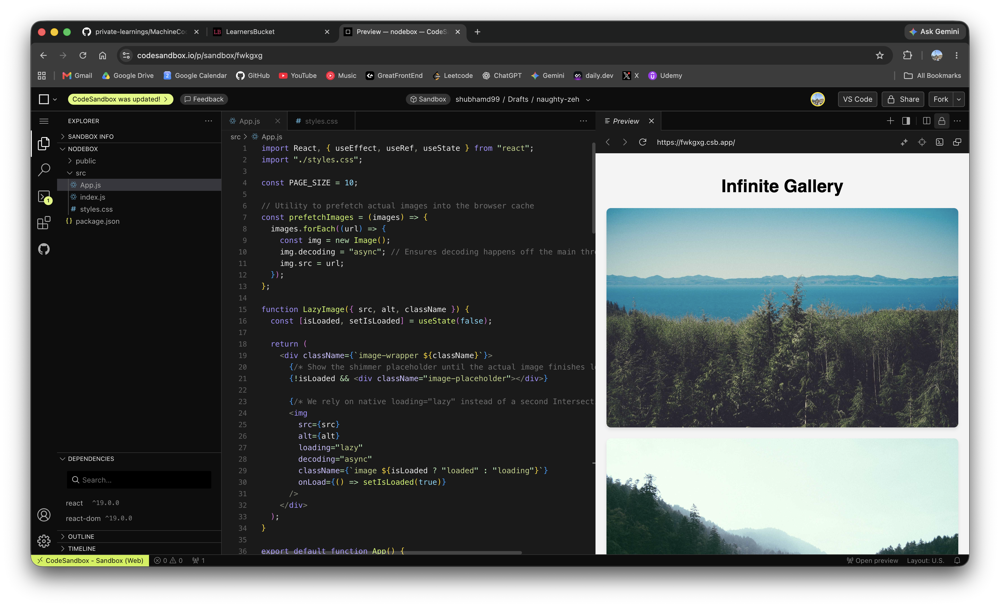

# Lazy Load & Prefetch with Infinite Scroll (Observer Pattern)

This machine coding example demonstrates how to combine **Infinite Scrolling**, **Lazy Loading**, and **Image Prefetching** in React using the `IntersectionObserver` API.

## Features:

1. **Infinite Scroll**: Uses an `IntersectionObserver` on a sentinel element at the bottom of the list. When the sentinel enters the viewport (with a large `1000px` root margin to trigger early), the next page of data is fetched. This gives the network ample time to download JSON and prefetch images before the user sees them.
2. **Lazy Loading**: Each image is wrapped in a `LazyImage` component. Instead of a complex observer, it utilizes the native `loading="lazy"` attribute. The browser handles deferring the network request until the image scrolls near the viewport.
3. **Prefetching**: When a new batch of data is fetched, the image URLs are prefetched into the browser's cache using `new Image().src`. Because they are cached in the background, when the user scrolls down and triggers the lazy load, the images render instantly without a network delay.
4. **Shimmer UI**: While the image is lazy-loading or waiting to be fetched, a CSS skeleton shimmer is displayed.

## The Role of the Intersection Observer

In this architecture, we only need **one** Intersection Observer:

1. **The Data Observer (Infinite Scroll)**: Located in `App.js`, this observer watches a single invisible `
` (the sentinel) at the very bottom of the page. Its only job is to detect when the user has scrolled to the bottom so it can fetch the _next page of JSON data_ from the API.

Instead of writing a second custom observer to lazy-load the actual images, we utilize the native `loading="lazy"` HTML attribute. The browser automatically handles deferring the image network request until the image scrolls near the viewport. We simply track the `onLoad` event of the image to hide the CSS shimmer placeholder once the image is ready!

## Important HTML Image Attributes

When rendering images, especially in a feed or gallery, you should be aware of several native HTML attributes that control how browsers prioritize and decode images:

1. **`loading="lazy"`**: Defers loading the image until it reaches a calculated distance from the viewport. Saves bandwidth and speeds up initial page load.
   - _Example_: ``
2. **`decoding="async"`**: Hints to the browser that decoding the image can be deferred, preventing the image decoding process from blocking the main thread. This is excellent for images that are not critical to the initial render (like those below the fold).
   - _Example_: ``
3. **`fetchpriority="high" | "low"`**: A relatively new attribute that signals the relative priority of fetching the image compared to other resources. Use `fetchpriority="high"` for critical above-the-fold images (like a hero image) and `fetchpriority="low"` for offscreen images.
   - _Example_: ``
4. **`srcset` and `sizes`**: Used for responsive images. Allows the browser to download a smaller, lighter version of the image on mobile devices and a high-resolution version on desktop.
   - _Example_: ``

While these native attributes are incredibly powerful and are used in this code, frontend interviews frequently ask you to implement lazy loading using the custom `IntersectionObserver` pattern manually. This is because doing it manually tests your understanding of browser APIs and allows for highly customized fallback UIs or scroll-triggered animations that native attributes can't handle. However, for a production app, utilizing native `loading="lazy"` (as demonstrated in `App.js`) is the optimal modern approach!

## How to Run:

Copy `App.js` and `styles.css` into any online IDE like CodeSandbox or StackBlitz.
