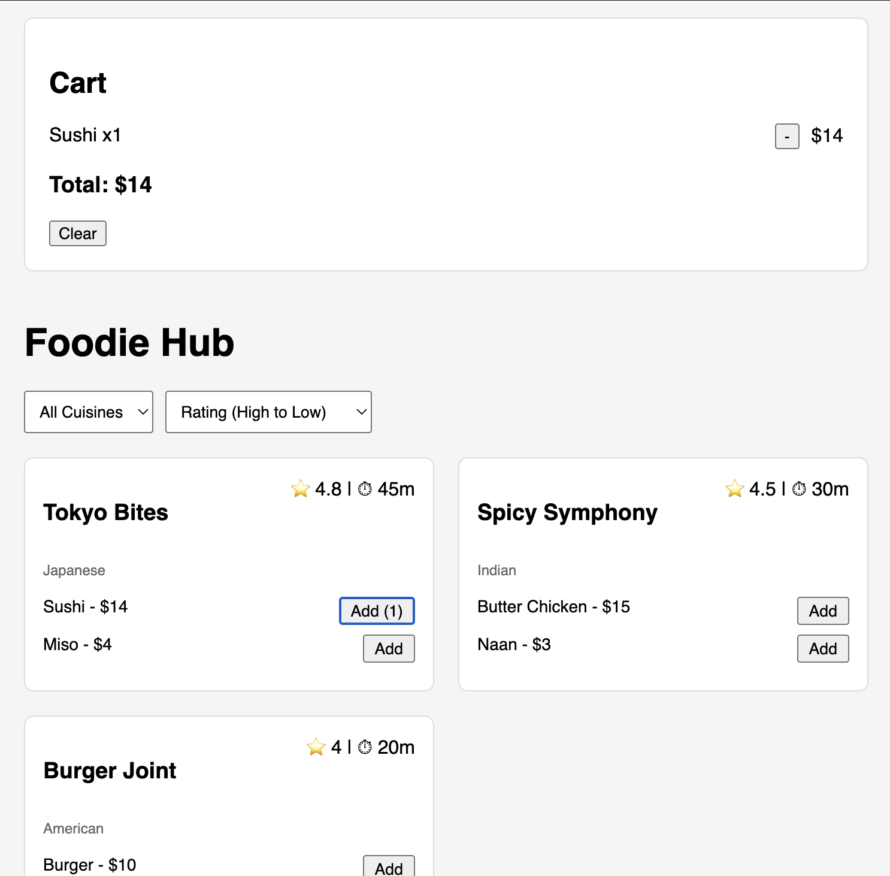

# Restaurant Listing App - React Machine Coding

A simplified, 60-minute interview-friendly version of a Restaurant Listing app.

## Preview



## Architecture & Code Details

To ensure this app can be successfully written within a 60-minute timeframe, it emphasizes a flat component structure and efficient state management.

### 1. State Management (`useState` & `useReducer` hybrid)

Instead of relying on heavy third-party state managers like Redux, the Cart state is managed entirely within the `App` component using `useState`.
We extracted the state transition logic into a helper reducer (`utils/cartUtils.js`) which receives the `prevCart` and the `action`. This provides the predictability of a Reducer while keeping the syntax light.

- **Why?** It clearly demonstrates to interviewers an understanding of functional state updates and immutability without the boilerplate of `useReducer`.

### 2. Context API (`CartContext`)

The `App` component acts as the global state orchestrator. It wraps its layout in a `<CartContext.Provider>`, supplying the `cart` array and the `dispatch` function down the tree.

- **Why?** This prevents "prop-drilling". Deeply nested components, like the `RestaurantCard`, can seamlessly dispatch `ADD` events to update the cart in the sidebar without intermediate structural components needing to pass props down.

### 3. Derived State (`useMemo`)

The application features local filtering (by Cuisine) and local sorting (by Rating and Delivery Time).
Instead of updating a secondary `filteredRestaurants` state, we compute the visible `displayed` array dynamically using `useMemo()`. It simply tracks `restaurants`, `filter`, and `sort` dependencies.

- **Why?** This prevents us from ever mutating or losing the original `restaurants` data array. Additionally, it prevents expensive array `.sort()` operations on every re-render (e.g., when you just add an item to the cart).

### 4. Mocking Asynchronicity

In a machine coding interview, you rarely hit a real, authenticated API. We simulate network latency using a static array (`mock/mockApi.js`) wrapped in a `Promise` combined with `setTimeout`.

- **Why?** This allows the main `App` component to demonstrate a proper data-fetching lifecycle utilizing `useEffect`, complete with boolean `loading` and `error` states, exactly as you would in production.

## File structure

```txt
RestaurantListing/
  App.js
  styles.css
  README.md
  components/
    RestaurantCard.js
  context/
    CartContext.js
  mock/
    mockApi.js
  utils/
    cartUtils.js
```
