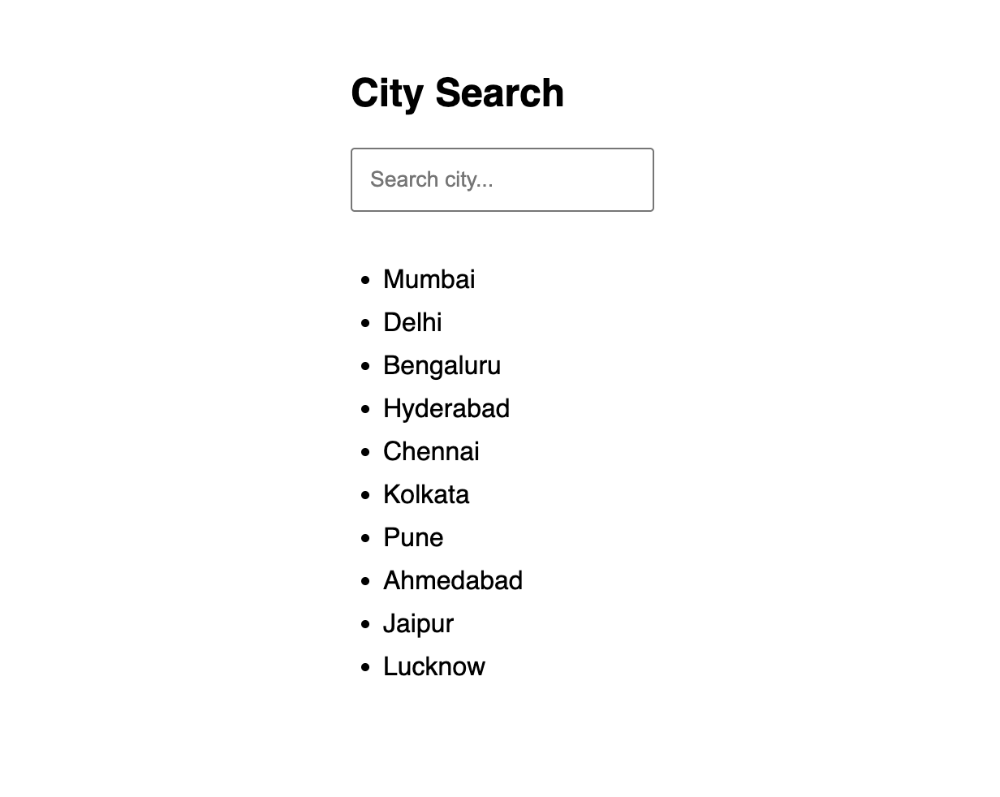
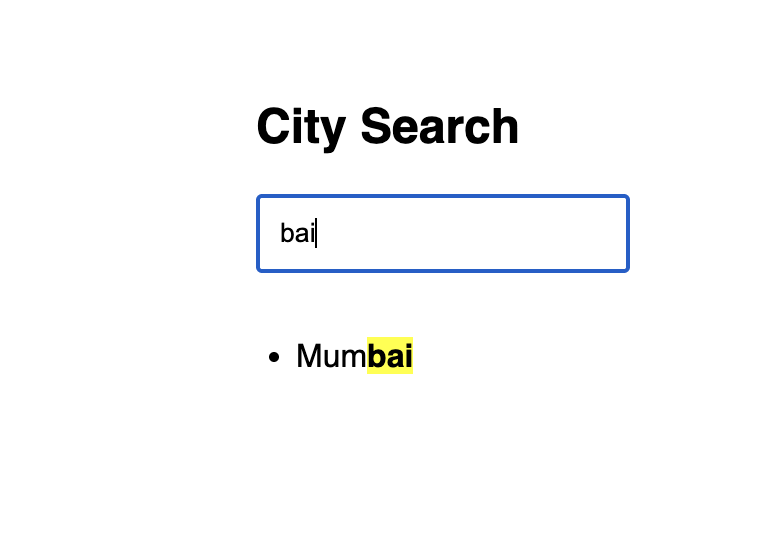
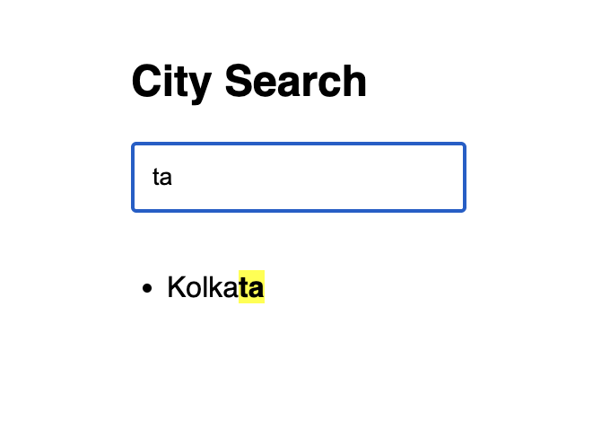

# Search List of Cities

A React application that demonstrates how to implement a searchable list with text highlighting.

  
  
  

## Features

- **Real-time Search:** Filters the list of cities instantly as you type.
- **Text Highlighting:** Matches in the city names are highlighted using the `<mark>` tag for better user experience.
- **Component Driven:** Clean separation of concerns with `SearchBox`, `CityList`, and `HighlightedText` components.

## Tech Stack

- React
- Vanilla CSS

## How it works

- The `App` component holds the search `query` state.
- `CityList` filters the array of cities based on the `query`.
- `HighlightedText` intelligently slices each string and wraps the matching substring in a `<mark>` tag to apply the highlight styling.
