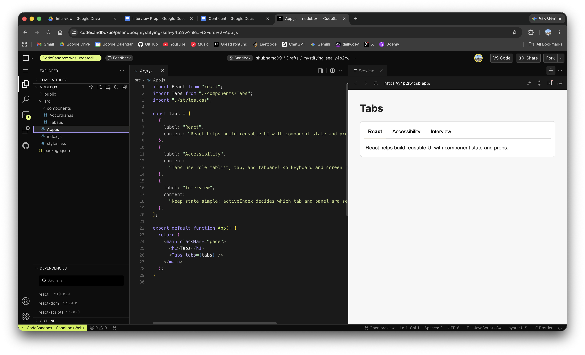

# Tabs - React Machine Coding

Small accessible tabs component with minimal CSS.

## Preview



## Requirements

- Show multiple tabs.
- Clicking a tab changes the active panel.
- Only the active panel is visible.
- Use accessible tab roles.
- Support keyboard navigation.

## Key ideas

- `activeIndex` stores the selected tab.
- The tab list has `role="tablist"`.
- Each tab has `role="tab"` and `aria-selected`.
- Each panel has `role="tabpanel"` and `aria-labelledby`.
- Inactive tabs get `tabIndex={-1}` so keyboard focus stays clean.
- Only the active tab panel is mounted, so inactive content is not rendered.

## Why these HTML tags are used

- `main`: Wraps the main content of the page. It helps assistive tech jump directly to the important content.
- `section`: Groups the tabs as one reusable UI component.
- `h1`: Page title for the example.
- `button`: Best element for tabs because tabs are interactive controls. It gives click, focus, Enter, and Space behavior.
- `div`: Used for `tablist` and `tabpanel` because ARIA roles define their tab behavior.

Semantic HTML gives the browser a better structure before JavaScript even runs. ARIA roles then add the exact tabs behavior.

## Keyboard support

- `ArrowRight`: select next tab.
- `ArrowLeft`: select previous tab.
- `Home`: select first tab.
- `End`: select last tab.

## Why only active content is rendered

Instead of rendering all panels and hiding inactive ones:

```jsx
{tabs.map(...)}
```

we render only:

```jsx
tabs[activeIndex].content;
```

This keeps the DOM smaller and avoids mounting expensive inactive content like forms, charts, API widgets, or heavy components.

Tradeoff: inactive panel state is lost when switching tabs because the panel unmounts. If you need to preserve form values or component state, render all panels and use `hidden`.

## File structure

```txt
Tabs/
  App.js
  components/
    Tabs.js
  styles.css
  README.md
```

## Complexity

- Render: `O(n)`
- Select tab: `O(1)`
- Space: `O(n)` for refs

## Interview explanation

Tabs are controlled by one state value, `activeIndex`. When the user clicks or presses arrow keys, we update `activeIndex`. Accessibility comes from the correct roles and ARIA attributes that connect each tab to its panel.
