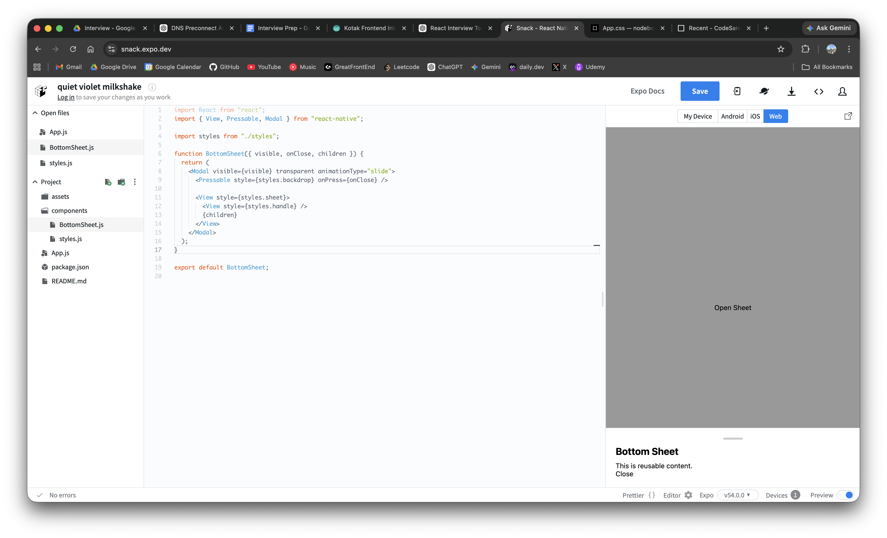

# Bottom Sheet

A simple and reusable Bottom Sheet component for React Native.

<p align="center">
  
</p>

## Features

- Uses built-in React Native `Modal` for clean overlay handling.
- Tappable backdrop to easily dismiss the sheet.
- Minimal and highly customizable styling.
- Accepts `children` directly, allowing you to render any content inside the sheet.

## Usage

```jsx
import React, { useState } from "react";
import { View, Text, Pressable } from "react-native";
import BottomSheet from "./components/BottomSheet";

export default function App() {
  const [open, setOpen] = useState(false);

  return (
    <View style={{ flex: 1, justifyContent: "center", alignItems: "center" }}>
      <Pressable onPress={() => setOpen(true)}>
        <Text>Open Sheet</Text>
      </Pressable>

      <BottomSheet visible={open} onClose={() => setOpen(false)}>
        <Text>Bottom Sheet Content</Text>
      </BottomSheet>
    </View>
  );
}
```
