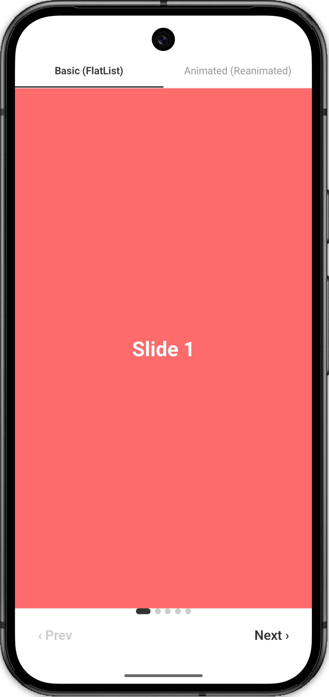
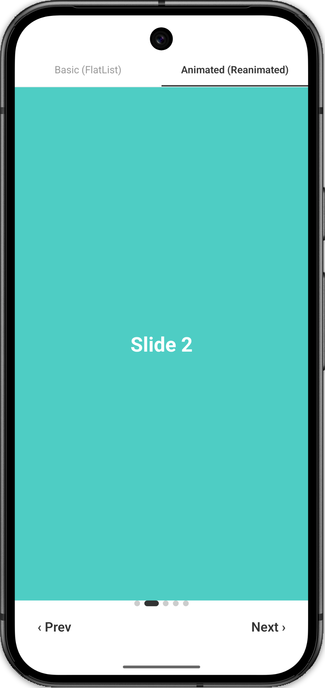

# Carousel — React Native (Machine Coding)

Four carousel implementations toggled via a tab bar in `App.tsx`.

## Preview

|         Basic (FlatList)          |        Animated (Reanimated)         |
| :-------------------------------: | :----------------------------------: |
|  |  |

---

## Project Structure

```
src/
  BasicCarousel/              ← FlatList + pagingEnabled
  AnimatedCarousel/           ← Reanimated scroll + slide scale
  AutoPlayCarousel/           ← Basic + setInterval + animated dots
  AnimatedAutoPlayCarousel/   ← Animated + setInterval + scrollX dots
App.tsx                       ← tab toggle
```

Each folder has `constants.ts`, `styles.ts`, `index.tsx`.

---

## Basic Carousel — `src/BasicCarousel/`

Uses only built-in React Native primitives. No third-party animation library.

| API | Why |
|---|---|
| `FlatList` + `pagingEnabled` | auto-snaps to multiples of `SCREEN_WIDTH` |
| `onMomentumScrollEnd` | fires after scroll settles — reliable index tracking |
| `getItemLayout` | skips item measurement, required for `scrollToIndex` |
| `scrollToIndex` | programmatic navigation for dots and prev/next buttons |

---

## Animated Carousel — `src/AnimatedCarousel/`

Same FlatList structure. Adds Reanimated v4 slide scale animation.

| API | Why |
|---|---|
| `useSharedValue` | `scrollX` lives on UI thread, not JS |
| `useAnimatedScrollHandler` | reads scroll offset at 60fps without JS bridge |
| `Animated.FlatList` | drop-in swap; accepts Reanimated scroll handler |
| `interpolate` | maps scrollX → scale per slide on UI thread |

---

## AutoPlay Carousel — `src/AutoPlayCarousel/`

Built on top of BasicCarousel. Two additions:

**1. Auto-play** — `setInterval` in a `useEffect([activeIndex])`:
```
Effect re-runs on every activeIndex change → timer always resets after each slide advance
(whether triggered by auto-play or manual swipe)
```

**2. Animated dots** — one `Animated.Value` per dot:
```
Animated.timing → width: 8 (inactive) or 20 (active)
useNativeDriver: false — width is a layout prop, native driver doesn't support it
```

| API | Why |
|---|---|
| `setInterval` in `useEffect([activeIndex])` | timer resets after each slide change |
| `Animated.Value` per dot | drives dot width on JS thread |
| `useNativeDriver: false` | required for layout property (`width`) animation |

---

## Animated AutoPlay Carousel — `src/AnimatedAutoPlayCarousel/`

Built on top of AnimatedCarousel. Two additions:

**1. Auto-play** — same `setInterval` pattern as AutoPlayCarousel.

**2. Animated dots driven by `scrollX`** — dot width interpolated from scroll position on UI thread:
```
scrollX at this dot's slide → width 20 (active)
scrollX one slide away      → width 8  (inactive)
```
Dots animate during the swipe itself, not just after it settles.

| API | Why |
|---|---|
| `AnimatedDot` component | `useAnimatedStyle` can't be called inside `.map()` — needs its own component |
| `interpolate(scrollX, ...)` | derives dot width from scroll on UI thread — synced with finger |
| `Extrapolation.CLAMP` | prevents dot width going outside 8–20 range |

---

## Dot animation comparison

| | AutoPlay (3rd) | Animated AutoPlay (4th) |
|---|---|---|
| Value | `Animated.Value` (JS thread) | `useSharedValue` via `scrollX` (UI thread) |
| Trigger | `useEffect` on `activeIndex` change | Continuous — follows scroll position in real time |
| Animates during swipe | No — updates after scroll settles | Yes — synced with finger at 60fps |

---

## Why `GestureHandlerRootView`?

`react-native-gesture-handler` replaces RN's touch system on Android. Without `GestureHandlerRootView`, the two systems compete and gestures silently fail. Required once per screen that uses the package.

---

## Setup

```sh
npm install

# iOS only
bundle exec pod install
```

> `babel.config.js` already has `react-native-worklets/plugin` configured.
