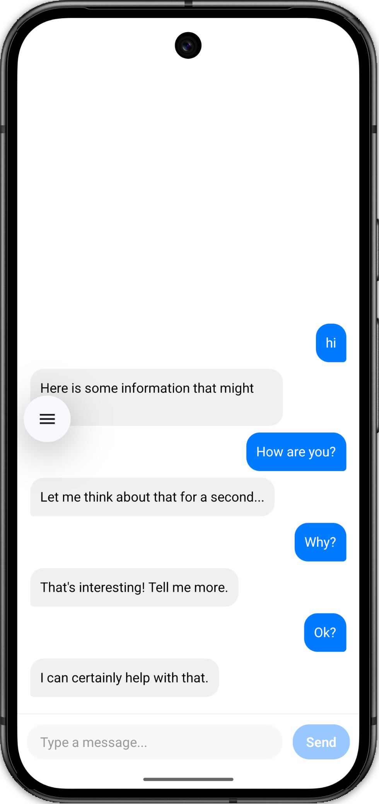

# React Native Chat UI (Machine Coding Round)

<div align="center">
  
</div>

A minimal, modular, and interview-ready Chat UI built with React Native. This project is specifically designed to demonstrate clean component architecture, fundamental React hooks (`useState`, `useCallback`), and robust React Native layout strategies (Flexbox, `FlatList`, `KeyboardAvoidingView`).

## 🎯 Core Features Evaluated

Interviews typically look for the following in a Chat UI machine coding round:

- **Clean Component Structure:** Splitting logic and view (e.g., separating input, chat bubbles, and the list).
- **State Management:** Properly appending messages to an array without mutating the previous state.
- **Optimistic UI Updates:** Providing immediate visual feedback (e.g., a "sending" state) before receiving server confirmation to guarantee a snappy user experience.
- **Dynamic Memory Pagination (Infinite Scroll):** Starting with a completely empty state and natively capping the active Virtual DOM array. Pushing all overflow past a limit of 12 natively into a background cache array, and actively pulling them back out dynamically when reaching the scroll limit.
- **Inverted FlatList UI:** Natively leveraging `inverted={true}` to flip the FlatList, eliminating manual calculate layouts to strictly attach messages directly above the keyboard naturally.

---

## 📁 Project Structure

```text
src/
 ┣ components/
 ┃ ┣ ChatBubble.tsx    # Renders individual user/AI message bubbles (handles left/right alignment)
 ┃ ┗ ChatInput.tsx     # The multiline input field and send button
 ┗ hooks/
   ┗ useChat.ts        # Custom hook handling all business logic and simulated API delays
App.tsx                # Main entry point bridging state and UI with FlatList
```

---

## 🚀 Step-by-Step Implementation Plan

### Step 1: The Business Logic (`useChat.ts`)

Instead of tangling API logic inside the view, an isolated custom hook was created to maintain the single source of truth.

- Defined the `Message` interface (`id`, `text`, `isAI`, `status`).
- Used `useState` to maintain the `messages` array and an `isTyping` boolean.
- Used two native `useState` bindings: an active `messages` array, and a background/archived `historyCache` array.
- Natively bounds the active conversation memory. If the `messages` array exceeds **12** objects, the app slices the oldest messages out of memory and physically pushes them into `historyCache`.
- Implemented the **Optimistic UI Pattern**: The user's message is immediately appended to state with a `'sending'` status icon.
- Triggered a mocked API delay (`setTimeout`) which, upon resolving, flips the earlier message's status to `'sent'` while appending the AI's response.
- Implemented **Infinite Scrolling via Cache Resumption** (`loadMoreMessages`): Automatically pulls arrays natively from `historyCache` and prepends them physically back onto the UI layer mimicking DB requests strictly from user inputs.

### Step 2: The Lowest-Level Components (`ChatBubble.tsx` & `ChatInput.tsx`)

- **`ChatBubble`:** A purely presentational component. Passed a `Message` object, it uses conditional styling in the `StyleSheet` to align AI messages left (`justifyContent: 'flex-start'`) and User messages right (`justifyContent: 'flex-end'`).
- **`ChatInput`:** Manages its local `text` state natively (controlled input). Designed to dynamically disable the "Send" button if the text is empty OR if the fake API is currently resolving (`disabled={isTyping}`).

### Step 3: Complex Main Layout (`App.tsx`)

The root file focuses heavily on orchestration and Flexbox UI edge-cases:

- Wrapped the view in `SafeAreaProvider` and `SafeAreaView` from `react-native-safe-area-context` to safely avoid the notch and hardware home indicators.
- Wrapped the core layout in a `KeyboardAvoidingView` set to `flex: 1` so the view naturally compresses when the iOS keyboard triggers, instead of overlapping the input field.
- Arranged the vertical layout such that the `<FlatList />` utilizes the remainder of the vertical space while the `<ChatInput />` rests naturally at the bottom.

### Step 4: The FlatList Polish (Inverted Physics)

List logic is notoriously heavily scrutinized:

- Passed the **`inverted`** prop to natively anchor our text organically to the bottom UI boundaries without relying on buggy programmatic overrides.
- Implemented cross-scale transformations (`transform: [{ scaleY: -1 }]`) to fix inverted UI elements on empty arrays to face right-side up.
- Bound physical backwards state caching directly to `onEndReached` without pulling mock databases on start. 
- Mapped double loading UIs physically into natural edge-cases (`ListHeaderComponent` correctly manages the typing dots on the bottom, while `ListFooterComponent` accurately floats a history loader organically at the absolute top natively).

---

## 💻 How to Run

1. Make sure you have installed standard dependencies (`npm install`).
2. Run standard commands to start the bundler:
   ```bash
   npm run start
   ```
3. Load it via Expo Go or the native iOS/Android simulators depending on your environment.
