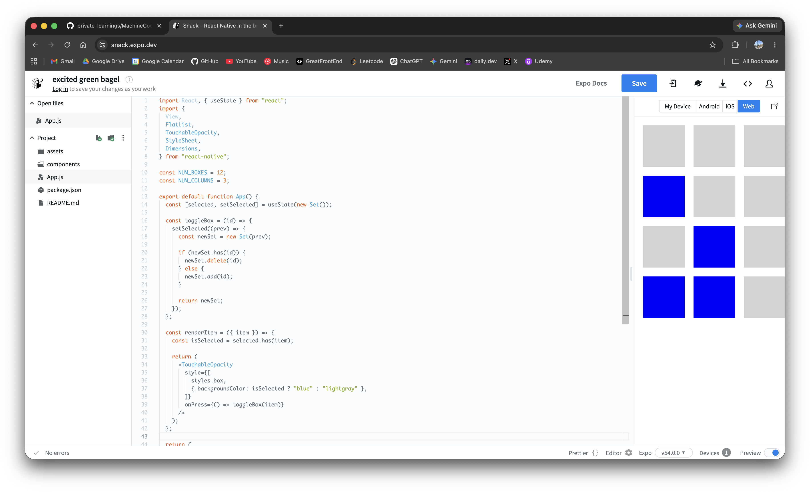

# Grid

A simple selectable grid built with React Native `FlatList`.

<p>
  
</p>

## Features

- Uses `FlatList` with `numColumns` to render a grid.
- Creates fixed-size square boxes based on screen width.
- Supports multi-select behavior using a `Set`.
- Toggles box color when selected or unselected.
- Keeps the implementation lightweight with built-in React Native APIs only.

## How It Works

```txt
FlatList receives 12 items
        |
        v
numColumns={3} lays items out in rows
        |
        v
User taps a box
        |
        v
toggleBox adds/removes the id from selected Set
        |
        v
Box background changes based on selected.has(item)
```

## Usage

```jsx
<FlatList
  data={Array.from({ length: NUM_BOXES }, (_, i) => i)}
  keyExtractor={(item) => item.toString()}
  renderItem={renderItem}
  numColumns={NUM_COLUMNS}
  contentContainerStyle={styles.container}
/>
```

## Machine Coding Cheat Sheet

### 1. Use `numColumns` for a simple grid

```jsx
const NUM_COLUMNS = 3;

<FlatList data={items} renderItem={renderItem} numColumns={NUM_COLUMNS} />;
```

### 2. Calculate square item size

Account for padding and margin so boxes fit cleanly in each row.

```jsx
const BOX_SIZE = Dimensions.get("window").width / NUM_COLUMNS - 20;

const styles = StyleSheet.create({
  box: {
    width: BOX_SIZE,
    height: BOX_SIZE,
    margin: 10,
  },
});
```

### 3. Store selected items in a Set

Use a new `Set` on every update so React receives a new state reference.

```jsx
const [selected, setSelected] = useState(new Set());

const toggleBox = (id) => {
  setSelected((prev) => {
    const newSet = new Set(prev);

    if (newSet.has(id)) {
      newSet.delete(id);
    } else {
      newSet.add(id);
    }

    return newSet;
  });
};
```

### 4. Style selected and unselected states

```jsx
const isSelected = selected.has(item);

<TouchableOpacity
  style={[styles.box, { backgroundColor: isSelected ? "blue" : "lightgray" }]}
  onPress={() => toggleBox(item)}
/>;
```

## Interview Follow-ups

| Requirement        | Approach                                                   |
| ------------------ | ---------------------------------------------------------- |
| Single select only | Store one `selectedId` instead of a `Set`.                 |
| Select all         | Fill the `Set` with all item ids.                          |
| Clear selection    | Set state to `new Set()`.                                  |
| Dynamic data       | Use real item ids instead of array indexes.                |
| Responsive columns | Recalculate columns based on screen width or orientation.  |
| Better performance | Extract `GridItem`, memoize it, and use stable callbacks.  |
| Accessibility      | Add `accessibilityRole`, `accessibilityState`, and labels. |

## Edge Cases

- Empty data: render an empty state instead of a blank screen.
- Last row has fewer items: `FlatList` handles it automatically.
- Orientation change: `Dimensions.get` is static after initial render; use `useWindowDimensions` if the layout must update live.
- Mutating the same `Set`: React may not re-render if the same Set reference is returned.
- Large grids: prefer stable ids and memoized item components.
