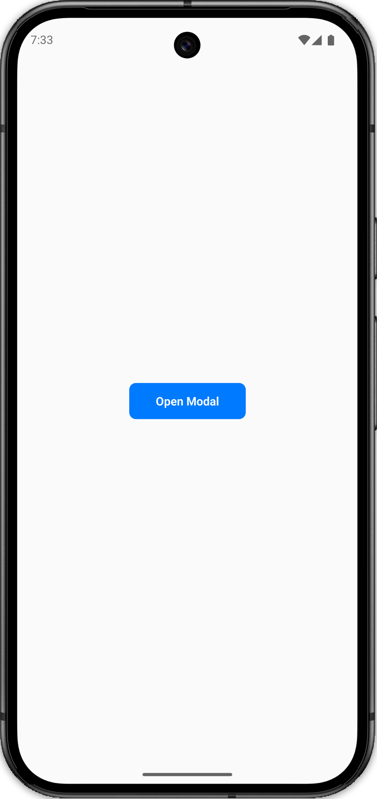
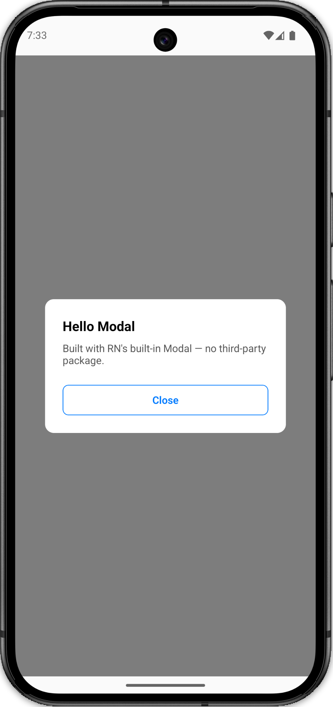

# Modal

> Machine Coding — RN built-in `<Modal>`, no third-party package

<p align="center">
  
  
</p>

---

## File structure

```
src/
  styles.ts     — all styles
  AppModal.tsx  — Modal component
  ModalApp.tsx  — root screen (holds visible state)
App.tsx
```

---

## How it works

```
Open pressed → setVisible(true)
  <Modal visible={true} transparent animationType="fade">
    <TouchableOpacity overlay />        ← absoluteFill, behind card
    <View cardContainer>                ← flex:1 centered, on top
      <View card> title + body + Close
Close pressed (button OR overlay tap OR Android back) → setVisible(false)
```

---

## Why `absoluteFill` for the overlay

The overlay must not wrap the card — if it did, taps on the card would bubble up and close the modal.

Instead:

- Overlay = `TouchableOpacity` with `absoluteFill` → rendered **first** (behind)
- Card = separate sibling `View` → rendered **after** (on top)

React Native renders children in order: later children appear on top and intercept touches first. So card touches never reach the overlay.

```
<Modal>
  <TouchableOpacity style={absoluteFill} />   ← z-order: bottom, catches outside taps
  <View cardContainer>                         ← z-order: top, blocks overlay touches
    <View card> … </View>
  </View>
</Modal>
```

---

## Key `<Modal>` props

| Prop             | Why                                       |
| ---------------- | ----------------------------------------- |
| `transparent`    | draw our own overlay colour               |
| `animationType`  | `"fade"` — simple in/out                  |
| `onRequestClose` | Android hardware back button closes modal |

---

## Interview Script

> "One boolean in parent. Overlay is an `absoluteFill` TouchableOpacity rendered before the card so it sits behind it — card touches never bubble to the overlay. Three close paths: overlay tap, Close button, Android back — all call the same `onClose`."
