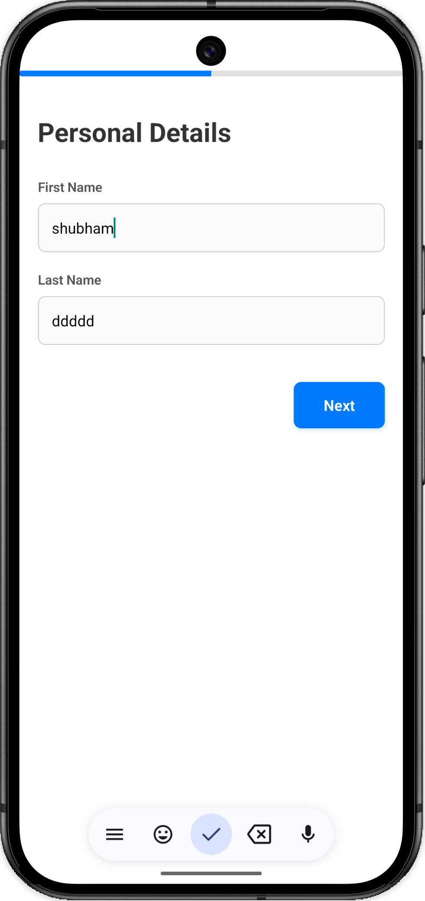
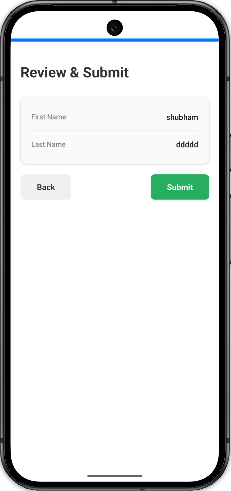

# React Native Multi-Step Form (Zero Dependency)

<p align="center">
  
  &nbsp;&nbsp;&nbsp;&nbsp;
  
</p>

A minimal, expertly structured Multi-Step Form built natively in React Native specifically designed for Machine Coding interviews.

## 🎯 The Interview Perspective

When an interviewer asks you to build a multi-step form, they are actively testing three core React fundamentals:

1. **State Lifting (`App.tsx`)**: Can you keep the single source of truth at the highest necessary level without polluting independent components?
2. \*\*Prop Drilling vs Modularity`: Can you extract `StepPersonal`and`StepContact`into totally separate files to keep`App.tsx` from becoming 500 lines of spaghetti code?
3. **Validation Bounding**: Can you prevent a user from continuing to Step 2 if Step 1 is invalid, and display specific UI errors locally?

## 🚀 Architecture Decisions

To answer the criteria above, this codebase relies on absolutely **zero external dependencies** (no `react-hook-form`, no `yup`). It proves absolute mastery over React core principles:

### 1. Unified Payload Model (`src/types.ts`)

We define a strict `FormData` type and incredibly strict `StepProps`. Every Step component (1, 2, and 3) inherits the exact same `StepProps` interface. This proves type-safety and eliminates prop-drilling errors natively.

### 2. State Orchestrator (`App.tsx`)

The `App.tsx` acts exclusively as the "Controller". It maintains:

- `currentStep`: `1` or `2`
- `formData`: The unified object holding `{ firstName, lastName }`
- `errors`: A dynamic Map of error messages.
- `validateStep()`: A function that explicitly intercepts progression (`handleNext`). It inspects the `currentStep` index, runs specific presence checks, and securely blocks traversal while projecting inline error messages to the children.

### 3. Styled Presentation Components

The UI is broken perfectly into:

- `<StepPersonal />`
- `<StepReview />`

Each component utilizes standard React Native `StyleSheet` blocks annotated with `// #1`, `// #2` logic detailing exactly _why_ a specific layout decision was made (e.g. relying on `flexDirection: 'row'` bounded by `justifyContent: 'space-between'` for the navigation rows).

## 💻 How to Run

1. Open a terminal inside the project directory.
2. Run standard commands to start the Metro bundler:
   ```bash
   npm install
   npm run start
   ```
3. Load it via Expo Go (if configured) or the native iOS/Android simulators depending on your environment.
