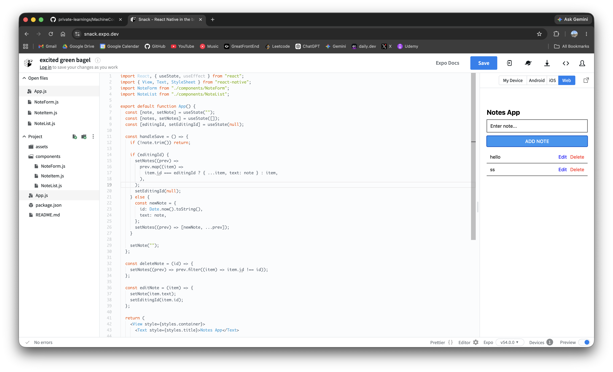

# Note Taking

A modular React Native notes app with add, edit, delete, and empty-state behavior.

<p>
  
</p>

## Features

- Add a new note.
- Edit an existing note.
- Delete a note.
- Shows an empty state when no notes exist.
- Keeps UI split into small reusable components.
- Uses simple local state only, which is ideal for a machine-coding round.

## Component Structure

```txt
App.js
  ├── components/NoteForm.js
  └── components/NoteList.js
        └── components/NoteItem.js
```

## Responsibilities

| File          | Responsibility                                  |
| ------------- | ----------------------------------------------- |
| `App.js`      | Owns note state, editing state, and handlers.   |
| `NoteForm.js` | Renders input and add/update button.            |
| `NoteList.js` | Renders `FlatList` and empty state.             |
| `NoteItem.js` | Renders each note row with edit/delete actions. |

## Machine Coding Cheat Sheet

### 1. Keep notes and editing state in parent

```jsx
const [note, setNote] = useState("");
const [notes, setNotes] = useState([]);
const [editingId, setEditingId] = useState(null);
```

### 2. Add or update from the same handler

```jsx
const handleSave = () => {
  if (!note.trim()) return;

  if (editingId) {
    setNotes((prev) =>
      prev.map((item) =>
        item.id === editingId ? { ...item, text: note } : item,
      ),
    );
    setEditingId(null);
  } else {
    setNotes((prev) => [{ id: Date.now().toString(), text: note }, ...prev]);
  }

  setNote("");
};
```

### 3. Start edit mode by copying text into input

```jsx
const editNote = (item) => {
  setNote(item.text);
  setEditingId(item.id);
};
```

### 4. Delete with filter

```jsx
const deleteNote = (id) => {
  setNotes((prev) => prev.filter((item) => item.id !== id));
};
```

### 5. Render list with FlatList

```jsx
<FlatList
  data={notes}
  keyExtractor={(item) => item.id}
  renderItem={({ item }) => (
    <NoteItem note={item} onEdit={onEdit} onDelete={onDelete} />
  )}
  ListEmptyComponent={<Text>No notes yet</Text>}
/>
```

## Interview Follow-ups

| Requirement   | Approach                                            |
| ------------- | --------------------------------------------------- |
| Persist notes | Store notes in `AsyncStorage`.                      |
| Search notes  | Add `searchText` state and filter before rendering. |
| Cancel edit   | Clear `note` and set `editingId` to `null`.         |
| Validation    | Disable submit when `note.trim()` is empty.         |
| Timestamps    | Add `createdAt` or `updatedAt` to each note object. |
| Better ids    | Use `uuid` or backend ids instead of `Date.now()`.  |

## Edge Cases

- Empty input should not create a note.
- Editing a note should update only the matching id.
- After update, reset `editingId` and clear the input.
- Deleting the note currently being edited should also clear edit mode if needed.
- Use stable ids for real apps; array indexes can break edit/delete behavior.
