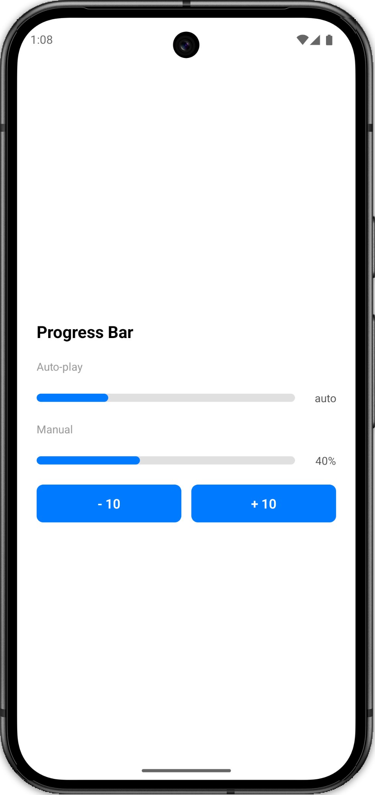

# Progress Bar

Minimal animated progress bar using React Native's built-in `Animated` API. No third-party libraries.



---

## How it works

```
progress prop changes (or autoPlay=true on mount)
        |
        v
Animated.timing  ──────────────────────────  animates animatedWidth (0 → 100)
        |
        v
interpolate  ────────────────────────────────  converts number to "N%" string
        |
        v
Animated.View width grows left-to-right inside the track
```

## Two modes

| Prop            | Behaviour                                                   |
| --------------- | ----------------------------------------------------------- |
| `progress={50}` | animates to that value whenever the prop changes            |
| `autoPlay`      | `Animated.loop` runs 0→100 forever — no state, no intervals |

## Component structure

```
<View>              wrapper  (row)
  <View>            track    (grey bg, overflow: hidden)
    <Animated.View> fill     (blue, width = widthStyle)
  <Text>            label    (percentage)
```

## Key concepts

| Concept                       | Why                                                                                   |
| ----------------------------- | ------------------------------------------------------------------------------------- |
| `useNativeDriver: false`      | `width` is a layout prop — native driver only supports transform/opacity              |
| `overflow: 'hidden'` on track | clips the fill so rounded corners work correctly                                      |
| `interpolate`                 | converts the numeric `Animated.Value` (0–100) to the `"N%"` string that `width` needs |
| `useRef` for `Animated.Value` | keeps the same instance across renders — `useState` would reset it                    |
| `Animated.loop` for autoPlay  | no `setInterval` means no gap between iterations — perfectly smooth                   |

## Why not setInterval for autoPlay?

```
setInterval (600ms)    -------|-------|-------|
Animated.timing (400ms)   ████░░░   ████░░░     <- 200ms pause gap

Animated.loop          ████████████████████████  <- no gaps, continuous
```

`setInterval` + `setState` causes a visible pause because the animation finishes before the next interval fires. `Animated.loop` runs entirely on the animation thread with zero gap.

## Interview mental model

```ts
// 1. Create
const animatedWidth = useRef(new Animated.Value(0)).current;

// 2. Animate (manual)
Animated.timing(animatedWidth, {
  toValue: progress,
  duration: 400,
  useNativeDriver: false,
}).start();

// 3. Animate (autoPlay)
Animated.loop(
  Animated.timing(animatedWidth, {
    toValue: 100,
    duration: 2000,
    useNativeDriver: false,
  }),
).start();

// 4. Use in style
const widthStyle = animatedWidth.interpolate({
  inputRange: [0, 100],
  outputRange: ['0%', '100%'],
});
```
