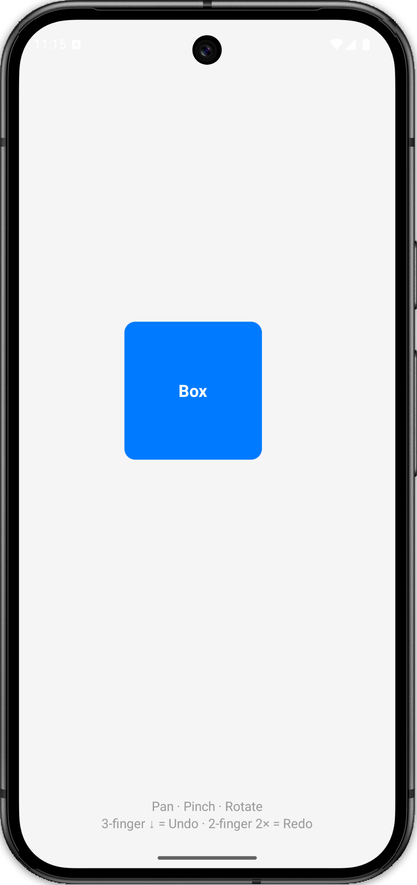

# Drag · Resize · Rotate — React Native Gesture + Undo/Redo

Machine Coding Problem (confirmed asked July 2025).

> Drag, resize, and rotate a colored box. Undo with a three-finger swipe down. Redo with a two-finger double tap.

<p align="center">
  
</p>

---

## Gestures

| Gesture                      | Action         |
| ---------------------------- | -------------- |
| 1-finger drag                | Move the box   |
| 2-finger pinch               | Resize the box |
| 2-finger twist               | Rotate the box |
| 3-finger swipe down (> 50px) | Undo           |
| 2-finger double tap          | Redo           |

---

## Tech Stack

| Package                        | Purpose                                      |
| ------------------------------ | -------------------------------------------- |
| `react-native-gesture-handler` | GestureDetector, Pan, Pinch, Rotation, Tap   |
| `react-native-reanimated`      | useSharedValue, useAnimatedStyle, withSpring |
| `react-native-worklets`        | scheduleOnRN (worklet → JS thread bridge)    |
| React `useReducer`             | Undo/redo state stack                        |

---

## Setup

```bash
npm install

# iOS
cd ios && bundle exec pod install && cd ..
npx react-native run-ios

# Android
npx react-native run-android
```

> Requires `react-native-worklets/plugin` in `babel.config.js` — already configured.

---

## Key Concepts

### `useReducer`

React hook that manages state through a pure function (`reducer`). Takes `(state, action) => newState`.
Preferred over `useState` when the next state depends on the previous one or when multiple related
values change together. Returns `[state, dispatch]` — `dispatch` sends an action to the reducer.

---

### `useSharedValue(initial)`

Creates a value that lives on the **UI thread** (not the JS thread). Reading or writing `.value`
inside a worklet happens at 60fps with no JS bridge crossing. On the JS thread you can also read/write
`.value` but changes are batched and posted to the UI thread asynchronously.

```ts
const x = useSharedValue(0); // lives on UI thread
x.value = 100; // write (from JS or worklet)
```

---

### `useAnimatedStyle(fn)`

Returns a style object that Reanimated keeps in sync with shared values on the UI thread.
The callback `fn` runs as a worklet — it re-executes automatically whenever any shared value it reads changes.
In Reanimated v4 the `'worklet'` directive is not needed; the Babel plugin adds it automatically.

```ts
const style = useAnimatedStyle(() => ({
  transform: [{ translateX: x.value }], // re-runs when x.value changes
}));
```

Attach to `<Animated.View style={style}>` — **not** a regular `<View>`.

---

### `Animated.View`

A View component that can accept an `AnimatedStyleHandle` (the return value of `useAnimatedStyle`)
as its `style` prop. A regular `<View>` cannot accept animated styles — using it would cause a type
error and the animation would not work.

---

### `withSpring(toValue)`

An animation helper that returns a spring-physics animated value rather than jumping instantly.
Used by assigning it: `x.value = withSpring(100)`. The animation runs entirely on the UI thread.
Useful here for undo/redo — the box springs back to its previous position instead of snapping.

---

### `'worklet'` directive

A string literal placed at the top of a function body. The **Worklets Babel plugin** detects it at
build time and serialises the function so it can be sent to and executed on the UI thread (or any
worker runtime) without going through the JS bridge.

```ts
const fn = () => {
  'worklet'; // ← Babel sees this and workletizes the function
  x.value = 100;
};
```

Without this directive, the function only exists on the JS thread and cannot safely access shared values
at 60fps. Gesture callbacks (`.onBegin`, `.onUpdate`, `.onEnd`) are workletized automatically by
`react-native-gesture-handler`, so the directive is optional there — but writing it explicitly is
a good reminder that the code runs on the UI thread.

---

### `scheduleOnRN(fn, ...args)`

Schedules a **plain JS function** to run on the React Native (JS) thread from a worklet.
This is the bridge going the other direction: UI thread → JS thread.

```
worklet (UI thread) ──scheduleOnRN──► fn (JS thread)
```

Use it whenever you need to call `dispatch`, `setState`, or any other React API from inside a gesture
callback. You cannot call React APIs directly from a worklet — they don't exist on the UI thread.

---

### `GestureHandlerRootView`

A required wrapper component from `react-native-gesture-handler`. Must be the root of any tree that
uses `GestureDetector`. Without it, gestures silently fail on Android.

---

### `GestureDetector`

Attaches a composed gesture (built with the `Gesture.*` API) to a subtree. Any pointer events inside
its children are processed by the attached gesture recogniser.

---

### `Gesture.Simultaneous(...gestures)`

Composes multiple gestures so they all **recognise at the same time**. Used for the box so pan,
pinch, and rotation can happen concurrently with a single multi-touch interaction.

### `Gesture.Exclusive(...gestures)`

Composes multiple gestures so **only the first one that recognises** will fire. Used for undo/redo
so a 3-finger swipe and a 2-finger double-tap don't both trigger at once.

---

### Gesture lifecycle: `onBegin → onUpdate → onEnd`

| Callback   | When it fires                    | What to do here                                       |
| ---------- | -------------------------------- | ----------------------------------------------------- |
| `onBegin`  | Finger(s) touch down             | Snapshot current animated values into `base*`         |
| `onUpdate` | Every pointer move (every frame) | Apply `base + delta` to animated values               |
| `onEnd`    | Finger(s) lift                   | Commit final values to the reducer via `scheduleOnRN` |

`onUpdate` runs at up to 60fps. **Never dispatch to the reducer here** — you would create 60 undo
entries per second. Only dispatch in `onEnd`.

---

### `e.translationX / e.translationY` (Pan)

The **cumulative displacement** from where the gesture started, not from the previous frame.
That is why `onUpdate` sets `translateX.value = baseX.value + e.translationX` — `baseX` is where
the box was when the finger touched down, and `e.translationX` is how far it has moved since then.

### `e.scale` (Pinch)

The **ratio** of the current finger spread to the finger spread at gesture start.
`1.0` = no change, `2.0` = fingers are twice as far apart. Multiply by `baseScale` to get the new scale.

### `e.rotation` (Rotation)

The **cumulative rotation in radians** from gesture start. Add to `baseRotation` to get the current angle.

---

## Build It Step by Step

### Step 1 — Types (`src/types.ts`)

Start by modelling what a snapshot of the box looks like, and what the undo stack needs.

```ts
export interface BoxState {
  x: number;
  y: number;
  scale: number;
  rotation: number;
}

export interface AppState {
  current: BoxState;
  past: BoxState[];
  future: BoxState[];
}

export type Action =
  | { type: 'PUSH_STATE'; payload: BoxState }
  | { type: 'UNDO' }
  | { type: 'REDO' };
```

**Mental model:** `current` is now, `past` is the undo stack, `future` is the redo stack.
Whenever the user commits a gesture, push the old `current` onto `past` and clear `future`.

---

### Step 2 — Reducer (`src/reducer.ts`)

Three actions. The undo/redo reducer is always the same shape — memorise it once.

```
PUSH_STATE → past.push(current),      current = payload,   future = []
UNDO       → future.unshift(current), current = past.pop()
REDO       → past.push(current),      current = future[0], future.shift()
```

```ts
case 'PUSH_STATE':
  return { past: [...state.past, state.current], current: action.payload, future: [] };

case 'UNDO': {
  if (state.past.length === 0) return state;
  const prev = state.past[state.past.length - 1];
  return { past: state.past.slice(0, -1), current: prev, future: [state.current, ...state.future] };
}

case 'REDO': {
  if (state.future.length === 0) return state;
  const next = state.future[0];
  return { past: [...state.past, state.current], current: next, future: state.future.slice(1) };
}
```

> Wrap `UNDO`/`REDO` case bodies in `{}` — required when declaring `const` inside a `switch` case;
> without braces TypeScript/ESLint flags a lexical declaration error.

---

### Step 3 — Shared Values

Two groups of shared values live on the UI thread:

```ts
// The box's current animated position
const translateX = useSharedValue(0);
const translateY = useSharedValue(0);
const scale = useSharedValue(1);
const rotation = useSharedValue(0);

// Snapshot captured at gesture start (onBegin), read in onUpdate
const baseX = useSharedValue(0);
const baseY = useSharedValue(0);
const baseScale = useSharedValue(1);
const baseRotation = useSharedValue(0);
```

The `base*` values answer: _"where was the box when this gesture started?"_
Without them, each `onUpdate` would add delta from 0 instead of from the box's actual position.

---

### Step 4 — Undo/Redo Sync (`useEffect`)

When the React state changes (after undo or redo), spring the animated values back to the saved snapshot:

```ts
useEffect(() => {
  const { x, y, scale: s, rotation: r } = state.current;
  translateX.value = withSpring(x);
  translateY.value = withSpring(y);
  scale.value = withSpring(s);
  rotation.value = withSpring(r);
}, [state, translateX, translateY, scale, rotation]);
```

> Shared values from Reanimated are stable references — they never change identity, so including
> them in deps is safe and satisfies the `react-hooks/exhaustive-deps` rule without causing extra re-runs.

---

### Step 5 — The `commit()` Worklet

All three gesture `onEnd` handlers need to save the same four values. Extract a worklet helper
instead of repeating the object literal three times:

```ts
const commit = (): BoxState => {
  'worklet';
  return {
    x: translateX.value,
    y: translateY.value,
    scale: scale.value,
    rotation: rotation.value,
  };
};
```

Call it on `onEnd`:

```ts
scheduleOnRN(saveState, commit());
```

`scheduleOnRN` runs `saveState` (a plain JS function) on the React Native thread.
This is the worklet → JS bridge.

---

### Step 6 — Box Gestures (`Gesture.Simultaneous`)

All three gestures run at the same time. Use `onBegin` to snapshot, `onUpdate` to animate,
`onEnd` to commit.

```ts
Gesture.Simultaneous(
  Gesture.Pan()
    .onBegin(() => {
      'worklet';
      baseX.value = translateX.value;
      baseY.value = translateY.value;
    })
    .onUpdate(e => {
      'worklet';
      translateX.value = baseX.value + e.translationX;
      translateY.value = baseY.value + e.translationY;
    })
    .onEnd(() => {
      'worklet';
      scheduleOnRN(saveState, commit());
    }),

  Gesture.Pinch()
    .onBegin(() => {
      'worklet';
      baseScale.value = scale.value;
    })
    .onUpdate(e => {
      'worklet';
      scale.value = baseScale.value * e.scale;
    })
    .onEnd(() => {
      'worklet';
      scheduleOnRN(saveState, commit());
    }),

  Gesture.Rotation()
    .onBegin(() => {
      'worklet';
      baseRotation.value = rotation.value;
    })
    .onUpdate(e => {
      'worklet';
      rotation.value = baseRotation.value + e.rotation;
    })
    .onEnd(() => {
      'worklet';
      scheduleOnRN(saveState, commit());
    }),
);
```

**Key rule:** update shared values on `onUpdate`, dispatch to reducer on `onEnd`.
Never save state on `onUpdate` — you would push 60 undo entries per second.

---

### Step 7 — Global Gestures (`Gesture.Exclusive`)

Undo/redo gestures wrap the entire screen. `Exclusive` means only one fires at a time.

```ts
Gesture.Exclusive(
  Gesture.Pan()
    .minPointers(3)
    .onEnd(e => {
      'worklet';
      if (e.translationY > 50) scheduleOnRN(undo);
    }),

  Gesture.Tap()
    .numberOfTaps(2)
    .minPointers(2)
    .onEnd(() => {
      'worklet';
      scheduleOnRN(redo);
    }),
);
```

---

### Step 8 — Animated Style

```ts
const animatedStyle = useAnimatedStyle(() => ({
  transform: [
    { translateX: translateX.value },
    { translateY: translateY.value },
    { scale: scale.value },
    { rotate: `${rotation.value}rad` },
  ],
}));
```

> No `'worklet'` directive needed — `useAnimatedStyle` is auto-workletized by Reanimated v4.

---

### Step 9 — JSX Tree

```
GestureHandlerRootView              ← required root wrapper
  GestureDetector (globalGesture)   ← undo / redo (full screen)
    View
      GestureDetector (boxGesture)  ← pan + pinch + rotate
        Animated.View               ← the box
```

---

## The Two-Thread Model

```
JS / RN Thread                       UI Thread
──────────────────────────           ──────────────────────────────
useReducer state                     useSharedValue (translateX …)
dispatch(action)                     gesture callbacks (worklets)
useEffect syncs on state change      useAnimatedStyle reads values

           JS ──── useEffect ────► shared values (withSpring)
           worklet ── scheduleOnRN ──► dispatch
```

The bridge only crosses on gesture commit (`onEnd`) and on state change (`useEffect`).
Everything in between — every frame of animation — stays on the UI thread.

---

## File Structure

```
src/
  types.ts          — BoxState, AppState, Action
  reducer.ts        — PUSH_STATE / UNDO / REDO
  styles.ts         — StyleSheet
  BoxGestureApp.tsx — all hooks, gestures, JSX
App.tsx             — entry point (renders BoxGestureApp)
```

---

## Simplification Notes (vs naive first implementation)

### `BoxGestureApp.tsx`

**Removed `currentBoxState` shared value** — the original code mirrored all of `state.current`
into a single shared value just so worklets could read the box's position. This required a line in
`useEffect` to keep it in sync on every state change. Replaced by 4 `base*` snapshot values
captured in `onBegin`. Each gesture now owns its own starting point — cleaner separation of
concerns, no global mirror.

**Removed `useCallback`** — `saveState`, `undo`, `redo` were wrapped in `useCallback` for stable
references. But gesture handlers in RNGH v2 are recreated on every render anyway, so they always
capture the latest function. Stable refs provide no benefit here.

**Removed separate gesture variables** — `panGesture`, `pinchGesture`, `rotationGesture`,
`undoGesture`, `redoGesture` were each used exactly once. Inlining them directly into
`Gesture.Simultaneous(...)` and `Gesture.Exclusive(...)` removes 5 variable declarations with no
loss of readability.

**Added `commit()` worklet helper** — the original code repeated the same 4-field
`{ x, y, scale, rotation }` snapshot object in all three `onEnd` callbacks (~9 lines of
duplication). One worklet function eliminates it.

**Removed `'worklet'` from `useAnimatedStyle`** — Reanimated v4 auto-workletizes the callback.
The directive is redundant noise.

### `styles.ts`

Removed `shadowColor`, `shadowOffset`, `shadowOpacity`, `shadowRadius`, and `elevation` — 5
platform-specific props irrelevant to the gesture/undo logic. Removed the `instructions` style
block (top-of-screen text replaced with a single `hint` at the bottom). Removed `status` and
`statusText` (debug display for past/future stack length).

### `reducer.ts`

Wrapped `UNDO` and `REDO` case bodies in `{}` — required when using `const` declarations inside a
`switch` case; without braces TypeScript/ESLint flags a lexical declaration error. Removed the
`INITIAL_BOX_STATE` named export (used in one place, inline object is clearer). Removed the
unused `BoxState` import.

---

## Interview Recall Framework

When asked this question, derive the solution in this order:

```
1. State shape   → BoxState { x, y, scale, rotation }
2. Undo stack    → { current, past[], future[] } + 3-action reducer
3. Gesture map   → Pan=x/y  Pinch=scale  Rotation=rotation  3-finger=undo  2-tap=redo
4. Thread bridge → onUpdate animates shared values, onEnd commits via scheduleOnRN
5. Sync hook     → useEffect springs animated values back on undo/redo
```

Say this out loud in the interview:

> "I'll model this as a time-travel state machine. BoxState is x/y/scale/rotation.
> Undo/redo uses a past/future stack in a reducer — PUSH clears future, UNDO pops past,
> REDO pops future. Gesture callbacks run as worklets on the UI thread; they animate shared
> values on every frame and commit to the reducer on release via scheduleOnRN."
