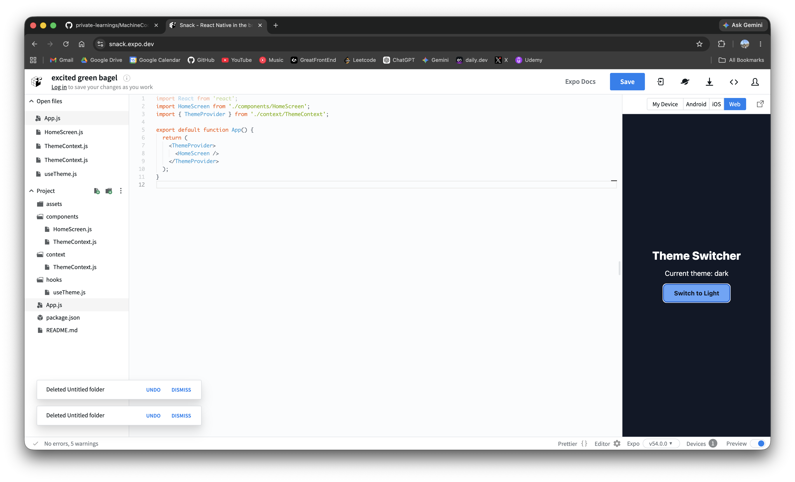

# Theme Switcher

A modular React Native light/dark theme switcher using Context API and a custom hook.

<p>
  
</p>

## Features

- Toggles between light and dark theme.
- Uses `ThemeProvider` to avoid prop drilling.
- Uses a custom `useTheme` hook for clean access.
- Keeps files organized by responsibility.
- Uses plain JavaScript only.

## Folder Structure

```txt
ThemeSwitcher/
  App.js
  components/
    HomeScreen.js
  context/
    ThemeContext.js
  hooks/
    useTheme.js
```

## Responsibilities

| File                       | Responsibility                                         |
| -------------------------- | ------------------------------------------------------ |
| `App.js`                   | Wraps the app with `ThemeProvider`.                    |
| `components/HomeScreen.js` | Renders UI and consumes theme values.                  |
| `context/ThemeContext.js`  | Stores themes, context, provider, and toggle logic.    |
| `hooks/useTheme.js`        | Reads theme context and guards missing provider usage. |

## How It Works

```txt
ThemeProvider keeps theme in state
        |
        v
Provider shares { theme, colors, toggleTheme }
        |
        v
HomeScreen calls useTheme()
        |
        v
User taps button
        |
        v
toggleTheme switches light <-> dark
```

## Machine Coding Cheat Sheet

### 1. Define theme colors

```jsx
export const themes = {
  light: {
    background: "#ffffff",
    text: "#111827",
    button: "#2563eb",
    buttonText: "#ffffff",
  },
  dark: {
    background: "#111827",
    text: "#ffffff",
    button: "#60a5fa",
    buttonText: "#111827",
  },
};
```

### 2. Create context and provider

```jsx
export const ThemeContext = createContext(null);

export function ThemeProvider({ children }) {
  const [theme, setTheme] = useState("light");

  function toggleTheme() {
    setTheme((prev) => (prev === "light" ? "dark" : "light"));
  }

  return (
    <ThemeContext.Provider
      value={{ theme, colors: themes[theme], toggleTheme }}
    >
      {children}
    </ThemeContext.Provider>
  );
}
```

### 3. Create custom hook

```jsx
export default function useTheme() {
  const context = useContext(ThemeContext);

  if (!context) {
    throw new Error("useTheme must be used inside ThemeProvider");
  }

  return context;
}
```

### 4. Consume theme in component

```jsx
const { theme, colors, toggleTheme } = useTheme();
const styles = getStyles(colors);
```

### 5. Wrap app with provider

```jsx
export default function App() {
  return (
    <ThemeProvider>
      <HomeScreen />
    </ThemeProvider>
  );
}
```

## Interview Follow-ups

| Requirement      | Approach                                        |
| ---------------- | ----------------------------------------------- |
| Persist theme    | Save selected theme in `AsyncStorage`.          |
| Use system theme | Seed state from `useColorScheme()`.             |
| More themes      | Add more keys to the `themes` object.           |
| Global styles    | Put shared spacing/font values in theme object. |
| Disable flicker  | Load persisted theme before rendering UI.       |
| Multiple screens | Wrap navigation root with `ThemeProvider`.      |

## Edge Cases

- `useTheme` must be called inside `ThemeProvider`.
- Missing theme keys can break dynamic styles.
- Persisted theme should fall back to light or system theme if invalid.
- Dynamic styles should be rebuilt when colors change.
