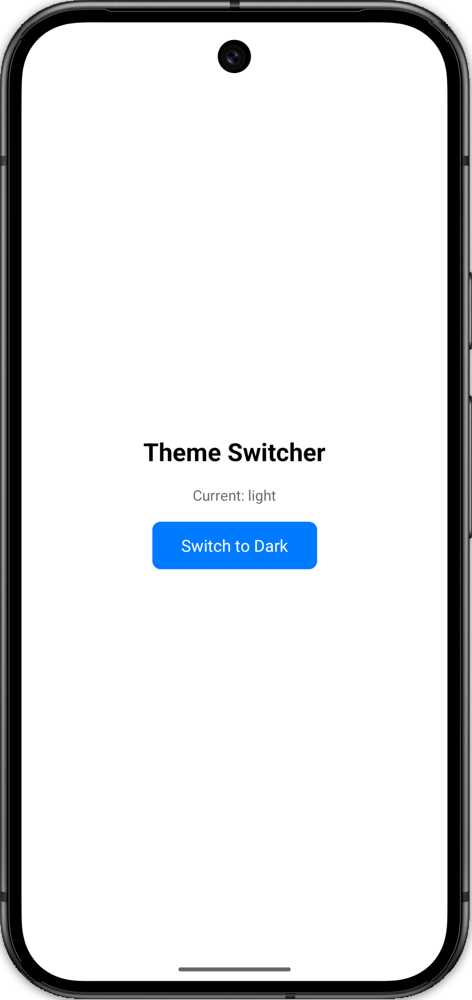
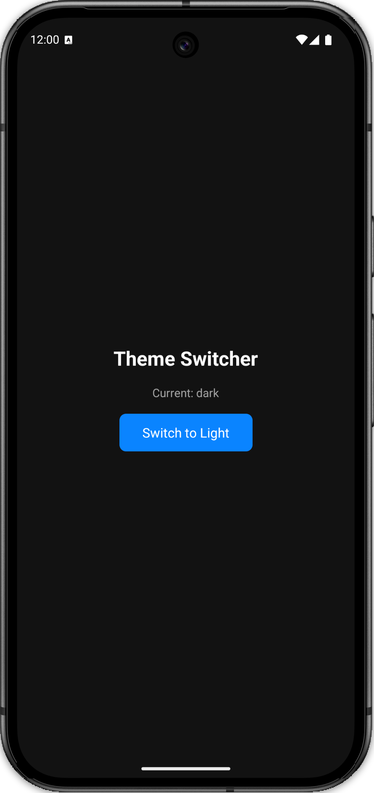

# Light / Dark Theme Switcher

> Machine Coding — confirmed asked July 2025

---

## Preview

<p align="center">
  
  &nbsp;&nbsp;&nbsp;
  
</p>

---

## What it does

Toggle between light and dark themes app-wide using a single button.
No prop drilling — any component anywhere in the tree can read and change the theme.

---

## Setup

```bash
npm install
npx react-native run-ios     # or run-android
```

---

## File Structure

```
src/
  ThemeContext.tsx  — theme colours, Context, Provider
  useTheme.ts       — custom hook (shortcut for useContext)
  HomeScreen.tsx    — UI that consumes the hook
App.tsx             — wraps app in ThemeProvider
```

---

## Key Concepts

**`createContext`** — creates a React context object. Takes a default value (we use `undefined` and guard against it in the hook). Any component inside the Provider can read this context.

**`useContext(ThemeContext)`** — reads the nearest Provider's value. Re-renders the component whenever the value changes (i.e. when theme toggles).

**Custom `useTheme` hook** — thin wrapper over `useContext`. Two benefits:

1. Screens write `useTheme()` instead of `useContext(ThemeContext)` — cleaner
2. Throws a clear error if used outside `<ThemeProvider>`

**`ThemeProvider`** — holds `useState('light')`. Passes `{ theme, colors, toggleTheme }` to all children via Context. No prop drilling needed.

**Dynamic `StyleSheet`** — `makeStyles(colors)` is called inside the component so it rebuilds with new colours on every theme toggle. The function is defined outside the component to avoid redefining it on every render.

---

## Data Flow

```
ThemeProvider (useState)
  └─ ThemeContext.Provider  value = { theme, colors, toggleTheme }
       └─ HomeScreen
            └─ useTheme()   reads value from context
                 └─ makeStyles(colors)  builds dynamic StyleSheet
                 └─ toggleTheme()       flips light ↔ dark
```

---

## Build It Step by Step

**Step 1 — Define colours**

```ts
const themes = {
  light: { background: '#fff', text: '#000', ... },
  dark:  { background: '#121212', text: '#fff', ... },
};
```

**Step 2 — Create context**

```ts
// undefined default so the hook can detect missing provider
const ThemeContext = createContext<ThemeContextValue | undefined>(undefined);
```

**Step 3 — Create provider**

```ts
const ThemeProvider = ({ children }) => {
  // Seed from OS setting on mount. Falls back to 'light' if system returns null.
  const systemTheme = useColorScheme();
  const [theme, setTheme] = useState<ThemeType>(
    systemTheme === 'dark' ? 'dark' : 'light',
  );

  const toggleTheme = () =>
    setTheme(prev => (prev === 'light' ? 'dark' : 'light'));
  return (
    <ThemeContext.Provider
      value={{ theme, colors: themes[theme], toggleTheme }}
    >
      {children}
    </ThemeContext.Provider>
  );
};
```

**Step 4 — Create custom hook**

```ts
const useTheme = () => {
  const ctx = useContext(ThemeContext);
  if (!ctx) throw new Error('useTheme must be used inside <ThemeProvider>');
  return ctx;
};
```

**Step 5 — Consume in any component**

```ts
const { theme, colors, toggleTheme } = useTheme();
const styles = makeStyles(colors); // dynamic styles
```

**Step 6 — Wrap app**

```tsx
<ThemeProvider>
  <HomeScreen />
</ThemeProvider>
```

---

## Interview Script

> "I'll create a ThemeContext that holds the active theme and a toggle function.
> A ThemeProvider wraps the app and stores theme in useState.
> A custom useTheme hook wraps useContext for cleaner imports and adds a missing-provider guard.
> Each screen calls useTheme(), gets the colour set, and passes it to makeStyles() for dynamic StyleSheets.
> No prop drilling at any level."

```
1. colours object   → { light: {...}, dark: {...} }
2. createContext    → ThemeContext with undefined default
3. Provider         → useState holds 'light'|'dark', passes colors + toggleTheme
4. useTheme hook    → useContext + missing-provider guard
5. Dynamic styles   → makeStyles(colors) called inside component
6. Wrap app         → <ThemeProvider> at root
```
