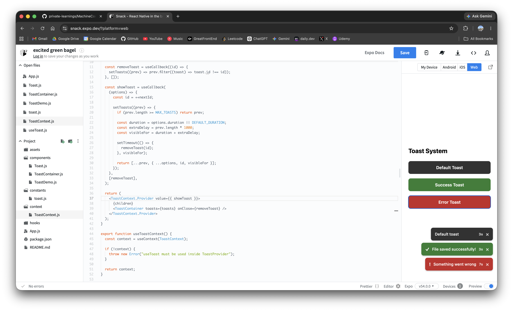

# Toast

A modular React Native toast system using plain JavaScript, Context API, and provider-owned timers.

<p>
  
</p>

## Features

- Shows stacked toast messages.
- Supports custom message, color, icon, and duration.
- Auto-dismiss is handled by `ToastProvider`.
- Each new stacked toast stays visible longer than the previous one.
- Each toast displays its own visible time, such as `3s`, `4s`, or `5s`.
- No animated toast layer.
- Each component keeps its own styles.

## Folder Structure

```txt
Toast/
  App.js
  components/
    ToastDemo.js
    ToastContainer.js
    Toast.js
  constants/
    toast.js
  context/
    ToastContext.js
  hooks/
    useToast.js
```

## Responsibilities

| File                           | Responsibility                                        |
| ------------------------------ | ----------------------------------------------------- |
| `App.js`                       | Wraps demo screen with `ToastProvider`.               |
| `components/ToastDemo.js`      | Demo buttons that call `showToast`.                   |
| `components/ToastContainer.js` | Positions and renders the toast stack.                |
| `components/Toast.js`          | Pure toast UI component.                              |
| `context/ToastContext.js`      | Stores toast list, adds/removes toasts, owns timers.  |
| `hooks/useToast.js`            | Exposes `showToast` from context.                     |
| `constants/toast.js`           | Stores colors, max toast count, and default duration. |

## How It Works

```txt
Button calls showToast(options)
        |
        v
ToastProvider creates id and visibleFor time
        |
        v
Toast is added to state
        |
        v
ToastContainer renders stacked toasts
        |
        v
Provider timeout removes toast after visibleFor
```

## Machine Coding Cheat Sheet

### 1. Keep toast state in provider

```jsx
const [toasts, setToasts] = useState([]);
```

### 2. Add toast and schedule removal

```jsx
const showToast = useCallback(
  (options) => {
    const id = ++nextId;

    setToasts((prev) => {
      if (prev.length >= MAX_TOASTS) return prev;

      const duration = options.duration || DEFAULT_DURATION;
      const extraDelay = prev.length * 1000;
      const visibleFor = duration + extraDelay;

      setTimeout(() => {
        removeToast(id);
      }, visibleFor);

      return [...prev, { ...options, id, visibleFor }];
    });
  },
  [removeToast],
);
```

### 3. Remove toast by id

```jsx
const removeToast = useCallback((id) => {
  setToasts((prev) => prev.filter((toast) => toast.id !== id));
}, []);
```

### 4. Render toast stack

```jsx
<View style={styles.container} pointerEvents="box-none">
  {toasts.map((toast) => (
    <Toast key={toast.id} {...toast} onClose={() => onClose(toast.id)} />
  ))}
</View>
```

### 5. Show duration in UI

```jsx
{
  visibleFor ? (
    <Text style={styles.time}>{Math.round(visibleFor / 1000)}s</Text>
  ) : null;
}
```

## Usage

```jsx
const { showToast } = useToast();

showToast({
  message: "File saved successfully!",
  color: "#2e7d32",
  icon: "✓",
  duration: 2000,
});
```

## Interview Follow-ups

| Requirement            | Approach                                             |
| ---------------------- | ---------------------------------------------------- |
| Top toast position     | Change container `top`/`bottom` styles.              |
| Different variants     | Add helper methods like `success`, `error`, `info`.  |
| Queue instead of limit | Store pending toasts and show next after removal.    |
| Pause on press         | Move timer ids into provider and clear/restart them. |
| Animated toast         | Wrap `Toast` with `Animated.View` or Reanimated.     |
| Global access          | Wrap app root with `ToastProvider`.                  |

## Edge Cases

- Empty message should not create a toast.
- If `MAX_TOASTS` is reached, do not start a timer for a skipped toast.
- Manual close can run before the timeout; filtering by id keeps it safe.
- Use stable ids so duplicate messages can still be removed independently.
- Provider-owned timers keep `Toast` as a pure UI component.
