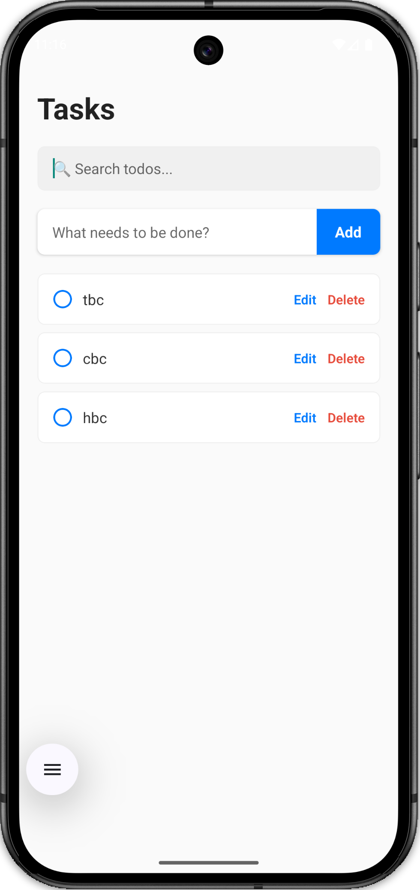

# React Native Todo List (Debounced Search + Context/Reducer)

<p align="center">
  
</p>

An advanced Machine Coding implementation of a Todo List natively engineered to answer two specific architectural interview questions:

1. **"How do you prevent useless renders?"** (Solved via Debounce Hooks)
2. **"How do you manage complex arrays safely?"** (Solved via Context & Reducers)

## 🎯 The Interview Perspective

When an interviewer asks you to build a Todo List with a Search bar, they are actively hunting for race conditions and severe performance lags. If you bind `<TextInput>` directly to a `array.filter()`, a user typing 5 characters instantly re-renders the list 5 times.

This repository perfectly counters that.

## 🚀 Architecture Decisions

### 1. The Debounce Hook (`useDebounce.ts`)

Instead of searching on every keystroke, the `TodoSearch.tsx` component completely localized the `<TextInput>` state so the user can type at 60 FPS natively. It passes the value through a `useDebounce` hook, which safely utilizes closures and `setTimeout/clearTimeout` logic to ensure the `onSearch` filter is only released upward _after_ the user stops typing for 400ms.

### 2. State Orchestrator (`TodoContext.tsx`)

Passing boolean toggle callbacks through 3 layers of components (`App -> TodoList -> TodoItem`) mathematically wastes memory allocation.

- We utilize `useReducer` to create highly isolated, predictable state mutation functions (`ADD_TODO`, `EDIT_TODO`, `REMOVE_TODO`).
- We wrap them identically behind Context. Now, `TodoItem.tsx` simply consumes `dispatch` directly. The unified array remains flawlessly synchronized across all edits and checks simultaneously.

### 3. Isolated Inputs (`TodoInput.tsx`)

Separated explicitly from `App.tsx` ensuring that when a user types "Make Coffe...", the master orchestrator `App.tsx` (and by extension the rendered `TodoList`) does not perform worthless re-render loops. The input state remains isolated solely inside `TodoInput` until it securely dispatches an `ADD_TODO` action.

## 💻 How to Run

1. Open a terminal inside this project directory.
2. Ensure you install local native dependencies if testing locally:
   ```bash
   npm install
   npm run start
   ```
3. Load it via Expo Go (if configured) or the native iOS/Android simulators depending on your environment.
