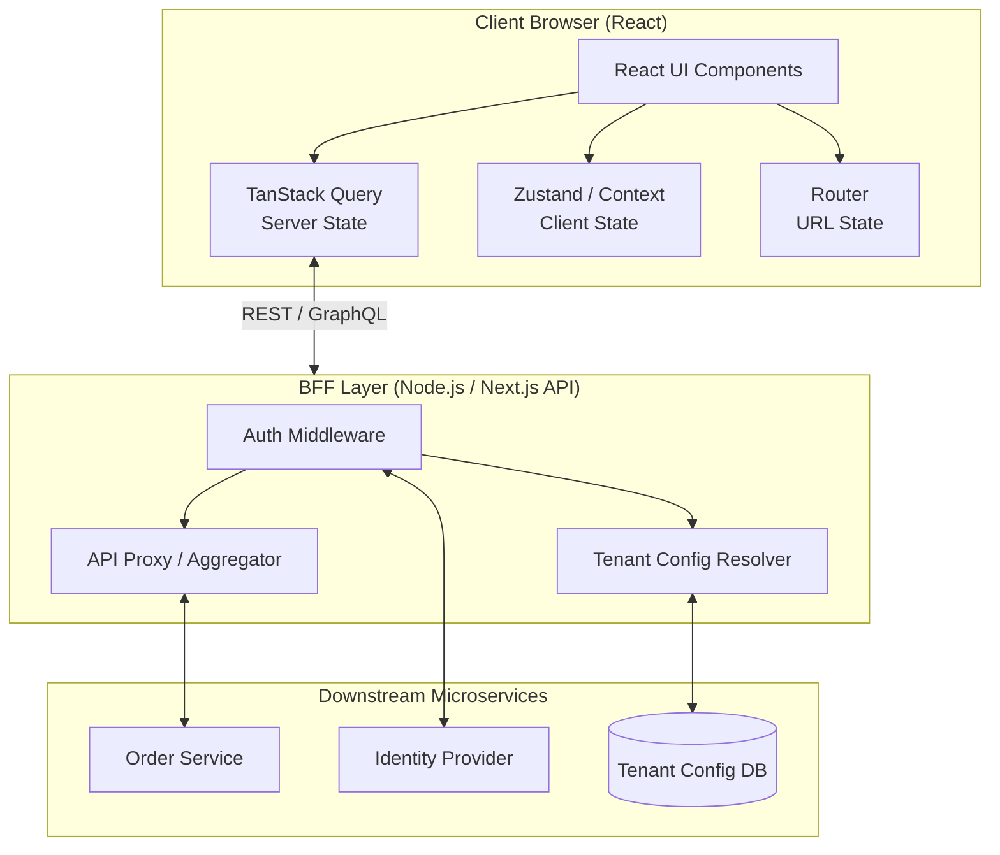
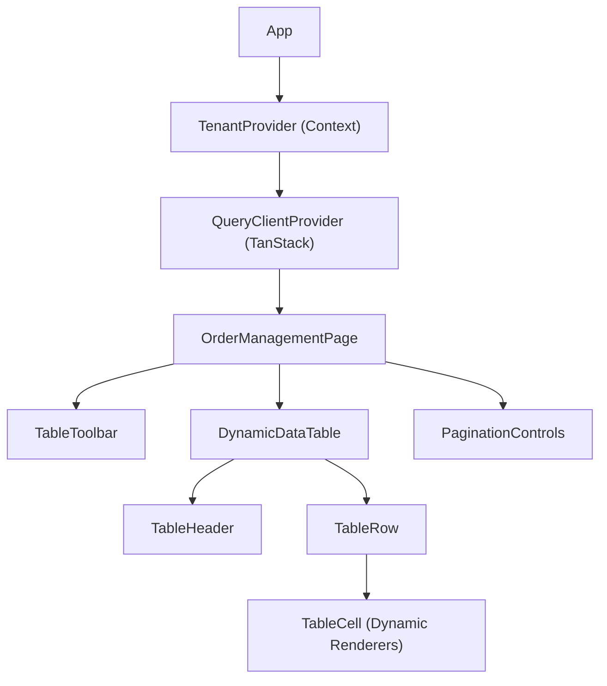

# Multi-Tenant Order Management System

## Question

Design the frontend architecture for a Multi-Tenant Order Management System (Vendor Portal). Every client (tenant) will have a customized data table page where users can view, filter, and manage their orders.

The system must:

- Support multi-tenant login and authorization.
- Provide dynamic configuration for each tenant using a Backend-For-Frontend (BFF) layer.
- Clearly separate client and server state using established modern solutions (e.g., TanStack Query).
- Emphasize scalability, configurability, and UX considerations (accessibility, shareability) from the outset.

---

## Clarifying Questions

- **Tenant Context:** How is the tenant identified? (e.g., subdomains `tenantA.portal.com` vs path-based `/tenantA/orders`).
- **Customization Scope:** What aspects of the table are customizable per tenant? (Columns, themes, features like export, pagination type).
- **Scale:** How much data will the table render? Do we need server-side pagination and virtualization?
- **Authentication:** Who handles the authentication logic and token storage? Is it handled entirely by the BFF?

---

## R - Requirements Exploration

### Functional Requirements

- **Multi-Tenant Login:** Users can log in, and the system resolves their tenant context to apply appropriate permissions and UI.
- **Dynamic Data Tables:** Render a highly customizable table based on the tenant's configuration (columns, formatting).
- **BFF Layer:** The frontend should communicate with a BFF layer that injects dynamic configuration and handles tenant routing securely.
- **Data Operations:** Support server-side pagination, sorting, and filtering based on user interaction.

### Non-Functional Requirements (UX & Architecture Focus)

- **State Management Separation:** Distinct separation between _Server State_ (remote data, caching) and _Client State_ (UI toggles, local theme). Use industry-standard tools rather than custom abstractions.
- **Scalable & Configurable Architecture:** The system must be designed from day one to accept configuration objects to drive the UI, rather than hardcoding client-specific logic.
- **Shareability (URL State):** Table filters, sorting, and pagination must be synced with the URL search parameters so users can easily share specific views.
- **Accessibility (A11y):** The data table and interactive elements must follow WAI-ARIA standards, including keyboard navigation and screen reader support.
- **Security:** Tenant isolation at the API level. The BFF handles sensitive tokens (HTTP-Only cookies) rather than exposing them directly to the client bundle.

---

## A - Architecture / High-Level Design

### System Overview

We will use a modern React architecture leveraging a **Backend-For-Frontend (BFF)** pattern to decouple the frontend from complex downstream microservices and to manage tenant context securely.



### The BFF Layer (Backend-For-Frontend)

Instead of the React app communicating directly with an array of microservices, it talks exclusively to the BFF.

1. **Tenant Resolution:** The BFF resolves the tenant via subdomain or headers.
2. **Dynamic Configuration:** When the app loads, it fetches a configuration object from the BFF. This object dictates which columns to show, theme colors, and enabled features (e.g., CSV export).
3. **Security:** The BFF handles token exchange and stores session IDs in secure, HTTP-only cookies. The React app never touches raw JWTs, preventing XSS vulnerabilities and ensuring secure authorization.

---

## State Management Architecture

A critical architectural decision in modern React applications is recognizing that not all state is created equal. We must separate **Server State** from **Client State**, leveraging established solutions rather than building custom abstractions.

### 1. Server State (TanStack Query)

Server state is data that is persisted remotely, requires asynchronous APIs for fetching/updating, and is shared among multiple clients.

- **Tool:** TanStack Query (React Query).
- **Why?** Instead of building custom `useEffect` hooks and Redux reducers for data fetching, TanStack Query provides caching, background synchronization, stale-time management, and loading/error states out of the box.
- **Multi-Tenant Consideration:** Cache keys must be aggressively scoped by the tenant ID to prevent cross-tenant data leakage in the client cache.
  ```javascript
  useQuery({
    queryKey: ["orders", tenantId, queryParams],
    queryFn: () => fetchOrders(tenantId, queryParams),
  });
  ```

### 2. Client State (Zustand / React Context)

Client state is ephemeral, synchronous UI state that does not persist across sessions.

- **Examples:** Sidebar open/closed state, currently active dropdown menu, local theme overrides.
- **Tool:** Zustand (for global UI state) or React Context (for deeply nested localized state, like providing the `TenantConfig` to the component tree).

### 3. URL State (React Router)

For shareability and usability, state that defines the user's current "view" should live in the URL.

- **Examples:** Search queries, pagination (`?page=2`), active filters (`?status=shipped`), and sorting.
- **Why?** A user can bookmark the page or send the link to a coworker, and the application will hydrate the exact same view without needing complex state-rehydration logic.

---

## D - Data Model

### Tenant Configuration Interface

The BFF returns this configuration to drive the UI dynamically. This is the foundation of our scalable, configurable system.

```typescript
interface TenantConfig {
  tenantId: string;
  theme: {
    primaryColor: string;
    logoUrl: string;
  };
  features: {
    enableCsvExport: boolean;
    enableAdvancedFilters: boolean;
  };
  tableSchema: {
    columns: ColumnDefinition[];
    defaultSort: { id: string; desc: boolean };
  };
}

interface ColumnDefinition {
  id: string; // Unique identifier for the column
  headerLabel: string; // Display text for the column header
  accessorKey: string; // Path to the data in the row object (e.g., 'customer.name')
  cellType: "text" | "currency" | "date" | "statusBadge"; // Drives dynamic cell rendering
  isSortable: boolean;
}
```

---

## L - Low-Level Design (LLD)

### 1. Component Hierarchy

A well-structured React application breaks down responsibilities clearly.



### 2. Core Custom Hooks

Custom hooks encapsulate complex logic and keep components clean:

- `useTenantConfig()`: Consumes the `TenantProvider` context to expose the current tenant's theme, features, and table schema to any component that needs it without prop-drilling.
- `useOrders(filters, pagination)`: A wrapper around TanStack Query's `useQuery`. It internally handles constructing the API request to the BFF, manages the query keys scoped by `tenantId`, and handles the caching lifecycle.
- `useTableURLState()`: A synchronization hook. It reads the current URL search parameters (using React Router or a library like `nuqs`) and converts them into a state object understandable by TanStack Table, and vice-versa.

### 3. Dynamic Data Table Implementation

Instead of building a rigid HTML table or using a heavy, opinionated component library, we use **TanStack Table** (a headless UI library). It provides the robust logic for sorting, filtering, and pagination, while we retain 100% control over the markup, accessibility, and styling.

1. **Initialize Table:** We feed TanStack Table the `data` (from `useOrders`) and the `columns` (mapped dynamically from `useTenantConfig`).
2. **URL Sync:** We hook TanStack Table's internal `state` and `onStateChange` handlers to our `useTableURLState()` hook. When a user clicks a column header to sort, the URL updates. This triggers a React re-render, passing the new sort params to `useOrders`, which instantly triggers a background refetch.
3. **Dynamic Cell Rendering:** Inside the `<TableCell />`, we check the `cellType` defined in the configuration to render a specialized micro-component (e.g., a `<StatusBadge status={value} />` or a `<CurrencyFormatter amount={value} />`), allowing tenants to have completely different cell formatting without altering the core table logic.

### 4. Component Interfaces (Props)

Defining strict TypeScript interfaces for our core components ensures the dynamic system remains robust and type-safe.

```typescript
// The main headless table orchestrator component
interface DynamicDataTableProps<TData> {
  data: TData[];
  columnsConfig: ColumnDefinition[]; // Injected from TenantConfig
  isLoading: boolean;

  // State lifted to the URL / Parent
  paginationState: {
    pageIndex: number;
    pageSize: number;
    pageCount: number;
  };
  onPaginationChange: (updater: PaginationStateUpdater) => void;

  sortingState: SortingState;
  onSortingChange: (updater: SortingStateUpdater) => void;
}

// Renders the specific UI for a cell based on the tenant's configuration
interface TableCellProps {
  value: any; // The raw data value
  cellType: ColumnDefinition["cellType"]; // "text" | "currency" | "date" | "statusBadge"
  rowData: OrderData; // Full row context in case complex formatting is needed
}
```

---

## I - API Design / Interface

### `GET /api/v1/config`

Fetches the current tenant's UI configuration. The tenant is inferred securely from the host header or secure cookie by the BFF.

- **Response:** `TenantConfig` object.

### `GET /api/v1/orders`

Fetches the orders for the authenticated tenant.

- **Query Parameters:** `page`, `pageSize`, `sortBy`, `sortOrder`, `filters`.
- **Response:**
  ```json
  {
    "data": [
      {
        "id": "ord_1",
        "customer": "Acme Corp",
        "total": 1500,
        "status": "shipped"
      }
    ],
    "meta": {
      "totalRowCount": 1050,
      "nextCursor": "abc123z"
    }
  }
  ```

---

## O - Optimizations / Deep Dive

### 1. Accessibility (A11y) First

Accessibility must be part of the initial design process, not a later addition.

- **Semantic HTML:** Use native `<table>`, `<thead>`, `<tbody>`, `<tr>`, `<th>`, and `<td>` elements to ensure screen readers parse the grid correctly.
- **ARIA Attributes:** Add `aria-sort="ascending|descending"` to sortable column headers. Use `aria-live="polite"` regions to announce when table data updates (e.g., "Showing 10 to 20 of 500 orders").
- **Keyboard Navigation:** Ensure pagination buttons, filter inputs, and row actions are fully focusable and usable via keyboard (`Enter` / `Space`). Focus management is crucial when modals or dialogs are opened from the table.

### 2. Shareability & Usability (URL-Driven Architecture)

By lifting the table's filter, sort, and pagination state into the URL search parameters:

- Users can use the browser's native Back/Forward buttons to navigate through their filter history.
- The link is immediately shareable.
- **Implementation Note:** Use a library or custom React Router hooks to seamlessly bind URL parameters to React state without causing redundant re-renders or infinite loops.

### 3. Scalable Configurable Systems (Inversion of Control)

By relying on the BFF to provide the `tableSchema` and `features` toggles, we invert control. The frontend acts as a "dumb" rendering engine that paints whatever the BFF tells it to.

- **Benefit:** Onboarding a new tenant who needs a completely different column layout or feature set requires **zero frontend code changes**. We simply update the configuration database, and the BFF serves the new layout. This heavily satisfies the requirement to design scalable systems from the outset.

### 4. Performance: Pagination & Virtualization

When dealing with large order datasets, we must employ data chunking strategies to maintain performance.

**Pagination Strategies:**

- **Offset Pagination (`?page=2&pageSize=50`):**
  - _Pros:_ Allows users to jump to a specific page. Easy to implement if the dataset is small or static.
  - _Cons:_ Can be slow on massive databases (database has to count/skip rows). Prone to data skipping/duplication if rows are added or deleted while the user is paginating.
- **Cursor Pagination (`?cursor=abc123z&pageSize=50`):**
  - _Pros:_ Extremely fast on large datasets (database uses an index to fetch the next batch). Consistent results even if data changes concurrently.
  - _Cons:_ Users cannot jump to "Page 10" directly; they must navigate sequentially (Next/Prev) or use infinite scrolling.
  - _Recommendation:_ **Cursor Pagination** is highly recommended for an Order Management System where new orders might be streaming in concurrently, preventing data drift and maintaining high query performance.

**Virtualization:**
If a tenant's configuration demands rendering hundreds of rows at once (e.g., in an infinite scroll setup powered by cursor pagination), we must implement **windowing/virtualization** (using tools like `@tanstack/react-virtual`). This ensures only the rows strictly visible in the viewport are rendered in the DOM, keeping memory usage low and scrolling smooth even on lower-end devices.

### 5. Rendering Strategy & Hydration

Choosing the right rendering strategy impacts both the Initial Load time and the Time to Interactive (TTI).

- **Client-Side Rendering (CSR):**
  - _Flow:_ Server sends empty HTML -> Client downloads JS -> Client fetches config -> Client fetches orders -> Render.
  - _Issue:_ Creates a "waterfall" of requests. The user stares at a blank screen or a loading spinner for a prolonged time. Since this is a vendor portal, SEO is not a priority, but the initial perceived performance is.
- **Server-Side Rendering (SSR) with Hydration (Recommended):**
  - Using a framework like Next.js or Remix at the BFF layer allows us to resolve the `tenantId` and fetch the `TenantConfig` _on the server_ before serving the HTML.
  - _Flow:_ Server identifies tenant -> Fetches config & initial orders -> Renders HTML -> Sends HTML to client -> Client "hydrates" the React tree.
  - _TanStack Query Dehydration/Hydration:_ Instead of the client refetching the orders on mount, we can **dehydrate** the TanStack Query cache on the server and send it down inside a `<script>` tag. On the client side, we **hydrate** the cache. This ensures the table renders instantly with data and is immediately interactive without double-fetching.

### 6. Real-time Updates & Resiliency (Senior Level Considerations)

For a robust order management system, static data is often insufficient:

- **Real-time Updates:** If order statuses (e.g., "Pending" -> "Shipped") need to reflect instantly without user intervention, implement **WebSockets** or **Server-Sent Events (SSE)**. The BFF can subscribe to a message broker (like Redis or Kafka) and push events down to the client. TanStack Query can listen to these events and optimally invalidate or update the specific row in the cache.
- **Resiliency & Offline Support:** Network failures happen. The frontend should gracefully handle BFF outages:
  - Implement **React Error Boundaries** at the component level (e.g., surrounding the data table) to prevent the entire app from crashing if a request fails.
  - Configure TanStack Query with exponential backoff retries.
  - Implement Optimistic Updates for actions (e.g., approving an order immediately updates the UI, reverting if the API fails).

### 7. Monitoring & Observability

A system is not complete without tracking its health in production:

- **Performance Budgets:** Monitor Core Web Vitals, specifically Largest Contentful Paint (LCP) and Total Blocking Time (TBT). Ensure that massive table renders do not lock up the main JavaScript thread.
- **Error Tracking:** Integrate tools like Sentry or Datadog to capture unhandled exceptions and failed API requests, ensuring they are automatically tagged with the specific `tenantId` to isolate tenant-specific bugs rapidly.
