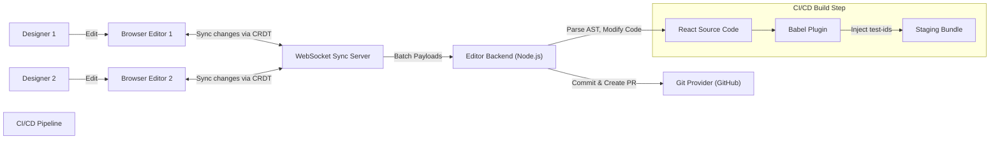
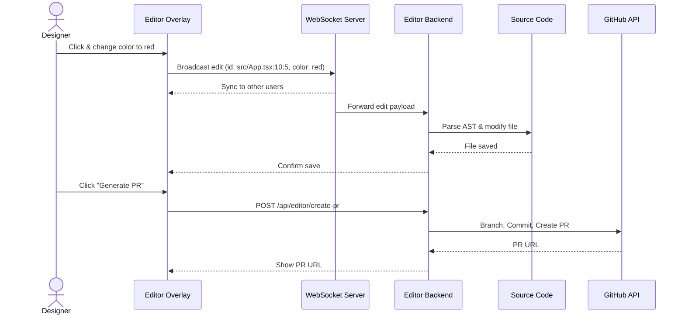

# Real-time Visual Editor (Design-to-Code PR Generator) System Design

## Question

Design a system for a product that allows changing a React web application in real-time directly from the browser. When a "design mode" is turned on, users (like product managers or designers) can make real-time visual edits to the web page. The system relies on a CI/CD pipeline to inject unique test IDs onto all React elements. When updates are made live, the system should match the changed elements, commit the corresponding code changes, and generate a Pull Request (PR) automatically.

---

## Clarifying Questions

- What kind of edits are supported? (e.g., text changes, style/CSS changes, moving elements, adding new components?)
- Do we need to support collaborative editing (multiple users editing at the same time)?
- How do we handle dynamic content or state-driven UI (e.g., elements that only appear on hover or after fetching data)?
- Which Git provider are we integrating with for the PR generation? (e.g., GitHub, GitLab)
- How do we handle styling? Are we using inline styles, Tailwind, CSS Modules, or CSS-in-JS?

---

## R - Requirements Exploration

### Functional Requirements

- **Design Mode Toggle**: Users can toggle a "design mode" on the live/staging application.
- **Visual Editing**: Users can click on elements and modify properties like text, color, layout, and spacing.
- **Element Identification**: The system must accurately identify which source code file and line correspond to the clicked element in the browser.
- **Code Transformation**: Visual changes must be translated back into AST (Abstract Syntax Tree) modifications of the React source code.
- **PR Generation**: The system should bundle changes, create a new branch, commit the modified code, and open a Pull Request.

### Non-Functional Requirements

- **Performance**: The visual editor should not degrade the performance of the application when design mode is off.
- **Accuracy**: Code modifications must be precise and not break existing logic or formatting (e.g., preserving Prettier formatting).
- **Security**: Only authorized users can enable design mode and trigger PRs.
- **Reliability**: The system should gracefully handle complex components or elements it cannot safely edit.
- **Accessibility (A11y)**: The editor overlay must be fully navigable via keyboard to support users who rely on screen readers or cannot use a mouse.

---

## A - Architecture / High-Level Design

### System Component Flow



### Real-time Update Sequence



### 1. Build Time Injection (CI/CD Pipeline)

To map DOM nodes to React source code, we use a Babel or SWC plugin during the CI/CD build process (typically for staging environments). This plugin traverses the JSX AST and injects a unique identifier (e.g., `data-editor-id` or `data-loc` containing filename, line, and column) into every DOM element.

### 2. Client-Side Editor Layer

When "Design Mode" is enabled, an overlay is mounted on top of the React app.

- It listens for `mouseover` and `click` events, intercepting them to prevent normal app behavior.
- When an element is clicked, it reads the injected `data-editor-id`.
- It presents a UI (sidebar or popover) to edit the element's properties (styles, text).
- It sends a JSON payload representing the change to the Editor Backend.

### 3. Editor Backend (Code Transformation Engine)

This is a Node.js service running either locally or securely in a staging environment.

- It receives the change payload (e.g., `id: "src/App.tsx:10:5"`, `change: { color: "red" }`).
- It uses tools like `@babel/parser`, `jscodeshift`, or `ts-morph` to parse the specific file into an AST.
- It locates the exact JSX element using the line/column data.
- It modifies the AST (e.g., adding/updating a `className` or `style` prop).
- It generates the new code from the AST and writes it to the file system.

### 4. Git & PR Integration

Once the user is done making a batch of changes and clicks "Publish" or "Create PR":

- The backend uses simple `git` commands or the GitHub REST API.
- It creates a new branch from the base branch.
- It stages and commits the modified files.
- It pushes the branch and creates a PR, returning the PR link to the user.

---

## D - Data Model

### Element Identifier Map

Injected during build time:
`data-editor-id="src/components/Button.tsx:15:4"`

### Edit Payload

Sent from the browser to the backend:

```typescript
type ElementLocation = {
  file: string;
  line: number;
  column: number;
};

type StyleChange = {
  property: string; // e.g., "backgroundColor"
  value: string; // e.g., "#ff0000"
};

type EditPayload = {
  location: ElementLocation;
  changes: {
    text?: string;
    styles?: StyleChange[];
    className?: string;
  };
};
```

### Git Action Payload

```typescript
type CreatePRRequest = {
  title: string;
  description: string;
  changes: EditPayload[];
  baseBranch: string;
};
```

---

## I - Interface Definition (API)

### 1. REST API (Editor Backend)

`POST /api/editor/apply-change`
Applies a change directly to the source code files hosted on the editor backend server (useful for immediate feedback in staging environments or if developers are using the tool on their own local machines).

- **Request Body**: `EditPayload`
- **Response**: `200 OK` (success), `400 Bad Request` (if AST modification fails)

`POST /api/editor/create-pr`
Generates the Pull Request.

- **Request Body**: `CreatePRRequest`
- **Response**:

```json
{
  "prUrl": "https://github.com/org/repo/pull/123",
  "branchName": "design-edit-16892301"
}
```

### 2. WebSocket API (Real-Time Sync)

To support multiple designers, the browser and WebSocket server communicate via events:

- `emit("crdt:update", payload)`: Broadcasts a Yjs CRDT binary state update to the server.
- `on("crdt:update", payload)`: Receives a CRDT update from other designers.
- `emit("cursor:move", { userId, location })`: Broadcasts mouse/selection location to show other designers' cursors.

---

## O - Optimizations and Deep Dive

### 1. Handling CSS-in-JS and Tailwind

Modifying inline styles is easy via AST, but it's bad practice for production.

- **Tailwind**: The editor backend can map style changes to Tailwind classes. If the user changes color to red, the backend adds `text-red-500` to the `className` string in the AST.
- **CSS Modules/Styled Components**: The backend would need to parse the corresponding CSS/Styled file, which is much more complex. Sticking to utility-first CSS (Tailwind) makes AST modification significantly more reliable.

### 2. Preserving Code Formatting

When writing the modified AST back to code, formatting is often lost or drastically changed, which creates noisy PRs.

- **Solution**: Run `prettier` on the file programmatically immediately after generating code from the AST, using the project's exact `.prettierrc` configuration.

### 3. State and Dynamic Elements

How do you edit a modal that only appears when a button is clicked?

- The editor overlay must allow "interaction mode" vs "edit mode". Users can toggle interaction mode to open the modal, then switch to edit mode to click and modify the modal's contents.
- For hover states, the editor UI can have a toggle to "Force Hover State" which applies pseudo-classes via JavaScript.

### 4. Security in Staging Environments

The editor backend effectively has write access to the source code repository.

- It must be secured behind strict authentication (e.g., OAuth with GitHub).
- The backend should use short-lived Git tokens.
- It should only be deployed in secure staging environments, NEVER in production.

### 5. AST Modification Edge Cases

What if the component is mapped from an array?

```jsx
{
  items.map((item) => <div data-editor-id="...">{item.name}</div>);
}
```

If a user edits one item, they are editing the template for all items. The UI should warn the user: "You are editing a repeated element. Changes will apply to all items." The `data-editor-id` will point to the single JSX declaration inside the `map` function.

### 6. Real-Time Collaborative Editing (Concurrency)

If multiple designers edit the same page simultaneously, we need a way to resolve conflicts.

- **WebSocket Layer**: Use WebSockets (e.g., Socket.io) to broadcast changes instantly to all connected clients.
- **CRDTs (Conflict-free Replicated Data Types)**: Use a library like `Yjs` to manage the collaborative state. When Designer A changes color and Designer B changes text on the same element, `Yjs` merges these changes deterministically before sending the final state to the AST modifier.

### 7. Handling Git Merge Conflicts

Because the system commits to the underlying repository, what happens if a developer modifies the same file on `main` while a designer is working in the visual editor?

- **Optimistic Rebase**: Before creating the PR, the editor backend should run `git pull --rebase origin main`.
- If a conflict occurs, the backend can notify the user that the underlying code has changed and the PR needs manual developer intervention to resolve the conflict.

### 8. Accessibility & Keyboard Navigation

The design overlay must not break the existing application's accessibility, but it also needs its own robust keyboard support:

- **Focus Management**: When "Design Mode" is toggled on, users should be able to press `Tab` to cycle focus through editable elements on the page.
- **Selection**: Pressing `Enter` or `Space` on a focused element should open the property editor sidebar/popover for that element.
- **Dismissal**: Pressing `Escape` should close the property editor and return focus to the underlying element, or turn off "interaction mode".
- **Shortcuts**: Provide global hotkeys (e.g., `Cmd+Z` to undo local AST modifications before PR generation).

---

## Summary

Building a real-time visual editor that generates PRs involves a build-time Babel plugin to inject location IDs, a client-side overlay to capture visual edits, an AST-parsing Node.js backend to modify the source code, and a Git integration layer to commit and push changes. This architecture enables a modern "review-based workflow" where non-technical stakeholders can contribute directly to the codebase safely.

## References

- React AST Manipulation (Babel/jscodeshift)
- Puck / Onlook (Open source visual editors for React)
- Builder.io Visual Copilot concepts
- GitHub Pull Request API
