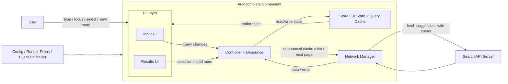
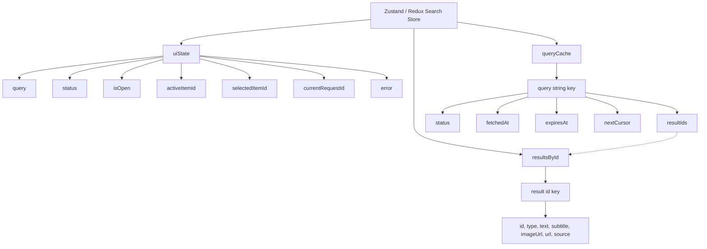

# Autocomplete / Search Component System Design

Autocomplete is a common question asked by many companies and encompasses many useful front end concepts and techniques that can be generalized to other front end system design questions. It is highly recommended to study this question well and thoroughly!

## Question

Design an autocomplete UI component that allows users to enter a search term into a text box, a list of search results appears in a popup, and the user can select a result.

Some real-life examples where you might have seen this component in action:

- **Google's search bar** on google.com where you see a list of primarily text-based suggestions.
- **Facebook's search input** where you see a list of rich results. The results can be friends, celebrities, groups, pages, etc.

A back end API is provided that will return a list of results based on the search query.

---

## Clarifying Questions

These are questions you should ask the interviewer to refine the scope before locking the requirements:

- What kind of results should be supported: text only, images, or rich media rows?
- What devices and screen sizes should this component support?
- Should the component support fuzzy search for typos and partial matches?
- Should suggestions appear only after a minimum query length?
- Should results be paginated or limited to a small fixed number?
- Should recent searches or trending suggestions be shown before the user types?
- How customizable should the input field and result item rendering be?
- Are there any accessibility or keyboard interaction requirements?

---

## R - Requirements Exploration

### Functional Requirements

- **Accept user input and fetch matching suggestions as the user types.**
- **Show suggestions in a popup/dropdown below the input field.**
- **Allow users to select a suggestion using mouse, touch, or keyboard.**
- **Allow users to submit the typed query directly without selecting a suggestion.**
- **Support different result types such as plain text, image results, and rich media rows.**
- **Support initial suggestions such as recent searches, popular searches, or trending queries.**
- **Allow the host application to customize the input UI and result item UI.**
- **Expose events such as input change, focus, blur, search, and suggestion selection.**
- **Show loading, empty, error, and offline states.**
- **Limit visible suggestions to a manageable count and provide a way to view full search results.**

### Non-Functional Requirements

- **Reusable:** The component should be generic enough to be used across different websites and product surfaces.
- **Performant:** Avoid firing a request on every keystroke by using debounce, caching, and request coordination.
- **Low latency:** Cached results should appear immediately, and fresh results should feel fast enough for typing-driven interaction.
- **Accessible:** Follow the WAI-ARIA combobox/listbox pattern with proper ARIA attributes and keyboard support for Arrow keys, Enter, Escape, and Tab.
- **Responsive:** Work well on desktop, tablet, and mobile viewports.
- **Reliable:** Handle slow networks, failed requests, out-of-order responses, and offline mode gracefully.
- **Scalable:** Avoid memory bloat in long-lived applications by using cache eviction or normalized cache storage.
- **Customizable:** Styling, rendering, and behavior should be configurable without changing the component internals.
- **Privacy-aware:** Avoid caching or exposing sensitive queries longer than necessary.

---

## A - Architecture / High-Level Design



### Input field UI

- Handles user input and passes the user input to the controller.

### Results UI (Popup)

- Receives results from the controller and presents them to the user.
- Handles user selection and informs the controller which input was selected.
- Can trigger `load more` either through infinite scroll or an explicit "View more" action.

### Store / UI State + Query Cache

- Stores UI state such as the current query, loading state, error state, active suggestion index, and whether the popup is open.
- Stores cached results for previous queries so the controller can reuse them before sending a new request.
- Stores normalized result entities so repeated results across queries are not duplicated.
- Stores pagination metadata such as `nextCursor`.

### Controller

- The "brain" of the whole component, similar to the Controller in the Model View Controller (MVC) pattern. All the components in the system interact with this component.
- Passes user input and results between components.
- Debounces query changes before deciding whether to read from cache or call the network manager.
- Fetches results from the server if the store does not already have cached results for a particular query.
- Fetches the next page when the user scrolls near the end of suggestions or clicks "View more".
- Conceptually, the controller sits at the center: it receives input from the field, checks the store for cached query results, falls back to the server on a miss, and writes responses back into the store so the results UI can render them.

### Network Manager

- Calls the search API and returns parsed data or a normalized error to the controller.
- Handles basic request validation, response validation, timeout, retry, and API error handling.
- Tracks the latest request id or abort controller so stale responses do not overwrite newer results.

### Pagination

- For autocomplete, keep the first page small so the popup stays easy to scan.
- Use infinite scroll when the dropdown has enough height, or a "View more" action when we want an explicit user intent before loading more.
- Prefer cursor-based pagination over offset-based pagination because search rankings can change while the user is typing or scrolling.

### Accessibility Helpers

- Adds proper ARIA tags for the input, popup, and active option.
- Supports keyboard navigation across the input and results popup.

---

## D - Data Model

At a glance, the store owns transient UI state (current input, active suggestion index, open/closed flag) and cached query history, keyed by the query string and referencing result entities.



### Store State

| Field              | Type                                                 | Description                                         |
| ------------------ | ---------------------------------------------------- | --------------------------------------------------- |
| `query`            | `string`                                             | Current search string                               |
| `status`           | `idle \| loading \| loadingMore \| stalled \| error` | Current fetch/rendering state                       |
| `activeItemId`     | `number \| null`                                     | Index/id of the currently highlighted suggestion    |
| `selectedItemId`   | `string \| null`                                     | Result selected by click, touch, or keyboard        |
| `isOpen`           | `boolean`                                            | Flag for whether the popup is open                  |
| `currentRequestId` | `string \| null`                                     | Latest request identifier used to ignore stale data |
| `error`            | `string \| null`                                     | Error message or code for the current query         |

### Query Cache Data Model

| Field        | Type                      | Description                                      |
| ------------ | ------------------------- | ------------------------------------------------ |
| `query`      | `string`                  | The search query term                            |
| `resultIds`  | `string[]`                | References to normalized result items            |
| `status`     | `fresh \| stale \| error` | Cache entry status                               |
| `fetchedAt`  | `number`                  | Timestamp for when it was fetched                |
| `expiresAt`  | `number`                  | Timestamp for cache eviction                     |
| `nextCursor` | `string \| null`          | Cursor if the full search result view loads more |

### Pagination Choice

- **Cursor pagination:** Better for autocomplete because it is stable when search ranking or indexed data changes between requests. Store the `nextCursor` per query and pass it when loading more.
- **Offset pagination:** Simpler to reason about, but can return duplicate or missing results if the underlying result set changes while the user is interacting.

For this component, cursor pagination is the better default.

### Result Entity

| Field      | Type     | Description                                         |
| ---------- | -------- | --------------------------------------------------- |
| `id`       | `string` | Unique identifier for the result                    |
| `type`     | `string` | Type of result (e.g., text, organization, musician) |
| `text`     | `string` | Main text of the result                             |
| `subtitle` | `string` | Secondary text or description                       |
| `imageUrl` | `string` | Optional image for rich result rows                 |
| `url`      | `string` | Destination for selected result or full search page |
| `source`   | `string` | Where it came from: recent, trending, or remote API |

---

## I - Interface Definition (API)

Since this is a front end system design question, we will focus on the API of the component and only briefly touch on the search API that the server should provide.

### Client Basic API

These are the core APIs that affect the functionality of the component.

- **Number of results:** The number of results to show in the list of results.
- **API URL:** The URL to hit when a query is made. For an autocomplete use case, queries are made as the user types.
- **Event listeners:** `'input'`, `'focus'`, `'blur'`, `'change'`, and `'select'` are some of the common events that developers might want to respond to (possibly to log user interactions), so adding hooks for these events would be helpful.
- **Customized rendering:** There are a few ways to allow developers to customize the rendering of the various parts of their UI for their use cases:
  - **Theming options object:** This approach is the easiest to use but the least flexible/customizable. The component can accept an object of key/value pairs (e.g. `{ textSize: '12px', textColor: 'red' }`) and use it when rendering.
  - **Classnames:** Allow developers to specify their own CSS class names that the component will add to the various UI sub-components.
  - **Render function/callback:** This is an inversion of control technique commonly used in React where the rendering is completely left to the developer. The component invokes a developer-provided function with some data, and the developer can customize the logic/code to render the UI based on that data. This is the most flexible approach but requires the most effort from the developer.

### Client Advanced API

These APIs affect the user experience and performance of the component and should be covered if there's enough time.

- **Minimum query length:** There will likely be too many irrelevant results if the user query is too short, as it is not specific enough. We might only want to trigger the search when a minimum number of characters have been typed in, possibly 3 or more.
- **Debounce duration:** Triggering a back end search API for every keystroke can be quite wasteful, especially when the queries for the first few characters are likely to not be meaningful. Debouncing is a technique that limits the number of times a function gets called. We could debounce the API calls so that the server does not get hit too often. With a debounce duration of `300ms`, the back end search API will only be called after there has been no user input for 300ms.
- **API timeout duration:** How long we should wait for a response before determining that the search has timed out so we can display an error.
- **Cache-related:**
  - **Initial results:** Showing results when input is first focused.
  - **Results source:** network only / network and cache / cache only.
  - **Function to merge results from server and cache.**
  - **Cache duration.**

### Server API

The server should provide an HTTP API that supports the following parameters:

- `query`: The actual search query
- `limit`: Number of results in one page
- `cursor`: Opaque cursor for loading the next page

Example response:

```json
{
  "results": [],
  "nextCursor": "cursor_abc"
}
```

---

## O - Optimizations and Deep Dive

With the basics out of the way, this section dives into the production concerns that make autocomplete reliable and pleasant to use.

### 1. Network

Autocomplete fires a request on nearly every keystroke, so the network layer has to tolerate in-flight responses arriving out of order, transient failures, and dropped connectivity.

#### Handling concurrent requests/race conditions

Never trust response arrival order to decide what to show. Responses for older keystrokes can easily overtake newer ones on a flaky network. Key responses by query string instead of canceling older requests. Aborting in-flight requests wastes work the server has already done and throws away results that can populate the cache for free. Storing each response under its query string lets the UI pick the right result for the current input and instantly serve backspace or fat-finger retypes from memory without a new round trip.

#### Failed requests and retries

Server requests can sometimes fail. The component can automatically retry firing the query using an exponential backoff strategy if concerned about overloading the server.

#### Offline usage

If the device has entirely lost its network connection:

- Read purely from the cache.
- Not fire any requests to avoid wasting CPU cycles.
- Indicate somewhere in the component that there's no network connection.

### 2. Cache

Caches are typically used to improve the performance of queries and reduce processing costs by saving the results of previous queries in memory.

#### Cache structure

1. **Hash map with search query as key and results as value:**

```javascript
const cache = {
  fa: [
    { type: "organization", text: "Facebook" },
    { type: "text", text: "face" },
  ],
  // ...
};
```

_Pros:_ O(1) lookup. _Cons:_ Lots of duplicate results.

2. **List of results:**

```javascript
const results = [
  { type: "company", text: "Facebook" },
  { type: "text", text: "face" },
];
```

_Pros:_ No duplication. _Cons:_ Filtering on client side blocks UI thread.

3. **Normalized map of results:**

```javascript
const results = {
  1: { id: 1, type: "organization", text: "Facebook" },
  3: { id: 3, type: "text", text: "face" },
};

const cache = {
  fa: [1, 3],
  fac: [1],
};
```

_Pros:_ Fast lookup and non-duplicated data. Best for long-lived applications.

**Which to use?**

- **Short-lived websites (e.g. Google search):** Option 1 is fine as the memory usage is cleared upon navigation.
- **Long-lived websites (e.g. Facebook SPA):** Option 3 is better to prevent memory bloat over time.

#### Caching strategy

- **Eviction:** Google can cache for hours, while Facebook might cache for half an hour. Stock tickers might not cache at all.
- **Initial Results:** E.g., showing trending searches on focus to save typing and reduce server costs.

### 3. Performance

- **Debouncing/throttling:** Default to a `300ms` debounce and reach for throttle only when scrolling. Debounce fires the request after the user pauses.
- **Memory usage:** Purge cache when the browser is idle or when memory exceeds a threshold.
- **Virtualized lists:** Only render what is visible to the user ("windowing"). Recycle DOM nodes instead of creating new ones to improve scrolling and rendering performance for large lists.

### 4. User Experience

- **Autofocus:** Add autofocus if the user has a high intent to search (like on Google's homepage).
- **Handle different states:** Show spinners for loading, error messages with retry buttons, or "no network" states.
- **Mobile-friendliness:** Ensure tap targets are large enough. Use `autocapitalize="off"`, `autocomplete="off"`, `autocorrect="off"`, and `spellcheck="false"`.
- **Typos in search (Fuzzy Search):** Use edit distance (e.g. Levenshtein distance) for client-side filtering or send query as-is for server-side fuzzy matching.
- **Positioning:** If the component is at the bottom of the window, render results above the input.

### 5. Accessibility

Follow the WAI-ARIA combobox pattern, do not invent your own roles.

#### Screen readers

- Use semantic HTML (e.g., `<ul>`, `<li>` or `role="listbox"`, `role="option"`).
- `aria-label` for `<input>`.
- `role="combobox"` for `<input>`.
- `aria-haspopup` to indicate interactive popup.
- `aria-expanded` to indicate if the popup is visible.
- `aria-live` region to notify screen reader users when new results appear.
- `aria-autocomplete` (`"both"`, `"list"`, or `"inline"`).

#### Keyboard interaction

- `Enter` to search (or wrap in a `<form>`).
- Up/Down arrows to navigate options (wrap around when the end is reached).
- `Escape` to dismiss results.
- `aria-activedescendant` to manage focus.

---

## Summary

Centralize traffic through a controller. Normalize the cache around `CACHE_ENTRY` and `resultIds`. Lean on platform primitives for the rest (debounce, ARIA roles, etc.).

### Comparing Google, Facebook, and X search components

| HTML Attribute    | Google       | Facebook  | X            |
| ----------------- | ------------ | --------- | ------------ |
| HTML Element      | `<textarea>` | `<input>` | `<input>`    |
| Within `<form>`   | Yes          | No        | Yes          |
| role              | `"combobox"` | Absent    | `"combobox"` |
| aria-autocomplete | `"both"`     | `"list"`  | `"list"`     |

---

## References

- **Search and typeahead case studies:**
  - The Life of a Typeahead Query
  - Query Autocomplete from LLMs
- **Accessibility patterns:**
  - Building an accessible autocomplete control
  - Combobox pattern | W3C ARIA APG
- **Combobox implementations:**
  - React Select
