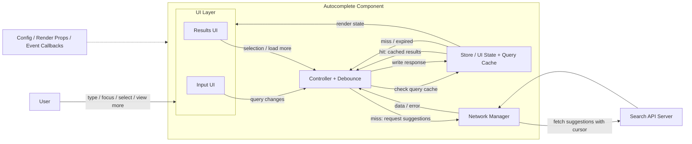

# Autocomplete / Search Component System Design

Autocomplete is a common question asked by many companies and encompasses many useful front end concepts and techniques that can be generalized to other front end system design questions. It is highly recommended to study this question well and thoroughly!

## Question

Design an autocomplete UI component that allows users to enter a search term into a text box, a list of search results appears in a popup, and the user can select a result.

Some real-life examples where you might have seen this component in action:

- **Google's search bar** on google.com where you see a list of primarily text-based suggestions.
- **Facebook's search input** where you see a list of rich results. The results can be friends, celebrities, groups, pages, etc.

A back end API is provided that will return a list of results based on the search query.

---

## Clarifying Questions

These are questions you should ask the interviewer to refine the scope before locking the requirements:

- What kind of results should be supported: text only, images, or rich media rows?
- What devices and screen sizes should this component support?
- Should the component support fuzzy search for typos and partial matches?
- Should suggestions appear only after a minimum query length?
- Should results be paginated or limited to a small fixed number?
- Should recent searches or trending suggestions be shown before the user types?
- How customizable should the input field and result item rendering be?
- Are there any accessibility or keyboard interaction requirements?

---

## R - Requirements Exploration

### Functional Requirements

- **Accept user input and fetch matching suggestions as the user types.**
- **Show suggestions in a popup/dropdown below the input field.**
- **Allow users to select a suggestion using mouse, touch, or keyboard.**
- **Allow users to submit the typed query directly without selecting a suggestion.**
- **Support different result types such as plain text, image results, and rich media rows.**
- **Support initial suggestions such as recent searches, popular searches, or trending queries.**
- **Allow the host application to customize the input UI and result item UI.**
- **Expose events such as input change, focus, blur, search, and suggestion selection.**
- **Show loading, empty, error, and offline states.**
- **Limit visible suggestions to a manageable count and provide a way to view full search results.**

### Non-Functional Requirements

- **Reusable:** The component should be generic enough to be used across different websites and product surfaces.
- **Performant:** Avoid firing a request on every keystroke by using debounce, caching, and request coordination.
- **Low latency:** Cached results should appear immediately, and fresh results should feel fast enough for typing-driven interaction.
- **Accessible:** Follow the WAI-ARIA combobox/listbox pattern with proper ARIA attributes and keyboard support for Arrow keys, Enter, Escape, and Tab.
- **Responsive:** Work well on desktop, tablet, and mobile viewports.
- **Reliable:** Handle slow networks, failed requests, out-of-order responses, and offline mode gracefully.
- **Scalable:** Avoid memory bloat in long-lived applications by using cache eviction or normalized cache storage.
- **Customizable:** Styling, rendering, and behavior should be configurable without changing the component internals.
- **Privacy-aware:** Avoid caching or exposing sensitive queries longer than necessary.

---

## A - Architecture / High-Level Design



### Input field UI

- Handles user input and passes the user input to the controller.

### Results UI (Popup)

- Receives results from the controller and presents them to the user.
- Handles user selection and informs the controller which input was selected.
- Can trigger `load more` either through infinite scroll or an explicit "View more" action.

### Store / UI State + Query Cache

- Stores UI state such as the current query, loading state, error state, active suggestion index, and whether the popup is open.
- Stores cached results for previous queries so the controller can reuse them before sending a new request.
- Stores normalized result entities so repeated results across queries are not duplicated.
- Stores pagination metadata such as `nextCursor`.

### Controller

- The "brain" of the whole component, similar to the Controller in the Model View Controller (MVC) pattern. All the components in the system interact with this component.
- Passes user input and results between components.
- Debounces query changes before deciding whether to read from cache or call the network manager.
- Fetches results from the server if the store does not already have cached results for a particular query.
- Fetches the next page when the user scrolls near the end of suggestions or clicks "View more".
- Conceptually, the controller sits at the center: it receives input from the field, checks the store for cached query results, falls back to the server on a miss, and writes responses back into the store so the results UI can render them.

### Network Manager

- Calls the search API and returns parsed data or a normalized error to the controller.
- Handles basic request validation, response validation, timeout, retry, and API error handling.
- Tracks the latest request id or abort controller so stale responses do not overwrite newer results.
- Good to have: use a small retry with backoff for transient failures, only if the query is still current.

### Pagination

- For autocomplete, keep the first page small so the popup stays easy to scan.
- Use infinite scroll when the dropdown has enough height, or a "View more" action when we want an explicit user intent before loading more.
- Prefer cursor-based pagination over offset-based pagination because search rankings can change while the user is typing or scrolling.

### Accessibility Helpers

- Adds proper ARIA tags for the input, popup, and active option.
- Supports keyboard navigation across the input and results popup.

---

## D - Data Model

Use one Zustand/Redux store with three logical slices. The important part is normalization: query cache stores only `resultIds`, and the actual result data lives once in `resultsById`.

```typescript
type SearchStatus = "idle" | "loading" | "loadingMore" | "stalled" | "error";

type ResultId = string;
type Query = string;

type SearchResult = {
  id: ResultId;
  type: "text" | "image" | "media" | string;
  text: string;
  subtitle?: string;
  imageUrl?: string;
  url?: string;
  source: "recent" | "trending" | "remote";
};

type SearchSessionStore = {
  // Current autocomplete session state.
  query: string;
  status: SearchStatus;
  isOpen: boolean;

  // Highlighted suggestion while navigating the popup.
  // Changes on hover or ArrowUp/ArrowDown. User has not selected it yet.
  activeItemId: ResultId | null;

  // Suggestion user actually picked by click, tap, or Enter.
  // Can be cleared after navigation/search submit if not needed later.
  selectedItemId: ResultId | null;

  // Result ids currently rendered for this query.
  // Array because order matters for ranked search suggestions.
  activeResultIds: ResultId[];

  // Cursor for the currently visible query.
  // If present, show "View more" or trigger infinite scroll.
  nextCursor: string | null;

  // Used to ignore stale responses from older queries.
  currentRequestId: string | null;
  error: string | null;
};

type SearchQueryCacheStore = {
  // Keyed by query string, e.g. "rea" or "react".
  // Use empty string "" for initial suggestions before the user types.
  // Object/map because query lookup should be O(1).
  queryCache: Record<
    Query,
    {
      resultIds: ResultId[]; // Array because result order matters.
      fetchedAt: number;
      expiresAt: number; // If Date.now() > expiresAt, evict or refetch.
      nextCursor: string | null; // Cursor saved per query for loading more later.
    }
  >;
};

type SearchResultEntityStore = {
  // Normalized result entities.
  // Object/map because cache entries and UI state reference results by id.
  // Cleanup removes an entity only when no non-expired query cache entry references it.
  resultsById: Record<ResultId, SearchResult>;
};

type SearchStoreActions = {
  // 1. Remove expired queryCache entries.
  // 2. Build a Set of resultIds still used by non-expired cache entries.
  // 3. Remove any resultsById entry not present in that Set.
  evictExpiredCacheEntries: () => void;
};

type SearchStore = SearchSessionStore &
  SearchQueryCacheStore &
  SearchResultEntityStore &
  SearchStoreActions;
```

### Pagination Choice

- **Cursor pagination:** Better for autocomplete because it is stable when search ranking or indexed data changes between requests. Store the `nextCursor` per query and pass it when loading more.
- **Offset pagination:** Simpler to reason about, but can return duplicate or missing results if the underlying result set changes while the user is interacting.

For this component, cursor pagination is the better default.

---

## I - Interface Definition (API)

The component API should support controlled state, custom rendering, event callbacks, and a replaceable backend fetcher.

### API Surface Summary

- **Basic API:** `limit`, backend endpoint/fetcher, event callbacks, CSS class names, and render callbacks.
- **Advanced API:** minimum query length, debounce duration, timeout, initial results, cache source, merge strategy, and cache TTL.

### Component API

```typescript
type AutocompleteProps<TItem> = {
  // Controlled/uncontrolled input support.
  value?: string;
  defaultValue?: string;
  onInputChange?: (query: string) => void;

  // Search behavior.
  minQueryLength?: number; // Default: 2 or 3.
  debounceMs?: number; // Default: 300ms.
  limit?: number; // Suggestions per page.
  cacheTtlMs?: number; // Time until query cache expires.
  timeoutMs?: number; // Time before request is treated as failed.
  allowCustomQuery?: boolean; // Allows submit without selecting a suggestion.
  initialResults?: TItem[]; // Recent/trending results before typing.
  mergeResults?: (cached: TItem[], remote: TItem[]) => TItem[];

  // Backend endpoint or custom fetcher. Fetcher is more flexible for apps.
  apiUrl?: string;
  fetchSuggestions: (params: {
    query: string;
    limit: number;
    cursor?: string | null;
    signal?: AbortSignal;
  }) => Promise<SuggestionResponse<TItem>>;

  // Styling customization through CSS class slots.
  className?: string;
  classNames?: {
    root?: string;
    input?: string;
    popup?: string;
    list?: string;
    item?: string;
    activeItem?: string;
    empty?: string;
    loading?: string;
    error?: string;
  };

  // Render customization. More flexible than CSS, but more work for users.
  renderInput?: (props: InputRenderProps) => React.ReactNode;
  renderItem?: (item: TItem, state: ItemRenderState) => React.ReactNode;
  renderEmpty?: (query: string) => React.ReactNode;
  renderLoading?: () => React.ReactNode;
  renderError?: (error: Error) => React.ReactNode;

  // Events for product analytics or host app behavior.
  onSelect?: (item: TItem) => void;
  onSubmit?: (query: string) => void;
  onOpenChange?: (isOpen: boolean) => void;
  onHighlightChange?: (item: TItem | null) => void;
  onError?: (error: Error) => void;
};

type SuggestionResponse<TItem> = {
  results: TItem[];
  nextCursor: string | null;
};

type InputRenderProps = {
  value: string;
  isOpen: boolean;
  status: SearchStatus;
  inputProps: React.InputHTMLAttributes<HTMLInputElement>;
};

type ItemRenderState = {
  isActive: boolean;
  isSelected: boolean;
  index: number;
};
```

### Backend API

```http
GET /api/search/suggestions?query=react&limit=10&cursor=cursor_abc
```

#### Request Parameters

| Param    | Type     | Required | Description                                     |
| -------- | -------- | -------- | ----------------------------------------------- |
| `query`  | `string` | Yes      | User typed search query                         |
| `limit`  | `number` | No       | Number of suggestions to return                 |
| `cursor` | `string` | No       | Opaque cursor returned by the previous response |

`query` can be empty only for initial suggestions such as trending or popular searches.

#### Success Response

```json
{
  "results": [
    {
      "id": "result_123",
      "type": "media",
      "text": "React Router",
      "subtitle": "Routing library for React",
      "imageUrl": "https://cdn.example.com/react-router.png",
      "url": "/search/react-router",
      "source": "remote",
      "matchedRanges": [{ "field": "text", "start": 0, "length": 5 }]
    }
  ],
  "nextCursor": "cursor_next_page"
}
```

- `nextCursor` should be `null` when there are no more results.
- Use cursor pagination because autocomplete ranking can change between requests.
- Backend should return stable ids so the frontend can normalize results into `resultsById`.
- `matchedRanges` is optional, but useful when the server wants to control text highlighting.

#### Error Response

```json
{
  "error": {
    "code": "RATE_LIMITED",
    "message": "Too many search requests. Please retry later.",
    "retryAfterMs": 1000
  }
}
```

Common status codes:

- `400`: Invalid query, limit, or cursor.
- `429`: Rate limited.
- `500`: Server error.
- `503`: Search service unavailable.

---

## O - Optimizations and Deep Dive

With the basics out of the way, this section dives into the production concerns that make autocomplete reliable and pleasant to use.

### 1. Network

Autocomplete can generate many requests while the user types, even with debounce. The network layer has to tolerate in-flight responses arriving out of order, transient failures, and dropped connectivity.

#### Handling concurrent requests/race conditions

Never trust response arrival order to decide what to show. Responses for older keystrokes can easily overtake newer ones on a flaky network. Track a `currentRequestId` or use `AbortController`, and only write the response if it still belongs to the latest query. Cache entries are still keyed by query string, so backspace or repeated queries can be served from memory.

#### Failed requests and retries

Autocomplete should not aggressively retry every failed keystroke. Use timeouts, show an error state, and optionally do one small backoff retry for transient failures only if the query is still current. Respect `429` and `retryAfterMs` when the backend sends it.

#### Offline usage

If the device has entirely lost its network connection:

- Read purely from the cache.
- Do not fire new requests.
- Show an offline state if cached results are unavailable.

### 2. Cache

Caches are typically used to improve the performance of queries and reduce processing costs by saving the results of previous queries in memory.

#### Cache structure

1. **Hash map with search query as key and results as value:**

```javascript
const cache = {
  fa: [
    { type: "organization", text: "Facebook" },
    { type: "text", text: "face" },
  ],
  // ...
};
```

_Pros:_ O(1) lookup. _Cons:_ Lots of duplicate results.

2. **List of results:**

```javascript
const results = [
  { type: "company", text: "Facebook" },
  { type: "text", text: "face" },
];
```

_Pros:_ No duplication. _Cons:_ Filtering on client side blocks UI thread.

3. **Normalized map of results:**

```javascript
const results = {
  1: { id: 1, type: "organization", text: "Facebook" },
  3: { id: 3, type: "text", text: "face" },
};

const cache = {
  fa: [1, 3],
  fac: [1],
};
```

_Pros:_ Fast lookup and non-duplicated data. Best for long-lived applications.

**Which to use?**

- **Short-lived websites (e.g. Google search):** Option 1 is fine as the memory usage is cleared upon navigation.
- **Long-lived websites (e.g. Facebook SPA):** Option 3 is better to prevent memory bloat over time.
- **Our choice:** Option 3. `queryCache` stores ordered `resultIds`, while `resultsById` stores each result entity once. This keeps lookup fast, avoids duplicate result objects, and lets each query keep its own `nextCursor`.

#### Caching strategy

- **Frontend cache location:** In-memory Zustand/Redux store.
- **Cache key:** Normalized query string.
- **Initial suggestions key:** Store recent, popular, or trending suggestions under the empty string key `""`.
- **Cache value:** Ordered `resultIds`, `fetchedAt`, `expiresAt`, and `nextCursor`.
- **Eviction:** Use TTL via `expiresAt`. When a query cache entry expires, remove it and then remove any `resultsById` entities no longer referenced by non-expired cache entries.
- **Initial results:** Show recent, popular, or trending searches on focus before typing.
- **Read path:** If cache hit and not expired, serve from store. If cache miss or expired, call network. If offline, serve cache if available or show offline state.
- **Backend caching good to have:** Cache popular query responses in Redis or an edge cache using keys like `suggestions:{normalizedQuery}:{limit}:{cursor}` with a short TTL. This reduces load on the search service for hot prefixes such as `fa`, `face`, or `react`.
- **Browser HTTP cache:** Optional, not core. Useful only for non-personalized public suggestions. Backend can send `Cache-Control: private, max-age=60` for per-user responses, or `Cache-Control: public, max-age=60, s-maxage=300` for shared public suggestions.

### 3. Performance

- **Debouncing:** Default to a `300ms` debounce. Debounce fires the request after the user pauses typing.
- **Minimum query length:** Avoid low-value requests until the query has at least 2 or 3 characters, unless fetching initial suggestions for `""`.
- **Memory usage:** Evict expired cache entries during idle time or when cache size crosses a threshold.
- **Pagination:** Keep the first page small. Load more with `nextCursor` only after user intent, either infinite scroll near the bottom or a "View more" action.
- **Virtualized lists:** Usually not needed for a small autocomplete popup, but useful if the component supports large scrollable result lists.

### 4. User Experience

- **Autofocus:** Add autofocus if the user has a high intent to search (like on Google's homepage).
- **Handle different states:** Show spinners for loading, error messages with retry buttons, or "no network" states.
- **Mobile-friendliness:** Ensure tap targets are large enough. Use `autocapitalize="off"`, `autocomplete="off"`, `autocorrect="off"`, and `spellcheck="false"`.
- **Typos in search (Fuzzy Search):** Good to have. Prefer server-side fuzzy matching for consistency; client-side edit distance can be used only for small local lists.
- **Positioning:** If the component is at the bottom of the window, render results above the input.

### 5. Accessibility

Follow the WAI-ARIA combobox pattern, do not invent your own roles.

#### Screen readers

- Use semantic HTML (e.g., `<ul>`, `<li>` or `role="listbox"`, `role="option"`).
- `aria-label` or visible `<label>` for the input.
- `role="combobox"` for the input or combobox wrapper.
- `aria-controls` to connect the input to the popup listbox.
- `aria-expanded` to indicate if the popup is visible.
- `aria-live` region to notify screen reader users when new results appear.
- `aria-autocomplete` (`"both"`, `"list"`, or `"inline"`).

#### Keyboard interaction

- `Enter` to search (or wrap in a `<form>`).
- Up/Down arrows to navigate options (wrap around when the end is reached).
- `Escape` to dismiss results.
- `aria-activedescendant` to manage focus.

---

## Summary

Centralize orchestration in the controller, keep query/results state in the frontend store, normalize result entities around `queryCache` and `resultsById`, and lean on platform primitives for debounce, ARIA roles, keyboard navigation, and request cancellation.

### Comparing Google, Facebook, and X search components

| HTML Attribute    | Google       | Facebook  | X            |
| ----------------- | ------------ | --------- | ------------ |
| HTML Element      | `<textarea>` | `<input>` | `<input>`    |
| Within `<form>`   | Yes          | No        | Yes          |
| role              | `"combobox"` | Absent    | `"combobox"` |
| aria-autocomplete | `"both"`     | `"list"`  | `"list"`     |

### Cheat Sheet

- **Flow:** User types -> controller debounces -> store cache check -> network on miss -> store update -> UI render.
- **Cache:** Zustand/Redux in-memory cache. `queryCache[query]` stores ordered `resultIds`, `expiresAt`, and `nextCursor`; `resultsById` stores normalized entities.
- **Initial suggestions:** Store under `queryCache[""]`.
- **Pagination:** Use cursor pagination. If `nextCursor` exists, show "View more" or trigger infinite scroll.
- **Race handling:** Use `currentRequestId` or `AbortController`; only latest query can write to store.
- **Network:** Timeout, normalized errors, optional one small backoff retry if query is still current.
- **Backend API:** `GET /api/search/suggestions?query=&limit=&cursor=`.
- **Accessibility:** Follow WAI-ARIA combobox/listbox pattern, keyboard navigation, `aria-expanded`, `aria-controls`, `aria-activedescendant`.
- **Customization:** `classNames` for CSS slots, render props for advanced UI.
- **Fuzzy:** Prefer backend fuzzy search; client fuzzy only for small local/cached lists.

### Extras: Fuzzy Search

Fuzzy search means returning useful results even when the user makes a typo or types an approximate query.

Example:

- User types `iphnoe`
- We still show `iPhone`

Fuzzy search is good to have, not required for the first version. Prefer backend fuzzy search for real products because the backend has the full index, ranking signals, synonyms, popularity, and language-specific analyzers.

#### Client-side fuzzy search

Client-side fuzzy search means checking the user's query against a small list already present in the browser.

- **Use for:** recent searches, trending suggestions, cached suggestions, or a small static list.
- **Do not use for:** full product/user/document search. The list is too large and backend ranking will be better.
- **How it works:** Compare the typed query with local items and allow 1-2 small mistakes.
- **Example:** `iphne` can match `iphone` because only one character is missing.
- **Implementation:** Use a small library like Fuse.js, or simple edit-distance algorithms such as Levenshtein or Damerau-Levenshtein for very small lists.
- **Ranking:** show exact/prefix matches first, then typo matches.

#### Backend fuzzy search

Backend should own fuzzy search for production autocomplete.

- **Elasticsearch/OpenSearch:** Use fuzzy query with `fuzziness: AUTO`, `prefix_length`, and `max_expansions`; combine with completion suggester/search-as-you-type fields for autocomplete.
- **Lucene/Solr:** Use `FuzzyQuery`, backed by edit distance with controls like `maxEdits`, `prefixLength`, and `maxExpansions`.
- **Algolia:** Use built-in typo tolerance, typo ranking, synonyms, splitting/concatenation, and typo thresholds.
- **Custom service:** Use an inverted index with edge n-grams for prefix matching, synonyms, typo-tolerant candidate generation, and ranking by typo count + popularity.

#### What we pick

- First version: no fuzzy requirement, only exact/prefix matching from backend.
- Good to have: backend typo tolerance for 1-2 edits.
- Client fallback: fuzzy only over `queryCache[""]`, recent searches, or currently cached results.

---

## References

- **Search and typeahead case studies:**
  - The Life of a Typeahead Query
  - Query Autocomplete from LLMs
- **Accessibility patterns:**
  - [Combobox pattern | W3C ARIA APG](https://www.w3.org/WAI/ARIA/apg/patterns/combobox/)
  - [MDN combobox role](https://developer.mozilla.org/en-US/docs/Web/Accessibility/ARIA/Reference/Roles/combobox_role)
- **Fuzzy search:**
  - [Elasticsearch fuzzy query](https://www.elastic.co/docs/reference/query-languages/query-dsl/query-dsl-fuzzy-query/)
  - [OpenSearch fuzzy query](https://docs.opensearch.org/latest/query-dsl/term/fuzzy/)
  - [Lucene FuzzyQuery](https://lucene.apache.org/core/10_0_0/core/org/apache/lucene/search/FuzzyQuery.html)
  - [Algolia typo tolerance](https://www.algolia.com/doc/guides/managing-results/optimize-search-results/typo-tolerance/)
- **Combobox implementations:**
  - React Select
