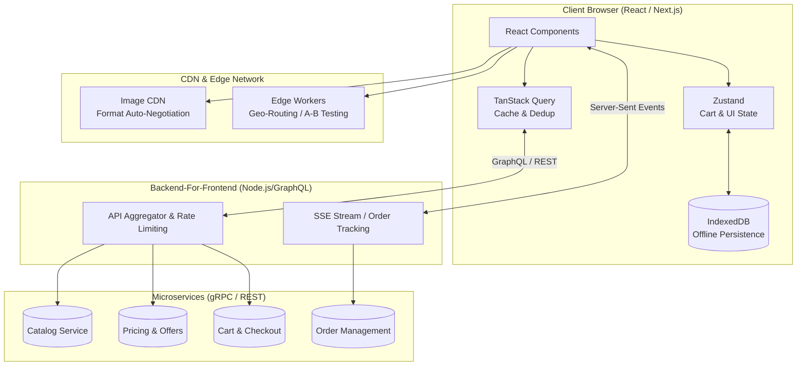

# Senior Frontend System Design: Swiggy / Zomato Restaurant Page

## 1. Problem Statement & Scope

Design the frontend architecture for the Restaurant Details and Checkout page of a high-scale food delivery application (e.g., Swiggy, Zomato, DoorDash).

**Key User Flows:**

- View restaurant details, meta-information, and a categorized menu.
- Add items to a cart, handle customizations (e.g., "Extra Cheese"), and manage quantities.
- Proceed through checkout, applying coupons and validating inventory.
- Real-time order tracking post-payment.

### Scale & Constraints (The "Senior" Context)

- **Traffic:** 10M+ DAU. High read-to-write ratio for menus, but intense write spikes during peak hours (dinner/lunch) or flash sales.
- **Payload Size:** Menus can range from 20 items to 2,000+ items.
- **Network Variance:** Users will access the app on unstable mobile networks (3G/4G drops), requiring extreme resilience.
- **Performance Budget:** Target Largest Contentful Paint (LCP) < 2.5s, First Input Delay (FID) < 100ms.

---

## 2. High-Level Architecture

At this scale, the frontend acts as a **distributed system**. We utilize a **Backend-For-Frontend (BFF)** pattern combined with a **Hybrid Rendering Strategy** and **Edge Delivery**.



---

## 3. Rendering Strategy & Component Architecture

A monolithic SPA (Single Page Application) is insufficient for e-commerce SEO and performance requirements. We will use a **Micro-Frontend** or **Modular Framework** approach (like Next.js) employing hybrid rendering.

### Rendering Tiers

1. **SSG (Static Site Generation):** Restaurant Meta-data and base menu structure. Generated at build time or via Incremental Static Regeneration (ISR) with a 1-hour revalidation. This guarantees instant initial loads and maximum SEO scoring.
2. **SSR (Server-Side Rendering):** Personalized data (User Profile, Recommended Items based on history).
3. **CSR (Client-Side Rendering):** The Cart, Checkout Modal, and Real-Time Tracking. These are highly dynamic and user-specific.

### Code Splitting

- **Above the Fold:** `Header`, `RestaurantHero`, and `MenuCategory(0)` are synchronously loaded.
- **Below the Fold:** Heavy components (e.g., `ReviewCarousel`, lower menu items) use `React.lazy()` combined with `IntersectionObserver`.
- **Heavy SDKs:** Payment Gateway SDKs (Stripe, Razorpay) and Maps SDKs are dynamically imported only when the user explicitly triggers the checkout flow.

---

## 4. State Management & Data Modeling

A senior architecture strictly separates **Server State** from **Client State**.

### Trade-offs: Context vs Redux vs Zustand

- **React Context:** Causes cascading re-renders. Acceptable for low-frequency updates (Theme, Auth), but fatal for a high-frequency Cart where every `+` click would re-render the entire app tree. **(Rejected for Cart)**
- **Redux (RTK):** Excellent for complex global workflows, but heavy on boilerplate and bundle size. **(Rejected for simplicity)**
- **Zustand:** Provides a Redux-like centralized store with atomic, selector-based re-renders without Provider wrappers. **(Accepted for Cart & Local UI State)**

### Data Normalization (The Store Structure)

To avoid `O(N)` search times when updating a deeply nested menu item, we normalize the data in the frontend store using ID-based dictionaries.

**Inefficient Array Structure (Anti-pattern):**

```json
[{ "categoryId": 1, "items": [{ "id": "m1", "name": "Pizza", "qty": 1 }] }]
```

**Normalized Dictionary Structure (Senior Approach):**

```typescript
interface StoreState {
  cart: {
    items: Record<string, CartItem>; // O(1) lookup: state.cart.items['m1']
    restaurantId: string | null;
    promoCode: string | null;
  };
  menu: {
    items: Record<string, MenuItem>;
    categories: Record<string, string[]>; // { "cat1": ["m1", "m2"] }
  };
}
```

_Why?_ If a user adds "Pizza" (m1) to the cart, we do an `O(1)` lookup `cart.items['m1']` instead of traversing arrays.

### Optimistic Updates

When a user clicks "Add to Cart", the UI must react in `< 16ms` (1 frame). We update the local Zustand store immediately and send the API request in the background. If the request fails (e.g., out of stock), we roll back the Zustand state and trigger a Toast notification.

---

## 5. Data Fetching & Caching

Plain `useEffect` hooks are an anti-pattern for complex data synchronization. We will leverage **TanStack Query (React Query)**.

- **Deduplication:** Multiple components (Sidebar, Header, Menu) can call `useRestaurant(id)` without triggering multiple network requests.
- **Cache vs Stale Time:**
  - `staleTime: 5 minutes` for the general menu (prevents refetching when navigating tabs).
  - `staleTime: 0 minutes` for Pricing and Coupons (forces background re-validation).
- **Background Sync:** If the user minimizes the browser and returns 10 minutes later, TanStack Query triggers a background refetch, silently updating prices.

---

## 6. Extreme Performance Optimization (LCP & CLS)

### Optimizing Largest Contentful Paint (LCP)

The LCP is typically the Restaurant Hero Image.

1. **Priority Hints:** `` tells the browser's preload scanner to fetch this before CSS/JS.
2. **Image CDN Integration:** We offload image manipulation to the edge. The UI requests `https://cdn.swiggy.com/img_id?format=webp&width=400` on mobile, but `width=1200` on desktop.
3. **Domain Sharding/Preconnect:** `<link rel="preconnect" href="https://cdn.swiggy.com">` reduces DNS lookup latency.

### Preventing Cumulative Layout Shift (CLS)

- Never use `loading="lazy"` on above-the-fold images.
- Always reserve space using CSS `aspect-ratio: 16/9` or explicit `width`/`height` attributes so text doesn't reflow when images load.

### DOM Virtualization

For a restaurant with 2,000 menu items, rendering all DOM nodes will freeze the main thread. We implement **Windowing/Virtualization** (e.g., `@tanstack/react-virtual`). Only the 15 items currently visible in the viewport are rendered, keeping DOM nodes under 1000 and scrolling silky smooth.

---

## 7. Edge Cases & Resiliency

Handling "unhappy paths" is the hallmark of senior design.

### A. Network Resilience & Offline Cart

- **Problem:** Users lose signal in elevators.
- **Solution:** Persist the Zustand cart to `IndexedDB` (not `localStorage`, as IndexedDB is non-blocking/async).
- **Sync Queue:** If the user updates the cart offline, push the actions to a local queue. Implement a custom hook listening to `window.addEventListener('online')` to flush the queue to the backend.

### B. Race Conditions & Idempotency

- **Problem:** User double-clicks "Place Order" on a slow network, creating two duplicate orders.
- **Solution:**
  1. UI-level debouncing and disabling buttons immediately.
  2. Generate a unique `Idempotency-Key` (UUID) in the frontend when the checkout modal opens. Send this header with the `POST /order` request. The backend guarantees exactly-once processing.

### C. Third-Party Failures

- **Problem:** Google Maps API or Stripe Gateway goes down.
- **Solution:** Graceful degradation. If Maps fails, fallback to a manual address entry form. Never allow a non-critical third-party failure to block the core checkout flow.

### D. Ghost States & Cart Validation

- **Problem:** User adds items, leaves the tab open for 2 hours, and returns. The item is now out of stock or price changed.
- **Solution:** Never trust client-side prices. Upon clicking "Checkout", send the cart payload to the BFF for a **Pre-Checkout Validation**. If discrepancies exist, display an inline diff UI ("Prices for 2 items have changed") before allowing payment.

---

## 8. Observability & Monitoring

A senior engineer ensures the system can be debugged in production.

1. **Metrics (Performance):** Use the `web-vitals` library to capture LCP, FID, and CLS directly from users' browsers. Send this telemetry to Datadog/Grafana.
2. **Logs (Client Errors):** Integrate Sentry. Capture unhandled promise rejections and React Error Boundary fallbacks. Attach the `X-Request-ID` and `Tenant/Restaurant-ID` to every log for traceability.
3. **Traces (RUM - Real User Monitoring):** Implement Distributed Tracing (OpenTelemetry). When a user clicks "Checkout", generate a trace ID that flows from the Browser -> BFF -> Order Service -> Payment Service, allowing immediate identification of latency bottlenecks.

---

## 9. Real-Time Order Updates

Once the order is placed, the user tracks it (Pending -> Cooking -> Out for Delivery -> Arrived).

### Trade-offs: WebSockets vs SSE vs Polling

| Technology                   | Direction        | Trade-offs                                                                                                                                                                   | Decision   |
| :--------------------------- | :--------------- | :--------------------------------------------------------------------------------------------------------------------------------------------------------------------------- | :--------- |
| **Short Polling**            | Client -> Server | Wastes bandwidth, destroys mobile battery, high backend load.                                                                                                                | **Reject** |
| **WebSockets**               | Bi-directional   | High infrastructure overhead. Requires persistent TCP connections and custom reconnection logic. Overkill since the client doesn't need to stream data _back_ to the server. | **Reject** |
| **Server-Sent Events (SSE)** | Server -> Client | Native HTTP support, firewall friendly, built-in automatic reconnection in the browser API (`EventSource`).                                                                  | **Accept** |

**Implementation Flow:**

1. Client opens an `EventSource` connection to `/api/v1/orders/:id/track`.
2. The Downstream Order Microservice publishes state changes to a Kafka/Redis pub-sub topic.
3. The BFF consumes the topic and pushes the event down the SSE connection to the specific client.
4. The React UI listens to the event and transitions the progress bar smoothly.
