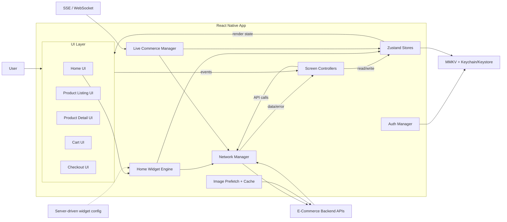

# E-Commerce App System Design (React Native)

Designing an e-commerce app is a strong React Native system design problem because it touches catalog browsing, server-driven home screens, pagination, image performance, cart consistency, authentication, checkout, offline behavior, and real-time updates.

The goal is not to build Amazon end to end. The goal is to design a production-ready mobile shopping experience with clear frontend responsibilities and safe backend contracts.

## Question

Design a React Native e-commerce app where users can browse products, search/filter/sort listings, view product details, add products to cart/wishlist, checkout, and track orders.

Some real-life examples:

- Amazon / Flipkart product browsing
- Myntra product listing and wishlist
- Truemeds medicine catalog and cart
- Marketplace apps with server-driven home widgets
- Auction or flash-sale products with live updates

The backend APIs are provided for products, cart, auth, orders, home widgets, and live updates.

---

## Clarifying Questions

These are questions you should ask the interviewer before locking the requirements:

- Should users be able to browse without login?
- Is cart local-only or server-maintained?
- Should cart sync across devices?
- Do we need wishlist, recently viewed, and offline browsing?
- What product listing features are required: category, filter, sort, search?
- Should product listings use infinite scroll or page numbers?
- Are product prices, inventory, and max quantity trusted from client or server?
- Is checkout in scope: address, shipping, payment, confirmation?
- Should home screen layout be static or server-driven?
- Which home widgets are required: hero banners, category strips, Buy Again, recommendations, flash-sale rows, sponsored slots?
- Are real-time commerce features required: flash-sale claimed percentage, inventory countdown, auctions, stock updates?
- What performance target should we optimize for on mid-range Android?

---

## R - Requirements Exploration

### Functional Requirements

- **Home screen:** Show banners, categories, recommendation rows, flash sale sections, and recently viewed products.
- **Server-driven widgets:** Home layout, widget order, widget type, and data URLs are controlled by backend, similar to Amazon/Flipkart-style personalized home feeds.
- **Personalized home:** Support widgets like Buy Again, recommended for you, trending products, deals, sponsored rows, recently viewed, and order history strip.
- **Product listing:** Browse by category and support filters, sort, and cursor-based pagination.
- **Product detail:** Show image carousel, product info, variants, stock, seller info, rating, and reviews summary.
- **Search:** Navigate to a product search/autocomplete flow.
- **Wishlist:** Toggle wishlist with instant UI feedback and persistence.
- **Cart:** Add, update quantity, remove items, and show cart badge/subtotal.
- **Server-maintained cart:** Cart is scoped to user account or guest session token and survives app restarts.
- **Guest browsing:** Guest users can browse catalog and add to server-side guest cart.
- **Guest to login migration:** Guest cart/wishlist should merge into account on login.
- **Checkout:** Address selection, shipping method, payment, order creation, and confirmation.
- **Order history:** Show past orders and order detail/tracking.
- **Offline browse:** Recently viewed products can be shown from local storage; cart mutations are disabled or queued carefully.
- **Flash sale / live deals:** Show countdown, limited inventory, claimed percentage, deal price, and real-time sold-out state.
- **Bidding / auction products:** Show current bid, minimum next bid, countdown, leaderboard, outbid event, and final result.
- **Live updates:** Promotional banners and deal inventory update via SSE/WebSocket with polling fallback.

### Non-Functional Requirements

- **Performance:** Product listing should scroll smoothly on mid-range Android.
- **Low layout shift:** Product images should include width/height so aspect ratio is known before loading.
- **Consistency:** Product list must not show duplicates when pages overlap.
- **Cart correctness:** Client never trusts local price, stock, or max quantity.
- **Reliability:** Cart and checkout should recover from app kill, payment interruption, and network failure.
- **Security:** Auth tokens stored in Keychain/Keystore, not AsyncStorage.
- **Scalability:** Product entities should be normalized to avoid duplication across listing, wishlist, cart, and widgets.
- **Offline-friendly:** Read-only cached content can render offline; unsafe mutations wait for network/server validation.
- **Experiment-friendly:** Server-driven home widgets allow promotions/A-B tests without app release.
- **Deal correctness:** Flash-sale inventory and auction bid status must be confirmed by server to prevent overselling or false winning states.

---

## A - Architecture / High-Level Design



### UI Layer

- Renders screens and captures user interactions.
- Uses FlashList for product grids and horizontal lists.
- Reads product/cart/widget state from Zustand stores.

### Screen Controllers

- Orchestrate screen behavior: fetch first page, load next page, apply filters, submit cart mutations, and start checkout.
- Build stable query keys for product listing and widget pagination.
- Ignore stale responses using request ids or abort controllers.

### Zustand Stores

- Store normalized products in `productsById`.
- Store listing/query slices separately from product entities.
- Store cart snapshot returned by server.
- Store widget manifest and per-widget data.
- Store flash-sale/deal state separately from product entities.
- Store optimistic wishlist/cart state while network request is pending.

### Home Widget Engine

- Reads `/home/manifest` and renders widgets in backend-defined order.
- Fetches above-fold widgets immediately and below-fold widgets when they enter viewport.
- Supports heterogeneous widgets: hero banners, category strips, Buy Again, product carousel, flash-sale row, sponsored row, recently viewed, and order history strip.
- Product widgets store only product IDs and reuse the global `productsById` map.

### Live Commerce Manager

- Owns SSE/WebSocket subscriptions for flash sales, live deals, banners, and auctions.
- Updates `dealsById` and `auctionsById` without refetching the full product entity.
- Uses SSE for one-way deal updates and WebSocket for bidding.
- Falls back to short polling when the live connection fails.

### Network Manager

- Calls backend APIs and returns parsed data or normalized errors.
- Handles timeout, retry for safe GET requests, auth refresh, and request cancellation.
- Sends `Authorization` token for logged-in users or `X-Session-Token` for guests.

### Auth Manager

- Stores access/refresh tokens in Keychain/Keystore.
- Stores guest session token in MMKV.
- Refreshes access token and triggers guest-cart merge on login.

### Local Persistence

- **Keychain/Keystore:** Auth tokens only.
- **MMKV:** Guest session token, recently viewed product IDs, wishlist IDs if guest/local, and small home snapshots.
- **Do not store:** Trusted cart price, inventory, or payment state as source of truth.

### Real-Time Layer

- SSE is good for one-way updates such as live banners, flash-sale stock/claimed percentage, and deal status.
- WebSocket is better for interactive real-time flows such as auctions/bidding.
- Polling fallback is used when SSE/WebSocket is unavailable.
- Close live connections on screen unmount or when the widget leaves the viewport for long enough.

---

## D - Data Model

Use one Zustand store split into logical slices. The important design choice is normalization: product data lives once in `productsById`; listing, widget, wishlist, and recently viewed slices store only product IDs.

```typescript
type ProductId = string;
type VariantId = string;
type QueryKey = string;
type Cursor = string | null;

type Product = {
  id: ProductId;
  title: string;
  brand: string;
  categoryId: string;
  price: number;
  originalPrice?: number;
  discountPct?: number;
  rating?: number;
  reviewCount?: number;
  image: {
    url: string;
    width: number; // Used to calculate aspectRatio before image loads.
    height: number;
  };
  inStock: boolean;
};

type CatalogStore = {
  // Normalized product entities. Object/map for O(1) lookup.
  productsById: Record<ProductId, Product>;

  // Product ids ordered per category/filter/sort/search query.
  // Array because list order matters.
  listingByQuery: Record<
    QueryKey,
    {
      productIds: ProductId[];
      nextCursor: Cursor;
      status: "idle" | "loading" | "loadingMore" | "error";
      error: string | null;
      fetchedAt: number;
      expiresAt: number;
    }
  >;
};

type HomeStore = {
  // Server controls widget order and type.
  manifest: {
    widgetId: string;
    type:
      | "hero_banner"
      | "category_strip"
      | "buy_again"
      | "product_carousel"
      | "flash_sale"
      | "live_deal"
      | "order_history_strip"
      | "sponsored_banner";
    priority: "above_fold" | "below_fold";
    dataUrl: string;
    liveUpdates?: boolean;
  }[];

  // Per-widget data. Product widgets store productIds only.
  widgetDataById: Record<
    string,
    {
      itemIds: string[];
      nextCursor: Cursor;
      status: "idle" | "loading" | "loadingMore" | "error";
      expiresAt: number;
    }
  >;
};

type LiveCommerceStore = {
  // Flash-sale/live-deal state changes frequently, so keep it separate from product metadata.
  dealsById: Record<
    string,
    {
      dealId: string;
      productId: ProductId;
      dealPrice: number;
      originalPrice: number;
      startsAt: string;
      endsAt: string;
      claimedPct: number;
      stockStatus: "available" | "low_stock" | "sold_out" | "expired";
      streamStatus:
        | "idle"
        | "connecting"
        | "open"
        | "fallback_polling"
        | "closed";
    }
  >;

  auctionsById: Record<
    string,
    {
      auctionId: string;
      productId: ProductId;
      currentBid: number;
      minNextBid: number;
      endsAt: string;
      status: "active" | "ending_soon" | "closed";
      userBidStatus: "none" | "leading" | "outbid" | "won" | "lost";
      wsStatus: "connecting" | "open" | "reconnecting" | "closed";
    }
  >;
};

type CartStore = {
  // Server is source of truth. Client mirrors last server response.
  cartId: string | null;
  items: {
    cartItemId: string;
    productId: ProductId;
    variantId?: VariantId;
    qty: number;
    title: string;
    imageUrl: string;
    unitPrice: number; // From server response, not computed locally.
    maxQty: number; // From server response.
  }[];
  subtotal: number;
  status: "idle" | "syncing" | "mutating" | "error";
  pendingMutationId: string | null;
};

type UserSessionStore = {
  role: "guest" | "user";
  userId: string | null;
  guestSessionToken: string | null; // Stored in MMKV.
  accessTokenExpiresAt: number | null; // Token itself lives in Keychain/Keystore.
};

type WishlistStore = {
  // Set-like map for O(1) lookup.
  wishlistedById: Record<ProductId, true>;
  pendingById: Record<ProductId, "adding" | "removing">;
};

type RecentlyViewedStore = {
  // Array because order matters: newest first.
  productIds: ProductId[];
};

type EcommerceStore = CatalogStore &
  HomeStore &
  LiveCommerceStore &
  CartStore &
  UserSessionStore &
  WishlistStore &
  RecentlyViewedStore;
```

### Why normalize products?

- Listing, wishlist, recommendations, and recently viewed can reference the same product.
- One stock/price update patches one product entity.
- FlashList receives only IDs, reducing re-renders.
- Duplicate products across cursor pages can be filtered before append.

### Local storage keys

| Store             | Key                   | Why it is stored locally      |
| ----------------- | --------------------- | ----------------------------- |
| MMKV              | `guest_session_token` | Scopes server-side guest cart |
| MMKV              | `recently_viewed_ids` | Offline/read-only browse      |
| MMKV              | `guest_wishlist_ids`  | Guest wishlist before login   |
| MMKV              | `home_snapshot`       | Fast home fallback            |
| Keychain/Keystore | `access_token`        | Encrypted auth token          |
| Keychain/Keystore | `refresh_token`       | Encrypted refresh token       |

---

## I - Interface Definition (API)

### Client API / Store Actions

```typescript
type CatalogActions = {
  fetchProducts: (params: {
    categoryId?: string;
    searchQuery?: string;
    filters?: Record<string, string | number | boolean>;
    sort?: "price_asc" | "price_desc" | "popular" | "newest";
    cursor?: Cursor;
  }) => Promise<void>;

  loadNextPage: (queryKey: QueryKey) => Promise<void>;
  patchProduct: (productId: ProductId, patch: Partial<Product>) => void;
};

type CartActions = {
  fetchCart: () => Promise<void>;
  addToCart: (params: {
    productId: ProductId;
    variantId?: VariantId;
    qty: number;
  }) => Promise<void>;
  updateQty: (cartItemId: string, qty: number) => Promise<void>;
  removeFromCart: (cartItemId: string) => Promise<void>;
  validateCart: () => Promise<void>;
};

type HomeActions = {
  fetchHomeManifest: () => Promise<void>;
  fetchWidgetData: (widgetId: string, cursor?: Cursor) => Promise<void>;
};

type LiveCommerceActions = {
  subscribeToDeal: (dealId: string) => void;
  unsubscribeFromDeal: (dealId: string) => void;
  subscribeToAuction: (auctionId: string) => void;
  placeBid: (params: { auctionId: string; amount: number }) => Promise<void>;
};
```

### Backend APIs

```http
# Catalog
GET /products?categoryId=&search=&sort=&filters=&cursor=&limit=20
GET /products/:productId
GET /products?ids=id1,id2,id3
GET /categories

# Server-driven home
GET /home/manifest
GET /home/widgets/:widgetId?cursor=&limit=
GET /home/banners/live

# Live commerce
GET /deals/:dealId
GET /deals/:dealId/live
GET /deals/live
POST /deals/:dealId/reserve
WS  /auctions/:auctionId/stream

# Cart
GET /cart
POST /cart/items
PATCH /cart/items/:cartItemId
DELETE /cart/items/:cartItemId
POST /cart/validate

# Auth
POST /auth/login
POST /auth/otp/verify
POST /auth/oauth
POST /auth/refresh
POST /auth/logout

# Checkout / Orders
POST /orders
GET /orders
GET /orders/:orderId

# Auctions / bidding
GET /auctions/:auctionId
POST /auctions/:auctionId/bids
WS /auctions/:auctionId/stream
```

### Home Manifest Response

```json
{
  "widgets": [
    {
      "widgetId": "w_hero_1",
      "type": "hero_banner",
      "priority": "above_fold",
      "dataUrl": "/home/widgets/w_hero_1",
      "liveUpdates": true
    },
    {
      "widgetId": "w_flash_sale",
      "type": "flash_sale",
      "priority": "above_fold",
      "dataUrl": "/home/widgets/w_flash_sale",
      "liveUpdates": true
    },
    {
      "widgetId": "w_buy_again",
      "type": "buy_again",
      "priority": "below_fold",
      "dataUrl": "/home/widgets/w_buy_again"
    }
  ]
}
```

### Widget Data Response

```json
{
  "widgetId": "w_flash_sale",
  "items": [
    {
      "productId": "prod_123",
      "dealId": "deal_123"
    }
  ],
  "nextCursor": "cursor_next",
  "ttlMs": 300000
}
```

Product widgets return product IDs and optional metadata like `dealId`; full product data is merged into `productsById`.

### Product Listing Response

```json
{
  "products": [
    {
      "id": "prod_123",
      "title": "Nike Air Max 270",
      "brand": "Nike",
      "categoryId": "shoes",
      "price": 129.99,
      "rating": 4.6,
      "image": {
        "url": "https://cdn.example.com/nike.jpg",
        "width": 800,
        "height": 800
      },
      "inStock": true
    }
  ],
  "nextCursor": "cursor_next"
}
```

### Cart Mutation Response

```json
{
  "cartId": "cart_123",
  "items": [
    {
      "cartItemId": "item_1",
      "productId": "prod_123",
      "variantId": "var_8",
      "qty": 2,
      "title": "Nike Air Max 270",
      "imageUrl": "https://cdn.example.com/nike.jpg",
      "unitPrice": 129.99,
      "maxQty": 5
    }
  ],
  "subtotal": 259.98
}
```

Important: cart response overwrites local optimistic state. Server wins for price, quantity, availability, and limits.

### Live Deal Event

SSE is enough for one-way live deal updates because the client mostly listens for state changes.

```json
{
  "event": "deal_updated",
  "dealId": "deal_123",
  "productId": "prod_123",
  "dealPrice": 99.99,
  "claimedPct": 82,
  "stockStatus": "low_stock",
  "endsAt": "2026-05-05T15:30:00Z"
}
```

### Auction Event

WebSocket is better for auctions because bid placement and bid state are interactive and latency-sensitive.

```json
{
  "event": "new_bid",
  "auctionId": "auc_123",
  "currentBid": 250,
  "minNextBid": 260,
  "userBidStatus": "outbid",
  "endsAt": "2026-05-05T16:00:00Z"
}
```

---

## O - Optimizations and Deep Dive

### 1. Product Listing Performance

- Use **FlashList** for large product grids.
- Pass `productIds` to the list instead of full product objects.
- Each `ProductCard` selects `productsById[id]` from store.
- Provide image `width` and `height` to calculate `aspectRatio` before image loads.
- Prefetch next-page images after current page settles.
- Use stable keys: `product.id`, not index.

### 2. Cursor Pagination

Use cursor pagination for product listings.

- Product catalogs are live: products, prices, and rankings can change.
- Offset pagination can cause duplicates or missing items when data shifts.
- Cursor should be opaque to the client.
- For sorted data, backend can encode composite sort values, for example `(price, id)`.

Offset pagination is acceptable for small, stable personal lists such as order history.

### 3. Cache Strategy

- **Frontend cache:** Zustand in-memory normalized store.
- **Local read-only cache:** MMKV for recently viewed and small home snapshot.
- **Backend cache good to have:** Redis or edge cache for popular catalog/home queries.
- **Browser HTTP cache:** Not core for React Native, but CDN caching helps images and public catalog data.
- **Eviction:** Listing/widget slices use `expiresAt`; product entities can be removed when no active slice references them.

### 4. Cart Correctness

- Server is source of truth.
- Client can optimistically update cart badge/UI.
- Server response always reconciles local state.
- Validate cart before checkout.
- Handle multi-device sync by refetching cart on app foreground.
- Silent push can be used as a fast path for `cart_updated`.

### 5. Auth + Guest Session

- Store access/refresh tokens in Keychain/Keystore.
- Store guest session token in MMKV.
- Send `X-Session-Token` for guest cart requests.
- On login, backend merges guest cart into account cart.
- Client deletes guest token after successful merge.

### 6. Offline Behavior

- Allow read-only recently viewed products from MMKV.
- Show cached home snapshot if network is unavailable.
- Disable checkout and cart mutations offline.
- Wishlist can be optimistic locally, but must reconcile with server later.

### 7. Server-Driven Home

- Amazon/Flipkart-style home pages are feeds of heterogeneous widgets, not a single static page.
- `/home/manifest` returns ordered widget descriptors: type, priority, data URL, display config, and live-update flag.
- Above-fold widgets fetch immediately so first screen appears fast.
- Below-fold widgets fetch on viewport entry to avoid blocking first render.
- Product widgets store product IDs and reuse `productsById`.
- Personalization widgets include Buy Again, recommended for you, recently viewed, trending, best-sellers, deals, sponsored rows, and category strips.
- Live banners and flash-sale widgets can use SSE with polling fallback.
- Unknown widget types should render a safe fallback instead of crashing the home screen.

### 8. Flash Sale / Live Deals

- Treat flash sale as a first-class feature, not a normal product listing.
- Show deal price, countdown, claimed percentage, low-stock/sold-out status, and max quantity.
- Use SSE for live one-way updates such as claimed percentage and stock status.
- Use polling fallback every 15-30 seconds if SSE is unavailable.
- Do not trust local inventory during add-to-cart or checkout; server validates and reserves.
- For very high-traffic drops, backend should use Redis/token bucket/queue based admission to avoid overselling and protect inventory writes.
- Client should handle `SOLD_OUT`, `DEAL_EXPIRED`, `WAITLISTED`, and `RATE_LIMITED` states gracefully.

### 9. Auctions / Bidding

- Use WebSocket only while auction product detail screen is open.
- Bid placement should not be optimistic.
- Server confirms accepted/outbid status.
- On `closed` event, winner proceeds to checkout at locked price.

---

## Summary

Use a normalized store for products, cursor pagination for listings, server-maintained cart for correctness, Keychain/Keystore for auth tokens, MMKV only for safe local state, and FlashList/image sizing for smooth React Native performance.

### Cheat Sheet

- **Flow:** Home/listing/PDP UI -> controller -> Zustand store -> network -> store -> UI.
- **Product data:** `productsById` is global; lists/widgets/wishlist store only IDs.
- **Listing pagination:** Cursor-based, keyed by category/filter/sort/search.
- **Cart:** Server-maintained; optimistic UI allowed, server response wins.
- **Guest cart:** Server scoped by `guest_session_token` stored in MMKV.
- **Auth tokens:** Keychain/Keystore, never AsyncStorage/MMKV.
- **Images:** Store width/height, use aspect ratio, prefetch next page.
- **Home:** Server-driven manifest with above-fold eager fetch and below-fold lazy fetch.
- **Widgets:** Support personalized Buy Again, recommendations, deals, sponsored rows, and category strips.
- **Flash sale:** SSE for live deal state, server validates reservation/checkout, queue/token gate for major drops.
- **Offline:** Recently viewed/home snapshot only; cart/checkout require server.
- **Bidding:** WebSocket for auctions; bid placement is server-confirmed, not optimistic.

### Extras: Native Storage Choices

- **MMKV:** Fast key-value storage for non-sensitive app data such as guest session token, recently viewed IDs, home snapshot, and guest wishlist.
- **Keychain/Keystore:** Encrypted OS storage for access token and refresh token.
- **AsyncStorage:** Avoid for tokens; acceptable only for low-value non-sensitive preferences if MMKV is not available.

---

## References

- Amazon homepage personalization and widget-style shopping feed: [Amazon enhanced homepage features](https://www.aboutamazon.com/news/retail/amazon-homepage-redesign-features)
- Amazon time-limited/limited-quantity deals: [Amazon Lightning Deals](https://www.aboutamazon.com/news/retail/how-to-find-amazon-lightning-deals/)
- Flipkart mobile/app-like performance and offline/re-engagement case study: [Flipkart Lite case study](https://web.dev/flipkart/)
- Flash-sale traffic and oversell prevention patterns: [Flash sale system design](https://www.techinterview.org/post/3233465613/system-design-flash-sale/)
- Real-time inventory updates using WebSocket pattern: [WebSocket e-commerce flash sale case study](https://clickpatrol.com/knowledge-base/what-is-websocket/)
- FlashList for React Native lists
- React Navigation deep linking and navigation state
- MMKV for React Native storage
- iOS Keychain and Android Keystore for secure token storage
- Cursor pagination for live catalog/feed data
